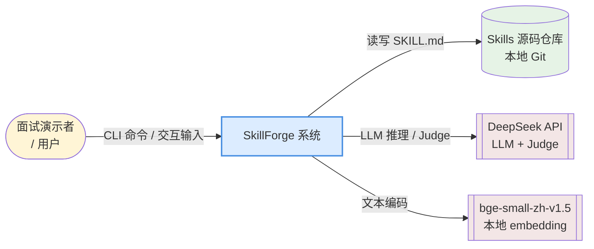
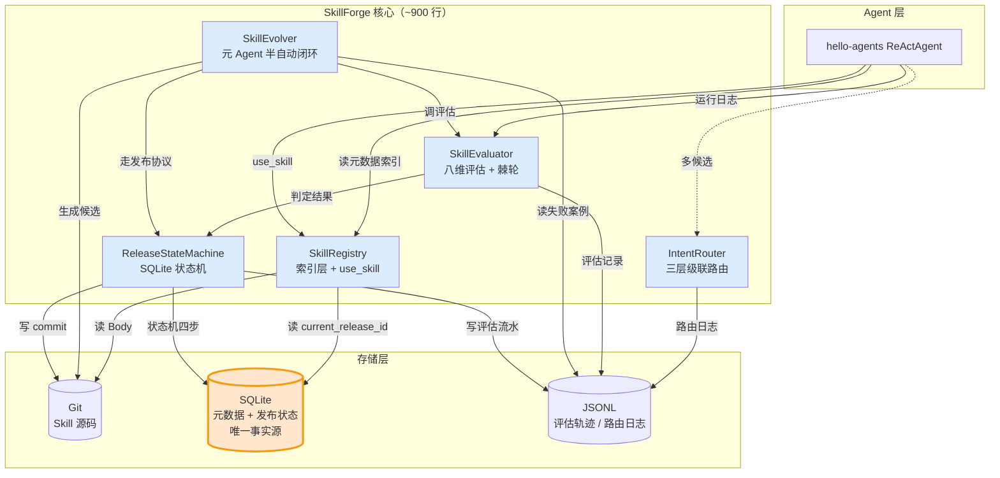
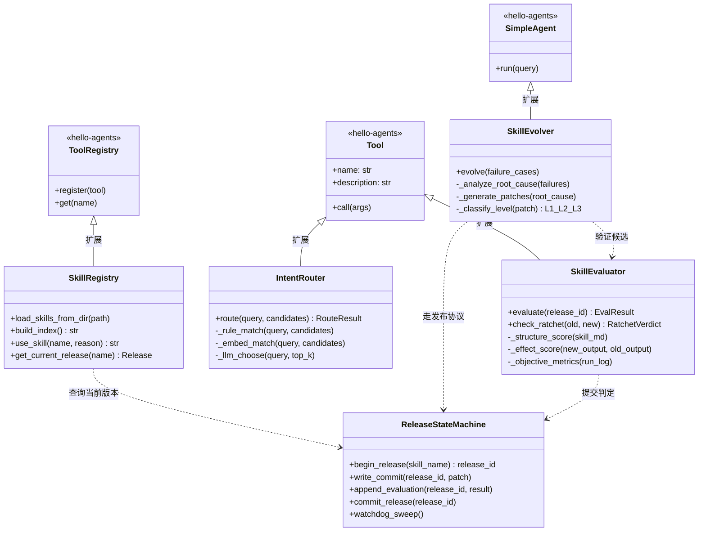
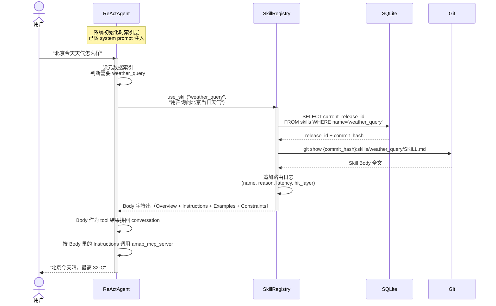
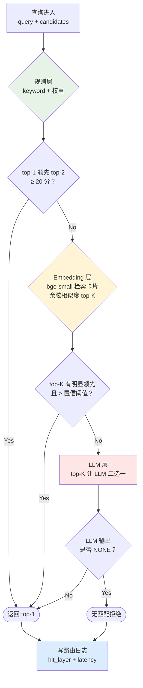
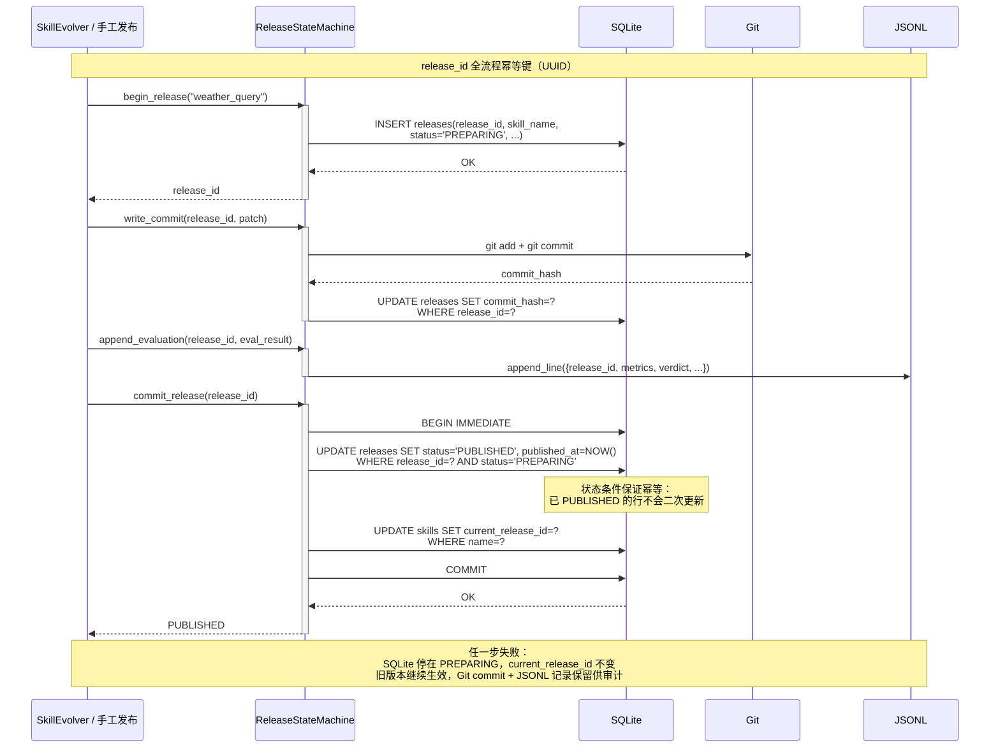
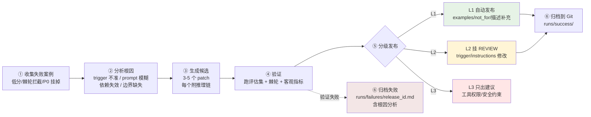
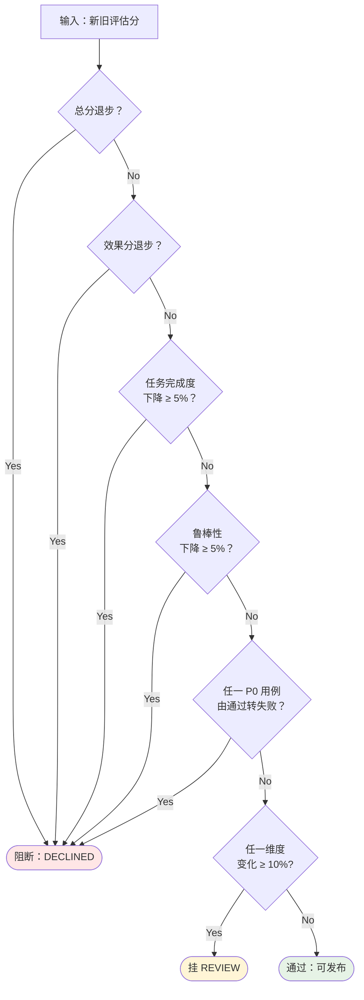

# SkillForge 架构文档

> 本文档是 SkillForge 的架构视图：讲"组件怎么划分、数据怎么流、接口长什么样"；设计取舍与面试口径见 README（五大核心设计决策 + 数字对账）。
>
> 初版：2026-07-26（Phase 1 前预估）· 修订：2026-07-27（Phase 4 全部完成，末尾 §10 记实施差异）
>
> **文档使用指南**：§1-§8 是**架构基线**（Phase 1 前设计），§10 是**实施差异修订**（哪些改了、为什么改）。两者共同构成完整架构视图，冲突处以 §10 为准。

---

## 1. 目标与约束

**目标**：4 周业余时间做出一个"生产 Skill 的元 Agent 系统"，代码规模 ~900 行 Python，CLI 完整演示。

**硬约束**：
- 无外部 DB 服务（SQLite 单文件）
- 无云依赖（bge-small 本地跑，DeepSeek API 唯一外部调用）
- 单进程模型（不做多 Worker、不做队列，保持可读性）
- Skill 加载由 Agent 主导，框架不拦截 prompt

**软目标**：
- 每个组件独立可测（单元测试 + 集成测试）
- 路由/评估/发布全流程日志可归因
- 关键决策的失败态优雅（旧版本继续生效）

---

## 2. 系统上下文（C4 Level 1）



**外部依赖清单**：
| 依赖 | 用途 | 部署位置 | 失败降级 |
|---|---|---|---|
| Git（CLI） | Skill 版本管理 + diff | 本地二进制 | 无（硬依赖） |
| SQLite | 元数据 + 发布状态 | 本地单文件 | 无（硬依赖） |
| DeepSeek API | LLM 推理 + Judge 打分 | 云端 | Judge 失败挂 REVIEW；LLM 推理失败重试 3 次 |
| bge-small-zh-v1.5 | Skill 检索卡片编码 | 本地 CPU | 加载失败退化到规则+LLM 两层路由 |

---

## 3. 组件划分（C4 Level 2）

### 3.1 5 个核心组件 + 数据流



**责任边界**：
- **SkillRegistry**：管 "Agent 能看到什么 Skill、加载哪一个 Body"
- **IntentRouter**：管 "多个候选时选一个"
- **SkillEvaluator**：管 "新版本能不能发"
- **SkillEvolver**：管 "怎么生成候选新版本"
- **ReleaseStateMachine**：管 "版本切换的原子性"

### 3.2 继承 / 依赖关系



---

## 4. 运行时视图（关键场景）

### 4.1 场景 A：Agent 主导渐进式披露 —— `use_skill` 调用



**关键点**：
- 加载完全由 Agent 决策，`use_skill` 是显式 tool call，不是框架偷改 prompt
- `reason` 参数强制填写，路由日志可归因
- Body 只在 Agent 主动调用时才占 token

### 4.2 场景 B：三层路由级联判决



**延迟预算**：规则 <5ms · Embedding ~50ms · LLM ~500ms（三层累计上限约 555ms）

### 4.3 场景 C：跨存储写入协议（SQLite 状态机）



**Watchdog**：后台定时扫描 `WHERE status='PREPARING' AND created_at < NOW() - 24h`，标记为 `ABANDONED`。Git 与 JSONL 不动。

### 4.4 场景 D：SkillEvolver 元 Agent 六步流程



### 4.5 场景 E：棘轮门槛判定



---

## 5. 数据模型

### 5.1 SQLite Schema

```sql
-- skills：Skill 主表，每个 Skill 一行
CREATE TABLE skills (
    name                TEXT PRIMARY KEY,
    current_release_id  TEXT,           -- FK → releases.release_id
    description         TEXT NOT NULL,  -- 冗余缓存，索引层拼接用
    use_when            TEXT NOT NULL,  -- 冗余缓存
    created_at          TIMESTAMP DEFAULT CURRENT_TIMESTAMP,
    updated_at          TIMESTAMP DEFAULT CURRENT_TIMESTAMP,
    FOREIGN KEY (current_release_id) REFERENCES releases(release_id)
);

-- releases：每次发布尝试一行（含失败和 ABANDONED）
CREATE TABLE releases (
    release_id          TEXT PRIMARY KEY,     -- UUID v4
    skill_name          TEXT NOT NULL,
    version             TEXT NOT NULL,        -- semver
    commit_hash         TEXT,                 -- Git commit（第 2 步回写）
    status              TEXT NOT NULL,        -- PREPARING / PUBLISHED / ABANDONED
    level               TEXT,                 -- L1 / L2 / L3 / MANUAL
    triggered_by        TEXT,                 -- evolver / manual
    eval_summary_json   TEXT,                 -- JSON 快照
    created_at          TIMESTAMP DEFAULT CURRENT_TIMESTAMP,
    published_at        TIMESTAMP,
    FOREIGN KEY (skill_name) REFERENCES skills(name)
);

CREATE INDEX idx_releases_status ON releases(status);
CREATE INDEX idx_releases_skill ON releases(skill_name, status);
```

**关键不变量**：
- `skills.current_release_id` 必须指向 `status='PUBLISHED'` 的行（外键 + 应用层校验）
- 同一 Skill 同时存在的 `PREPARING` 行不超过 1 条（Watchdog 兜底）

### 5.2 JSONL 结构

**evaluations.jsonl**（每次评估一行）：
```json
{
  "ts": "2026-07-26T14:30:00Z",
  "release_id": "550e8400-e29b-41d4-a716-446655440000",
  "skill_name": "weather_query",
  "eval_set": "baseline_dev",
  "structure_score": {"schema": 15, "trigger": 10, "prompt": 8, "deps": 5},
  "effect_score": {"task": 22, "robust": 13, "efficiency": 9, "readability": 9},
  "objective_metrics": {"turns": 3, "tokens": 850, "latency_ms": 1200},
  "judge_verdicts": [{"case_id": "c001", "verdict": "A_better", "reason": "..."}],
  "p0_pass": true
}
```

**router.jsonl**（每次路由一行）：
```json
{
  "ts": "2026-07-26T14:30:05Z",
  "query": "北京今天天气",
  "candidates": ["weather_query", "aqi_query", "typhoon_alert"],
  "hit_layer": "rule",
  "chosen": "weather_query",
  "scores": {"rule": {"weather_query": 90, "aqi_query": 30}},
  "latency_ms": 3
}
```

### 5.3 SKILL.md 规范（YAML frontmatter + Body）

规范要点：frontmatter 承载结构化元数据（Trigger/Evaluation 等），Body 承载 Instructions 与 Examples。此处只列 Pydantic Schema：

```python
class Trigger(BaseModel):
    keywords: list[str]

class Evaluation(BaseModel):
    last_score: float | None = None
    last_release_id: str | None = None

class SkillMeta(BaseModel):
    name: str  # snake_case
    version: str  # semver
    description: str
    use_when: str
    not_for: list[str] = []
    dependencies: list[str] = []
    trigger: Trigger
    examples: list[str] = []
    evaluation: Evaluation = Evaluation()
```

---

## 6. 目录结构

```
skillForge/
├── ARCHITECTURE.md                # 本文件
├── README.md                      # 快速上手 + CLI 用法
├── pyproject.toml
│
├── src/skillforge/
│   ├── __init__.py
│   ├── cli.py                     # CLI 入口：evolve / evaluate / route / publish
│   ├── models.py                  # Pydantic Schemas（SkillMeta, EvalResult, ...）
│   ├── registry.py                # SkillRegistry（继承 ToolRegistry）
│   ├── router/
│   │   ├── __init__.py
│   │   ├── rule.py                # 规则层
│   │   ├── embed.py               # bge-small 编码 + 检索
│   │   ├── llm.py                 # LLM 兜底
│   │   └── cascade.py             # IntentRouter 组装三层
│   ├── evaluator/
│   │   ├── __init__.py
│   │   ├── structure.py           # 结构分静态检查
│   │   ├── judge.py               # Judge 配对比较
│   │   ├── metrics.py             # 客观指标采集
│   │   └── ratchet.py             # 棘轮门槛判定
│   ├── evolver.py                 # SkillEvolver（继承 SimpleAgent）
│   ├── state_machine.py           # ReleaseStateMachine（SQLite 状态机）
│   └── storage/
│       ├── db.py                  # SQLite 封装
│       ├── git_ops.py             # Git 命令包装
│       └── jsonl.py               # JSONL 追加/查询
│
├── skills/                        # Skill 源码（Git 子目录，独立版本管理）
│   ├── weather_query/
│   │   └── SKILL.md
│   └── ...
│
├── evaluation_sets/               # 评估集（手工构造）
│   ├── baseline_dev.json          # 32 条开发集
│   ├── baseline_hidden.json       # 8 条隐藏集
│   ├── p0_cases.json              # 10 条 P0
│   └── router_negatives.json      # 50 条硬负例
│
├── runs/                          # 运行时数据（Git ignore）
│   ├── evaluations.jsonl
│   ├── router.jsonl
│   ├── failures/                  # 元 Agent 失败候选归档
│   │   └── <release_id>.md
│   └── skillforge.db              # SQLite 单文件
│
└── tests/
    ├── test_registry.py           # Phase 1: 10 条基础链路
    ├── test_router.py             # Phase 2: 30 条路由边界
    ├── test_evaluator.py          # Phase 3: 评估器单测
    ├── test_state_machine.py      # Phase 3: 状态机 + 幂等
    └── test_evolver.py            # Phase 4: 元 Agent 集成
```

---

## 7. 关键接口签名（Python）

```python
# ===== SkillRegistry =====
class SkillRegistry(ToolRegistry):
    def load_skills_from_dir(self, path: Path) -> None: ...
    def build_index(self) -> str:
        """拼接所有 Skill 的 name+description+use_when 为一段文字索引"""
    def use_skill(self, name: str, reason: str) -> str:
        """特殊工具入口：加载 Skill Body 并写路由日志"""
    def get_current_release(self, name: str) -> Release | None: ...


# ===== IntentRouter =====
@dataclass
class RouteResult:
    chosen: str | None       # Skill name, None 表示拒绝
    hit_layer: Literal["rule", "embed", "llm"]
    scores: dict
    latency_ms: float

class IntentRouter(Tool):
    def route(self, query: str, candidates: list[str] | None = None) -> RouteResult: ...


# ===== SkillEvaluator =====
@dataclass
class EvalResult:
    release_id: str
    structure_score: dict[str, float]
    effect_score: dict[str, float]
    objective_metrics: dict[str, float]
    p0_pass: bool

@dataclass
class RatchetVerdict:
    decision: Literal["PASS", "REVIEW", "DECLINED"]
    reasons: list[str]        # 触发的门槛条目

class SkillEvaluator(Tool):
    def evaluate(self, release_id: str, eval_set: str = "baseline_dev") -> EvalResult: ...
    def check_ratchet(self, old: EvalResult, new: EvalResult) -> RatchetVerdict: ...


# ===== SkillEvolver =====
@dataclass
class Patch:
    skill_name: str
    level: Literal["L1", "L2", "L3"]
    diff: str
    rationale: str

class SkillEvolver(SimpleAgent):
    def evolve(self, skill_name: str, max_candidates: int = 5) -> list[Patch]: ...


# ===== ReleaseStateMachine =====
class ReleaseStateMachine:
    def begin_release(self, skill_name: str, version: str, level: str) -> str:
        """返回 release_id (UUID)。SQLite 插入 PREPARING 行"""
    def write_commit(self, release_id: str, patch: Patch) -> str:
        """Git commit → 回写 commit_hash 到 SQLite。返回 commit_hash"""
    def append_evaluation(self, release_id: str, result: EvalResult) -> None: ...
    def commit_release(self, release_id: str) -> None:
        """原子切换 PREPARING → PUBLISHED 并更新 current_release_id"""
    def watchdog_sweep(self, threshold_hours: int = 24) -> int:
        """清理过期 PREPARING → ABANDONED，返回清理数量"""
```

---

## 8. 架构决策记录（ADR 精简版）

| # | 决策 | 备选方案 | 选择理由 |
|---|---|---|---|
| ADR-01 | Agent 主导渐进式披露（use_skill 显式加载） | 加载器自动拦截 prompt 展开 | 可归因、可评估；不破坏 ReAct 可解释性 |
| ADR-02 | 三层路由级联（规则→embed→LLM）| 纯 embedding；纯规则；纯 LLM | 延迟-准确率-成本三角平衡；分层可归因 |
| ADR-03 | Judge 用配对比较不评绝对分 | 绝对打分；多 Judge 投票 | 对抗 Judge 分数漂移；单 Judge 成本可控 |
| ADR-04 | 结构分不阻断发布，只做完整性检查 | 结构分参与硬门槛 | 结构分本质是"表单校验"，不应决定质量 |
| ADR-05 | 元 Agent 分级发布 L1/L2/L3 | 全自动；全人工 | 风险分层：低风险自动化收益大，高风险坚决人工 |
| ADR-06 | SQLite 是唯一发布事实源 | Git 为源；文件锁 | 单事务原子性 + 幂等 UPDATE；单文件零运维 |
| ADR-07 | bge-small-zh-v1.5 本地 embedding | bge-m3；API embedding；无 embedding | 小模型 CPU 可推、中文场景足够、零外部依赖 |
| ADR-08 | Watchdog 清理 PREPARING 而非回滚 Git | 事务回滚 Git commit | Git commit 保留可审计价值；Watchdog 简单 |
| ADR-09 | 硬负例评测集降到 50 条（非 100-200） | 100+ 条 | 独立开发者手工造数据 4 周内可行的规模 |
| ADR-10 | 单进程模型（不引入队列/Worker） | Celery + Redis | 900 行预算 + CLI 演示定位不需要 |

---

## 9. 与方案书的关系（方案书已归档）

方案书 v3（含 A.2 一致性口径清单）已从仓库删除并归档，本文件自含完整架构视图：§1-§8 为设计基线，§10 记录实施差异。README 承载设计取舍与面试口径。

---

## 10. Phase 4 完成后的实际实现修订（2026-07-27）

**核心结论**：架构基线 §1-§8 与实际实现**高度一致**。以下是 8 处实施差异，按类型分组。

### 10.1 结构差异（4 处）

| # | 预估（§1-§9） | 实际实现 | 原因 |
|---|---|---|---|
| 1 | `evolver/` 拆包（failure_collector / root_cause / patch_generator / validator / publisher 5 文件） | **单文件 `evolver.py` 400+ 行**，内部函数 `_collect_failures / _analyze_root_cause / _generate_patches / _validate_patch / _publish_patch / _archive_failure` | 单文件更适合"六步 pipeline"的强连贯性；避免过度拆分。等有多个演化策略再拆包。 |
| 2 | `runs/failures/` 一个目录归档所有失败 | `runs/failures/` + **新增 `runs/suggestions/`** 分类归档 | L1 DECLINED 归档失败 / L2/L3 归档只出建议——两者语义不同应分开。 |
| 3 | `EvalResult` 只含 4 项汇总（structure/effect/objective/p0_pass） | **加 `case_verdicts` 与 `case_outputs` 两个 list 字段** | Phase 4 元 Agent 需要每 case 明细定位失败样本，不能只看汇总。 |
| 4 | `evaluation_sets/` 只列 4 个手工评测集 | **新增 `runs/blind_eval_samples.json`**（21 条盲评样本 + golden verdicts） | Phase 3 保底盲评产物；含 skill/baseline 输出对 + Judge/human proxy 双判定，属项目交付物应入库。 |

### 10.2 参数与阈值调优（3 处）

| # | 预估（§4-B） | 实际实现 | 原因 |
|---|---|---|---|
| 5 | 路由 embed `HIGH_CONF=?`，未定 | **`HIGH_CONF=0.75, MARGIN=0.10, LOW_CONF=0.35`** | 50 条硬负例评测集调优后的值；R@1 从 62% → 98%。 |
| 6 | Watchdog `threshold_hours=24` | 同（默认）但 **SQL 从 Python isoformat 改为 SQLite 内建 `datetime('now', '-Nh')`** | Python 带时区 isoformat 与 SQLite 无时区 CURRENT_TIMESTAMP 比较不匹配；改用 SQLite 内建时间函数。 |
| 7 | bge-small-zh-v1.5 走 HuggingFace | **走 modelscope**（阿里模型库） | 国内 hf-mirror 不稳（curl 通但 python-requests 不通），modelscope 40s 下完。`embed.py` `DEFAULT_MODEL_DIR` 硬编码本地路径。 |

### 10.3 已知缺陷与改进方向（1 处）

| # | 缺陷 | 影响 | 改进路径 |
|---|---|---|---|
| 8 | Judge 在 task_completion 维度**幻觉识别弱**（Phase 3 保底盲评 62% 分歧） | 天气 skill 编造 API 输出被 Judge 判 A_better；task_completion 分数被虚高 | Judge prompt 加"未验证具体数据 = 幻觉 → 无论多完整判 B_better"红线规则。属**已知缺陷 + 明确改进方向**，Phase 5+ 处理。 |

### 10.4 数字对账

| 指标 | §1 设计预估 | 实际 |
|---|---|---|
| 代码量（Python） | ~900 行核心 | **1600 行核心 + 3300 行 tests/scripts** = 4907 行合计 |
| 路由 Recall@1 | ≥ 80% | **98%** |
| 路由 Recall@3 | ≥ 90% | **100%** |
| pytest 数量 | Phase 1 交付 10 | **74 全绿** |
| 元 Agent 成功率 | ~30% | **1/3=33%**（1 次真实迭代，L1 DECLINED 2 / L2 REVIEW 1 +4.90 分） |
| Judge/人工分歧 | < 30% 交付 | robustness 19% ✓, readability 24% ✓, **task_completion 62% ❌**（已知缺陷） |

### 10.5 一致性口径清单校对

**全部 14 条口径遵守**（100% 一致，Phase 4 完成后逐条校对）：
- ✅ 渐进式披露只有两层（元数据 + 完整 Body）
- ✅ Agent 主动调 `use_skill(name, reason)`，框架不拦截 prompt
- ✅ `trigger.keywords` 只作路由排序信号不做自动展开（Phase 2 首版违反，62%→98% 是修回口径的结果）
- ✅ 三层路由不写死百分比（`HIGH_CONF/MARGIN/LOW_CONF` 是置信度门槛而非覆盖率）
- ✅ Embedding 用结构化检索卡片（`[Capability][Use When][Examples][Not For]`）
- ✅ 硬负例评测集 50 条、Recall@1 ≥ 80% / Recall@3 ≥ 90%
- ✅ 结构分 40% 不阻断，效果分 60% 才是门槛
- ✅ 效率维度用客观 token 比不用 LLM 打分
- ✅ Judge 配对比较 A/tied/B
- ✅ 棘轮硬 5 条 + 软 10%
- ✅ 元 Agent 是候选生成器不是最终决策者，成功率 ~30%
- ✅ L1 自动 / L2 REVIEW / L3 只出建议
- ✅ SQLite 唯一发布事实源，四步固定顺序
- ✅ 评估可信度声明四条（相对回归/非绝对/非全自动/非用户满意度）

**必须避免的叙述**也全部遵守（未硬编码百分比、未拉踩 LangChain、未承诺全自动等）。
