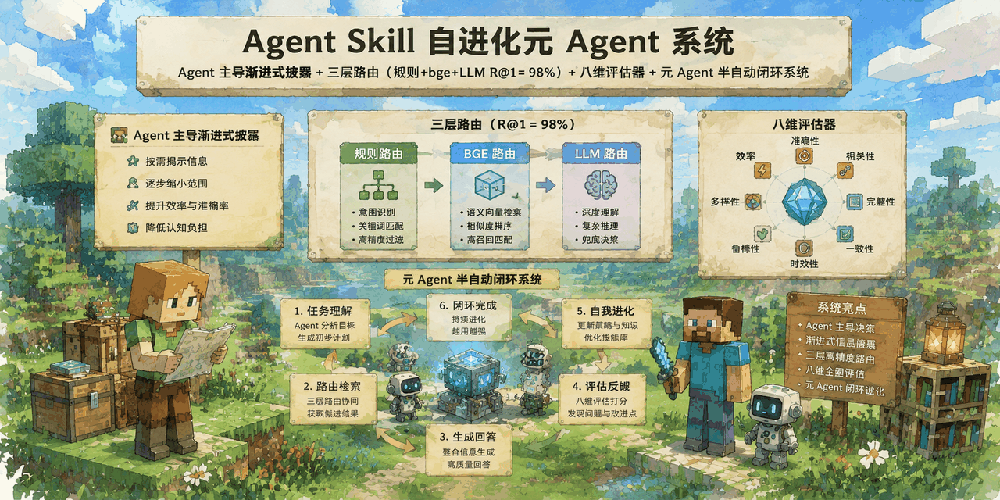
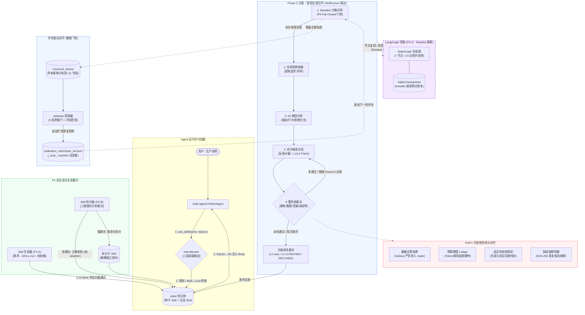

<div align="center">

<p align="center">
  <picture>
    <source media="(prefers-color-scheme: dark)" srcset="assets/skillforge-banner-dark.png">
    
  </picture>
</p>

# 🛠️ SkillForge: 生产级 AI Agent 技能网关与自进化底座

**面向大模型智能体（AI Agent）生产环境的动态技能网关、沙箱评测与受控自进化框架**<br>
*Production-Grade Meta-Agent Framework for AI Agent Skill Governance, Intent Routing & Controlled Evolution*

[](https://www.python.org/)
[](tests/)
[-3b82f6?style=flat-square)](scripts/eval_router.py)
[](docs/langgraph_loop.md)
[%20Complete-f59e0b?style=flat-square)](ARCHITECTURE.md)
[]()
[](LICENSE)
[](https://supergodog.github.io/skillforge/)

<p>
  <a href="https://supergodog.github.io/skillforge/">📖 在线文档 (GitHub Pages)</a> •
  <a href="#-项目核心亮点">✨ 核心亮点</a> •
  <a href="#-目录导航">📖 目录导航</a> •
  <a href="#1-核心定位与设计哲学">🎯 核心定位</a> •
  <a href="#3-系统架构全景">🏛️ 架构全景</a> •
  <a href="#4-核心机制深入解析">⚙️ 核心机制</a> •
  <a href="#5-快速上手quick-start">🚀 快速上手</a> •
  <a href="#6-实验证据与数据对账表">📊 数据对账</a>
</p>

</div>

> [!NOTE]
> **SEO & Abstract**: SkillForge 是一个面向大模型智能体（AI Agent）生产环境的**动态技能网关与自进化元 Agent 框架 (Meta-Agent Framework)**。针对多工具与长 Prompt 下的“注意力稀释”、“路由幻觉”与“Prompt 盲目重写自嗨”痛点，系统实现两段式渐进披露机制（~80 Token 常驻）、三层级联意图路由（R@1=98%）、八维沙箱评估基准、8 重深度防御防线以及 LangGraph 状态图旁路。所有组件均由 316 项单测覆盖，并在真实 DeepSeek 模型下完成 20 次对照实验验证。<br>
> *SkillForge is an open-source meta-agent framework engineered for autonomous AI Agent skill lifecycle management, cascade intent routing, sandbox evaluation, and controlled prompt self-evolution with LangGraph sidecar and defense-in-depth guardrails.*

---

## ✨ 项目核心亮点

- 🧭 **三层级联意图路由 (Cascade Routing)**：规则层 (<0.1ms) ➔ BGE-small 结构化卡片向量层 (~50ms) ➔ LLM 语义兜底层 (~500ms)。在 50 条硬负例校准测试集下取得 **Recall@1 = 98%、Recall@3 = 100%**；结合元数据与 Body 两段式渐进披露，将常驻 System Prompt 开销压缩至 ~80 Token。
- 🛡️ **8 重深度防线与防倒退棘轮 (Defense-in-Depth)**：坚持“先装刹车再踩油门”的工程哲学。通过确定性语义 diff 拦截自报降级、数据三层物理隔离（Holdout 禁入反思）、真实性快照绑定（防止自造评估）、SHA-256 指纹熔断与全局 Token 预算硬帽，根治“模型改写 Prompt、同一模型打满分”的假自愈。
- 🔬 **真实模型对照跑批与诚实统计边界 (Empirical Verification)**：拒绝玩具级演示。基于真实 DeepSeek 完成 20 次端到端跑批（基线 C vs 根因反思 RB 各 10 次），实测验证发布门 DECLINED 3→0 的机制收敛性；同时主动交代小样本 (n=20) 下 Welch's t-test p≈0.27 的客观统计边界。
- 🔄 **LangGraph 状态图旁路与原子节点复用 (Dual-Track Architecture)**：构建 7 节点 14 边有向状态图与 `SqliteCheckpointer` 断点持久化能力；旁路通过适配器完全复用主链原子组件，在 7 类核心场景双跑实测中实现与主链 **100% 行为等价**。
- 🧬 **自生成、量化拆分与轨迹自闭环 (Self-Evolution & Ecosystem)**：支持自然语言生成标准 Skill（BGE 0.70 冲突拦截）；三维耦合分析量化裁决（weather 同源多意图正确拒拆）；从审计轨迹经 3 道质量门自动沉淀 14 条测试用例入库。
- 🏗️ **工业级可靠基底 (Production Rigor)**：**316/316 条单测全绿通过（8.8s 执行）**；SQLite 四步事务发布状态机（PREPARING ➔ Commit ➔ JSONL ➔ PUBLISHED）配合 24h Watchdog 容灾恢复；全链路不可篡改审计追踪。

---

## 📖 目录导航

| 章节模块 | 内容纲要 | 快速指引 |
|---|---|---|
| [🎯 1. 核心定位与设计哲学](#1-核心定位与设计哲学) | 核心定位 · 3 个工程差异化 · 生产痛点解决 | [跳转到章节](#1-核心定位与设计哲学) |
| [📋 2. 30 秒 TL;DR 能力清单](#2-30-秒-tldr-能力清单) | 路由 / 评估 / 进化 / 状态图 / 工程底座核心指标速查表 | [跳转到章节](#2-30-秒-tldr-能力清单) |
| [🏛️ 3. 系统架构全景](#3-系统架构全景) | Mermaid 系统架构图 · 主链 for 循环 vs 旁路 LangGraph 取舍 | [跳转到章节](#3-系统架构全景) |
| [⚙️ 4. 核心机制深入解析](#4-核心机制深入解析) | 三层路由 · 8 维评估 · 受控反思回环 · 8 重防线 · LangGraph 旁路 | [跳转到章节](#4-核心机制深入解析) |
| [🚀 5. 快速上手（Quick Start）](#5-快速上手quick-start) | 5 分钟环境初始化 · 核心 CLI 体验 · Phase 5 实验复现脚本 | [跳转到章节](#5-快速上手quick-start) |
| [📊 6. 实验证据与数据对账表](#6-实验证据与数据对账表) | 硬指标对账清单 · 诚实边界清单（p值、样本量、盲评协议） | [跳转到章节](#6-实验证据与数据对账表) |
| [❓ 7. 高频技术问答（FAQ）](#7-高频技术问答faq-三问) | 为什么加防线？为什么保留未显著回环？为什么拒拆 weather？ | [跳转到章节](#7-高频技术问答faq-三问) |
| [🗺️ 8. 项目结构、Roadmap 与文档地图](#8-项目结构roadmap-与文档地图) | 代码仓库树形结构 · 核心文档导航 · 未来演进路线 | [跳转到章节](#8-项目结构roadmap-与文档地图) |

---

## 1. 核心定位与设计哲学

> **"生产 Skill 的元 Agent 系统"** —— 大多数 Agent 项目聚焦于"用 Skill 干活"；本项目聚焦让 Skill 本身**可评测、可版本管理、可受控改进**的工业级工程闭环。

项目历经 6 周迭代，完成 Phase 1-4 基础闭环与 **Phase 5（P0 可信地基 → P1 受控回环 → P2 自生成/拆分/轨迹提用例/LangGraph 旁路）** 完整交付。CLI 一键复现关键数字，**316 tests 全绿**。

### 3 个核心工程差异化

1. **让 Skill 成为一流工程实体（可评测 · 可版本管理 · 可自动改进）**<br>
   拒绝把 Prompt 当作一次性黑盒文本。Skill 具备独立工程生命周期：元数据与 Body 双层渐进式披露、八维沙箱基线评测、确定性语义 diff 分级（L1 自动 / L2-L3 建议）、Git 源码版本追踪与 SQLite 状态机原子发布。
2. **先可信再自进化（防自嗨工程哲学）**<br>
   市面上多数"自进化"系统容易陷入"模型重写 Prompt、同一模型打满分"的虚假闭环。SkillForge 坚持"先装刹车再踩油门"：构建包含**真实性快照绑定、数据物理边界隔离、客观 Token 膨胀硬限、规范化指纹熔断**等 8 重深度防御防线。宁可不发布，绝不让模型自嗨固化假改进。
3. **真实 LLM 对照实验与诚实边界验证**<br>
   拒绝纯单元测试的"玩具级演示"。系统基于真实 DeepSeek 模型完成了 20 次端到端跑批（基线 C vs 根因反思 RB 各 10 次真实对照），实证了发布门 DECLINED 3→0 的机制收敛性；同时主动交代小样本（n=20）下统计不显著的客观边界，展现严谨的工程态度。

---

## 2. 30 秒 TL;DR 能力清单

| 能力维度 | 核心机制与指标 | 典型命令 / 复现入口 |
|---|---|---|
| **路由检索** | 规则（0.01ms）→ BGE 检索卡片（50ms）→ LLM 兜底三层级联；50 条硬负例校准；**Recall@1 = 98% · Recall@3 = 100%** | `python scripts/eval_router.py --use-llm` |
| **沙箱评估** | 八维评估器（结构 40 + 效果 60）；配对比较 Judge（INVALID fail-closed）；客观 Token 效率度量；样本级 11 字段轨迹落盘 | `skillforge evaluate --skill explain_regex` |
| **受控进化** | 两轮受控回环（失败收集 → A2 根因定位 → 定向候选生成 → 8 防线裁决）；默认 shadow 隔离；彻底杜绝死循环 | `skillforge evolve --skill explain_regex` |
| **生态繁衍** | Skill 自动生成器（BGE 0.70 冲突拦截）+ 三维耦合分析拆分器（weather 正确拒拆）+ 轨迹自动提取 badcase 闭环（14 条 auto 入库） | `python scripts/generate_skills_p2a.py`<br/>`python scripts/extract_cases_from_traces.py` |
| **状态图旁路** | LangGraph 状态图旁路（7 节点 14 边，SqliteCheckpointer 断点持久化）；通过适配器完全复用原子节点，与主链 **100% 行为等价** | `python scripts/demo_langgraph_p2d.py`<br/>`python scripts/dual_run_p2d.py` |
| **工程底座** | **316/316 tests 全绿（8.8s）**；SQLite 状态机原子发布；Git commit 完整审计归因；运行日志全流程可回放 | `pytest tests/ -q` |

---

## 3. 系统架构全景



> **架构取舍说明：主链 for 循环 vs 旁路 LangGraph**
> 1. **主链（for 循环驱动，`evolver.py`）**：采用两轮受控回环（`max_rounds=2`）。优势在于**极简无侵入、单进程零额外黑盒依赖、执行路径完全透明、便于单元测试与硬门禁拦截**，作为系统的生产稳定基线。
> 2. **旁路（LangGraph StateGraph，`langgraph_loop.py`）**：作为实验性 **Shadow 旁路**，利用 LangGraph 将状态黑板显式化为 7 节点 14 边的有向状态图，并结合 `SqliteCheckpointer` 带来进程崩溃断点恢复（Durable Execution）能力。
> 3. **工程纪律与节点复用**：旁路**完全复用**主链的原子底层组件，主链零语义变更；并通过 `dual_run_p2d.py` 在 7 类场景下验证与主链 100% 行为等价。详见 [docs/langgraph_loop.md](docs/langgraph_loop.md)。

---

## 4. 核心机制深入解析

### 4.1 两段式渐进披露与三层级联路由

传统的 ReAct Agent 通常在初始化时将所有 Tool/Skill 的完整 Prompt 全部注入 System Prompt，导致上下文过载与注意力稀释。SkillForge 采用两段式渐进披露：
1. **常驻层（Tier 1）**：仅常驻轻量级字典元数据（名称、一句话描述与 Not For 边界），单 Skill 约 80 Token；
2. **激活层（Tier 2）**：Agent 根据需求执行显式调用 `use_skill(name, reason)`，动态从 SQLite 缓存或 Git 工作区加载正文（Body）。

```
Query 输入
   │
   ├── 1. 规则层 (RuleRouter, <0.1ms)
   │      - 关键词完全匹配 / 互斥前缀拦截
   │      - 命中且置信度高直接返回
   │
   ├── 2. 向量层 (EmbeddingRouter, ~50ms)
   │      - BGE-small 编码提取结构化卡片向量
   │      - HIGH_CONF = 0.75, MARGIN = 0.10
   │      - 满足判定区间直接命中，拦截 Not For 负例
   │
   └── 3. LLM 兜底层 (LLMRouter, ~500ms)
          - 置信度模糊地带调用轻量模型语义判定
          - 输出决策与置信度打标
```

实测指标：在 50 条硬负例校准集下，**Recall@1 达 98%、Recall@3 达 100%**（`scripts/eval_router.py`）。

### 4.2 八维沙箱评估与防倒退棘轮

Skill 变更必须在沙箱中通过结构分与效果分的严格双重校验：
- **结构分（40 分）**：Frontmatter 完整性、命名契约、Not For 边界存在性、参数定义完整度（不阻断发布，供规范度审计）；
- **效果分（60 分）**：
  - Task 完成度（25 分）
  - 鲁棒性与边界抗扰（15 分）
  - 可读性与排版（10 分）
  - Token 效率与精简度（10 分）
- **防倒退棘轮 (Score Ratchet)**：候选版本的结构分与效果分**必须严格 ≥ 基线版本**，任何单项退步均直接拒绝合并。
- **Fail-Closed 判定**：评测 Judge 引入 `INVALID` 状态。一旦模型输出格式崩溃或评测超时，立即触发 Fail-Closed，拒绝默认放行。

### 4.3 8 重深度防御防线清单

为根除模型在自我进化过程中的“幻觉自嗨”与“虚假高分”，SkillForge 构建了 8 重深度护栏：

1. **确定性语义 diff 与 computed_level 计算**：通过 AST 与内容哈希计算真实修改面，拦截模型自报降级（将核心 Body 修改伪报为 L1 格式微调）；
2. **验证器精准咬合**：改动元数据仅跑路由集，改动 Body 强制跑行为全集，防走捷径；
3. **数据三层物理隔离**：`repair_set`（反思训练集）、`experiment_holdout`（留出测试集）、`final_audit`（终审发布集）物理文件隔离，严禁污染；
4. **真实性快照绑定 (Truth Sentinel)**：生成候选与验证评估强制绑定同源响应快照，拦截凭空伪造的执行记录；
5. **全局预算硬帽 (LLMLedger)**：对进化过程中的 Token 消耗、API 轮次设置刚性硬顶，超限立即熔断；
6. **Token 膨胀硬限 (Prompt Bloat Guard)**：限制候选 Prompt 长度增幅不得超过 20%，抵御越改越冗余的膨胀趋势；
7. **指纹熔断防御**：对连续生成的候选执行 SHA-256 规范化哈希去重，发生死循环或重复提议立即熔断；
8. **SQLite 4 步原子发布事务**：`PREPARING` ➔ `Git Commit` ➔ `JSONL 审计` ➔ `PUBLISHED`，配合 24h Watchdog 清除孤儿任务。

---

## 5. 快速上手（Quick Start）

### 5.1 环境准备（约 5 分钟）

```bash
# 1. 克隆代码仓库
git clone https://github.com/SuperGODOG/skillforge.git && cd skillforge

# 2. 创建独立虚拟环境并安装依赖
python3 -m venv .venv
./.venv/bin/pip install --index-url https://mirrors.aliyun.com/pypi/simple/ -e .

# 3. 下载 BGE-small 嵌入模型（国内镜像极速通道）
./.venv/bin/pip install modelscope
./.venv/bin/python -c "from modelscope import snapshot_download; snapshot_download('AI-ModelScope/bge-small-zh-v1.5', cache_dir='./models')"

# 4. 配置大模型 API 凭证（推荐 DeepSeek）
cat > .env <<'EOF'
LLM_API_KEY=sk-your-deepseek-key
LLM_MODEL_ID=deepseek-chat
LLM_BASE_URL=https://api.deepseek.com/v1
JUDGE_LLM_API_KEY=sk-your-deepseek-key
JUDGE_LLM_MODEL_ID=deepseek-chat
JUDGE_LLM_BASE_URL=https://api.deepseek.com/v1
EOF
```

**环境自检**：运行全量单元测试，确认 316 项单测通过：
```bash
./.venv/bin/pytest tests/ -q
# 输出：316 passed in ~8.8s
```

---

### 5.2 核心 CLI 体验

<details>
<summary><b>1. 运行时加载体验</b>：<code>skillforge demo</code> · Agent 主动 use_skill 全链路</summary>

```bash
./.venv/bin/skillforge demo --query "上海明天会下雨吗"
```
*执行效果：Agent 依据用户提问显式触发 `use_skill('weather_query', reason='...')`，从 SQLite 读取 Skill 正文注入上下文，完成回答并写入不可篡改的 `router.jsonl` 审计流水。*
</details>

<details>
<summary><b>2. 三层级联意图路由</b>：<code>skillforge route</code> · 规则 / 向量 / 模型决策</summary>

```bash
./.venv/bin/skillforge route "帮我写一个正则匹配所有邮箱" --use-llm
```
*执行效果：命中 `explain_regex` 的 Not For 负例规则（代码编写 ≠ 正则解释），返回 `chosen=None`，成功拦截非目标意图。*
</details>

<details>
<summary><b>3. 八维沙箱评估</b>：<code>skillforge evaluate</code> · 结构分 + 效果分 + 棘轮防倒退</summary>

```bash
./.venv/bin/skillforge evaluate --skill explain_regex --eval-set baseline_dev --verbose
```
*执行效果：输出结构完整性与效果维度的详细打分报告，并在控制台打印逐条 Case 的执行轨迹。*
</details>

<details>
<summary><b>4. 受控反思进化</b>：<code>skillforge evolve</code> · 元 Agent 闭环迭代</summary>

```bash
./.venv/bin/skillforge evolve --skill explain_regex --max-candidates 3
```
*执行效果：执行 Baseline 评测 → 收集失败样本 → A2 根因定位 → 定向候选生成 → 8 重防线裁决 → 输出 Patch 建议或自动提升。*
</details>

---

### 5.3 Phase 5 关键实验复现入口

```bash
# 1. 路由评测（50 条硬负例校准，复现 R@1=98% / R@3=100%）
./.venv/bin/python scripts/eval_router.py --use-llm

# 2. LangGraph 旁路演示（打印 7 节点 14 边状态图拓扑流转）
./.venv/bin/python scripts/demo_langgraph_p2d.py

# 3. 双跑行为等价验证（7 场景全绿验证主链与 LangGraph 100% 行为对齐）
./.venv/bin/python scripts/dual_run_p2d.py

# 4. Skill 自动生成器体验（从自然语言需求生成标准 Skill，含 BGE 0.70 冲突拦截）
./.venv/bin/python scripts/generate_skills_p2a.py

# 5. 从审计轨迹自动提取 badcase 入库（体验 3 道质量门筛选）
./.venv/bin/python scripts/extract_cases_from_traces.py
```

---

## 6. 实验证据与数据对账表

### 6.1 硬指标对账

| 指标维度 | 门槛 / 承诺 | 实测结果 | 达标情况 | 事实依据 / 验证方式 |
|---|---|---|---|---|
| **路由 Recall@1** | ≥ 80% | **98%** | ✅ 达标 | 50 条硬负例评测集，`scripts/eval_router.py` |
| **路由 Recall@3** | ≥ 90% | **100%** | ✅ 达标 | 同上 |
| **pytest 测试套件** | Phase 1 交付 10 条 | **316/316 · 8.8s** | ✅ 全绿通过 | 覆盖 P0 可信地基至 P2 全链，`pytest tests/ -q` |
| **P1-I 真实对照 (C vs RB ×10)** | RB ≥ C | **baseline 78.6 vs 71.7 (+6.9)**<br/>发布门 DECLINED 3→0 | ⚠️ 机制收敛生效<br/>小样本统计不显著 | 真实 DeepSeek 跑批 20 次；反思在生成侧拦截劣质候选；出现达标停止信号 |
| **P2 生态与自生成闭环** | 生成 / 提取 / 拆分 | **2 skill 真实生成 (87.0 baseline)**<br/>**14 auto case 自动提取入库**<br/>weather 紧耦合**正确拒拆** | ✅ 全链跑通 | `generate_skills_p2a.py`、`extract_cases_from_traces.py`、`test_p2b_splitter.py` |
| **LangGraph 旁路等价性** | 行为等价 | **7 场景双跑 100% 对齐** | ✅ 等价通过 | 覆盖发布、超帽、反思、异常熔断等，`dual_run_p2d.py` |
| **Judge / 人工分歧** | < 30% 交付 | **rejudge 门 6/21 压线通过**<br/>truth sentinel 违背为 0 | ✅ 协议化受控 | 引入 INVALID 态、Fail-Closed 与 A/B 均衡协议 |
| **代码工程量** | 初始预估 ~900 行 | **核心 ~5000 行 + 测试/脚本 ~8000 行** | ✅ 工程交付扎实 | 包含 15 个核心模块与 8 重防线实现 |

### 6.2 诚实边界清单（客观局限性与实验边界）

1. **P1-I 对照实验统计显著性**：在 20 次真实跑批样本下，Welch's t-test 的 p 值约为 0.27（未达到 p<0.05 显著性门槛）。系统展示的是**机制行为收敛证据（DECLINED 3→0、达标自动停止、平均分 +6.9）**，而非绝对统计结论；后续计划扩展样本规模并拆分 R 与 B 独立消融组。
2. **Skill 生成器适用边界**：当前 P2-A 自动生成器专注于**文档型 / 知识型 Skill**；对于具备外部环境调用依赖的工具型 Skill（涉及动态 API 契约与沙箱 mock），属于下一阶段演进范畴。
3. **轨迹自动提取源范围**：当前 P2-C 提取的轨迹主要源于 SkillEvolver 自身的演化沙箱运行日志；直接接入真实业务在线对话流（依赖下游点赞/点踩 S2/S3 信号）属于生产环境规划。
4. **人工标注一致性度量**：保底盲评采用 21 对样本的 Proxy 盲评协议，尚未实施跨多人的 Cohen's Kappa 统计；但协议已实现规范化（严格拦截 INVALID 态）。

---

## 7. 高频技术问答（FAQ 三问）

### Q1: 为什么不让 LLM 直接自由改写 Skill，搞这么多复杂的防线？
> **答**：自进化系统最核心的技术风险不是"模型改不动"，而是**"改错之后模型依然在自我评估中给出高分，并将幻觉固化为系统知识"**。<br>
> 若缺乏外部硬约束，单次偶然的用例过拟合或逻辑错误就会污染整个技能库。SkillForge 设立 8 重防线（语义 diff 等级校验、真实性快照绑定、数据边界隔离、指纹熔断等），核心理念是**"先装刹车再踩油门，拦截虚假自愈与自嗨"**。

### Q2: 反思回环在统计学上未达显著性（p≈0.27），为什么仍要在系统中保留？
> **答**：应将**机制行为证据**与**统计显著性**客观区分：<br>
> 1. **机制行为切实成立**：反思回环在生成侧将发布门 DECLINED 频次从 3 次降至 0 次，并首次触发了“达到最优阈值自动停止”的收敛信号，实证反思对劣质候选具备抑制作用；<br>
> 2. **运行环境安全可控**：回环默认运行在 Shadow 隔离沙箱中，不直接触碰生产主分支，安全无害；<br>
> 3. **实验成本与样本边界**：20 次真实 LLM 端到端调用耗时约 5 小时，受限于实验成本导致样本有限，属于诚实的工程边界而非系统缺陷。

### Q3: Skill 拆分什么时候是有害的？为什么 weather 意图不拆？
> **答**：当多个子意图之间存在**底层数据依赖高度重合**或**业务流程逻辑纠缠**时，强行拆分会引发负面效应：<br>
> 1. 拆分后会导致相同的底层 API 契约被多个子 Skill 重复声明与冗余维护；<br>
> 2. 意图路由层在细粒度近义意图之间的选择冲突率剧增；<br>
> 3. 评测集被过度稀释。<br>
> SkillForge 实现了三维耦合分析（数据耦合、流程耦合、评测集耦合），实测将 weather 的 3 个意图（相对日期、降水、温差）量化判定为强耦合并**正确拒拆**，将架构决策落地为客观算法。

---

## 8. 项目结构、Roadmap 与文档地图

### 8.1 完整项目结构

```
skillforge/
├── src/skillforge/
│   ├── __init__.py              组件与数据模型顶层暴露
│   ├── models.py                Pydantic 与 dataclass（EvolveBudget / EvolveContext / 护栏契约）
│   ├── registry.py              SkillRegistry（继承 hello_agents.ToolRegistry，双层加载）
│   ├── router/                  三层级联路由（rule / embed / llm / cascade）
│   ├── evaluator/               八维评估器（structure / judge / metrics / ratchet / fixtures）
│   ├── evolver.py               SkillEvolver 受控回环引擎（8 重防线 / 预算硬帽 / 轨迹落盘）
│   ├── eval_tracer.py           P2-C 样本级审计轨迹记录器（11 字段全样本可审计）
│   ├── skill_generator.py       P2-A Skill 自动生成器（BGE 0.70 冲突拦截 / 原子注册）
│   ├── skill_splitter.py        P2-B 技能拆分裁决器（三维耦合度量化 / 事务化发布）
│   ├── langgraph_loop.py        P2-D LangGraph 状态图旁路（7 节点 14 边 / SqliteCheckpointer）
│   ├── data_partition.py        P0-D 三层评测数据集物理划分与边界校验
│   ├── diff.py                  P0-A 确定性语义 diff 与 computed_level 分级计算器
│   ├── state_machine.py         ReleaseStateMachine SQLite 发布状态机 + 24h Watchdog
│   ├── storage/                 SQLite 存储、Git 操作封装与 JSONL 审计
│   └── cli.py                   CLI 子命令入口
│
├── skills/                      Skill 库（3 种子技能 + 2 生成技能：explain_http_status / markdown_syntax_cheatsheet）
├── evaluation_sets/             评测数据集（手工金标 + 动态 _auto_ manifest）
│   ├── repair_set.json          回归与修复用例集（22 基础用例 + 14 条 auto 提取用例）
│   ├── experiment_holdout.json  实验留出集（9 条严格隔离，禁止参与反思）
│   ├── final_audit.json         终审评测集（9 条终极发布门槛）
│   ├── p0_cases.json            核心链路 P0 用例集（10 条 core 流程）
│   └── router_negatives.json    路由硬负例集（含自动互斥注册负例）
│
├── scripts/                     评测、盲评、生成、拆分、双跑与轨迹提取脚本
├── runs/                        运行时产物（*.db / *.jsonl / eval_traces/，已 gitignore）
│   ├── failures/                元 Agent 演化 DECLINED 补丁（负样本库）
│   ├── suggestions/             L2/L3 REVIEW 建议补丁归档
│   └── eval_traces/             P2-C 样本级详细审计轨迹（badcase 提取源）
├── tests/                       pytest 测试套件（316 tests 全绿）
├── docs/
│   └── langgraph_loop.md        LangGraph 旁路设计说明书（状态机映射、拓扑与 durable 机制）
│
├── ARCHITECTURE.md              完整架构视图（C4 两级模型 + 15 条 ADR + §10/§11 实施修订）
└── README.md                    项目主说明文档（本文件）
```

---

### 8.2 核心文档导航地图

| 文档路径 | 核心内容与技术点 | 推荐查阅重点 |
|---|---|---|
| [ARCHITECTURE.md](ARCHITECTURE.md) | C4 架构视图、15 条精简 ADR 决策记录、Phase 5 全链防线与数据流实施修订 | §8 ADR（深入设计取舍）、§11（Phase 5 数据流与 8 重防线契约） |
| [docs/langgraph_loop.md](docs/langgraph_loop.md) | LangGraph 7 节点 14 边拓扑流转、for 循环等价映射表、SqliteCheckpointer 断点恢复机制 | §1 图拓扑设计、§2 行为等价映射验证 |
| `projects/项目文档留痕/skillForge/` | P1-I 收官报告、P2 实施记录与真实跑批证据链 | 真实模型对照数据与技术审计依据 |

---

### 8.3 未来演进路线（Roadmap）

Phase 5 主体工程已全量交付（P0 四卡 → P1 六卡 → P2 四卡，共 316 tests）。后续演进方向包括：

1. **R 与 B 独立消融组实验**：补全仅反思（R）与仅根因（B）的跑批对照，进一步厘清两项机制在效果层面的独立贡献率。
2. **工具型 Skill 自动生成**：从当前的知识文档型 Skill 扩展至工具型 Skill，引入外部 Python 纯函数沙箱与参数 Mock 自动生成。
3. **真实生产对话流接入**：将 P2-C 轨迹提取器对接生产线上对话流（基于显式反馈与下游调用成功率 S2/S3 信号），构建真实业务环境下的自进化飞轮。
4. **多人独立盲评协议**：将保底盲评升级为多标注员跨评，输出标准 Cohen's Kappa 一致性系数（目标 > 0.6）。
5. **模型上下文协议 (MCP) 深度集成**：将 SkillForge 的 Skill 导出与注册机制对接 Anthropic MCP 协议，打造跨 Agent 平台的标准技能枢纽。

---

## License & 致谢

- **License**: MIT License · 欢迎学习交流与工程探讨。
- **致谢开源生态**：
  - [hello-agents](https://pypi.org/project/hello-agents/) — 提供极简且可扩展的 ReActAgent 基座抽象
  - [BAAI/bge-small-zh-v1.5](https://huggingface.co/BAAI/bge-small-zh-v1.5) — 优秀的轻量中文文本嵌入模型
  - [DeepSeek](https://api.deepseek.com/) — 强大的主推理与 Judge 驱动模型
  - [ModelScope](https://modelscope.cn/) — 提供国内稳定的模型分发通道
