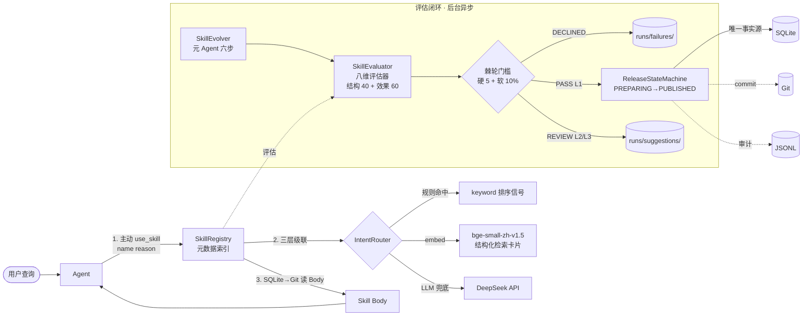

<div align="center">

# SkillForge

**Agent Skill 自进化元 Agent 系统**

*基于 [hello-agents](https://pypi.org/project/hello-agents/) 扩展的元 Agent 工厂 —— Agent 主导加载、结构化路由、八维评估、元 Agent 半自动闭环*


</div>

---

## 一句话定位

**"生产 Skill 的元 Agent 系统"** —— 大多数 Agent 项目聚焦"用 Skill 干活"；本项目聚焦让 Skill 本身**可评测、可版本管理、可自动改进**的工程闭环。

4 周业余时间独立完成 · 1600 行核心 + 3300 行 tests/scripts · CLI 一键复现所有数字。

---

## 四阶段交付

<table>
<thead><tr>
<th>Phase</th><th>目标</th><th>硬指标</th><th>结果</th><th>复现命令</th>
</tr></thead>
<tbody>
<tr>
<td><b>P1</b> 骨架</td>
<td>5 组件 + <code>use_skill</code> 三档降级 + SQLite 状态机</td>
<td>10 单测通过</td>
<td>✅ 10/10</td>
<td><code>pytest tests/test_registry.py</code></td>
</tr>
<tr>
<td><b>P2</b> 路由</td>
<td>规则 + bge-small + LLM 三层级联 + 50 硬负例</td>
<td>R@1 ≥ 80%, R@3 ≥ 90%</td>
<td>✅ <b>R@1=98% · R@3=100%</b></td>
<td><code>python scripts/eval_router.py --use-llm</code></td>
</tr>
<tr>
<td><b>P3</b> 评估</td>
<td>八维评估器（结构 40 + 效果 60）+ 棘轮 + 21 条保底盲评</td>
<td>出偏差报告</td>
<td>✅ robust/read 通过, task 62% 定位 Judge 幻觉盲区</td>
<td><code>python scripts/blind_eval_report.py</code></td>
</tr>
<tr>
<td><b>P4</b> 元 Agent</td>
<td>六步流程 + L1 auto 分级发布</td>
<td>至少 L1 auto 打通</td>
<td>✅ 1 次真迭代 · L2 REVIEW +4.90 分</td>
<td><code>skillforge evolve --skill explain_regex</code></td>
</tr>
</tbody>
</table>

---

## 架构简图



**关键设计**：Agent 层通过 `use_skill(name, reason)` 显式加载（不拦截 prompt，可归因）；路由层三层级联按置信度 fallback（不写死百分比）；评估闭环用 Judge 配对比较（对抗分数漂移）；元 Agent 分级发布（L1 自动 / L2 L3 只出建议）。

---

## Quick Start

### 1️⃣ 环境准备（约 5 分钟）

```bash
git clone https://github.com/SuperGODOG/skillforge.git && cd skillforge

# venv + 依赖（阿里源规避清华源哈希冲突）
python3 -m venv .venv
./.venv/bin/pip install --index-url https://mirrors.aliyun.com/pypi/simple/ -e .

# bge-small 走 modelscope（国内 hf-mirror 不稳）
./.venv/bin/pip install modelscope
./.venv/bin/python -c "from modelscope import snapshot_download; snapshot_download('AI-ModelScope/bge-small-zh-v1.5', cache_dir='./models')"

# DeepSeek API Key
cat > .env <<'EOF'
LLM_API_KEY=sk-填你的-key
LLM_MODEL_ID=deepseek-chat
LLM_BASE_URL=https://api.deepseek.com/v1
# Judge 必须走独立 client/session；可以使用同一服务，也可以换独立模型。
JUDGE_LLM_API_KEY=sk-填你的-judge-key
JUDGE_LLM_MODEL_ID=deepseek-chat
JUDGE_LLM_BASE_URL=https://api.deepseek.com/v1
EOF
```

**验证成功**：`./.venv/bin/pytest tests/ -q` 应全量通过。

---

### 2️⃣ 四个 CLI 命令覆盖四个 Phase

<details>
<summary><b>Phase 1</b>: <code>skillforge demo</code> · Agent 主动 use_skill 完整链路</summary>

```bash
./.venv/bin/skillforge demo --query "上海明天会下雨吗"
```

预期输出（片段）：
```
▶ Step 3: 模拟 Agent 决策
  用户查询：'上海明天会下雨吗'
  Agent 决定：调用 use_skill('weather_query', ...)

▶ Step 4: 加载 Skill Body（SQLite→Git 全链路，失败降级到磁盘）
  ✓ body 长度 584 chars（27 行）

▶ Step 5: router.jsonl 最新一条
{
  "op": "use_skill",
  "name": "weather_query",
  "reason": "用户查询 '上海明天会下雨吗'，判断需要 weather_query 提供的能力",
  "source": "disk_no_release",
  "latency_ms": 11.44
}
```
</details>

<details>
<summary><b>Phase 2</b>: <code>skillforge route</code> · 三层级联路由</summary>

```bash
./.venv/bin/skillforge route "帮我写一个正则匹配所有邮箱" --use-llm
# → chosen=None（硬负例被 LLM 判 not_for 拒绝，代码生成 ≠ 正则讲解）
```

**规则 vs embed vs LLM** 分层决策，`hit_layer` 字段告诉你路由决策发生在哪一层：
- `rule`   — keyword 排序信号唯一命中（0.01ms 秒回）
- `embed`  — top1 相似度 ≥ 0.75 且 margin ≥ 0.10
- `llm`    — 中间地带交 LLM 兜底二选一（~500ms）
</details>

<details>
<summary><b>Phase 3</b>: <code>skillforge evaluate</code> · 八维评估器 + 棘轮</summary>

```bash
./.venv/bin/skillforge evaluate --skill explain_regex --eval-set baseline_dev --verbose
```

预期输出：
```
结构分（40 分，权重 40%，不阻断发布）:
  schema      : 15.00
  trigger     : 10.00
  prompt      : 10.00
  deps        :  5.00
  小计          : 40.00 / 40

效果分（60 分，权重 60%，发布门槛）:
  task        : 19.32
  robust      :  8.18
  readability :  8.18
  efficiency  :  9.93
  小计          : 45.61 / 60

总分: 85.61 / 100  ·  P0 用例: ✓ 全通过
```
</details>

<details>
<summary><b>Phase 4</b>: <code>skillforge evolve</code> · 元 Agent 六步迭代</summary>

```bash
./.venv/bin/skillforge evolve --skill explain_regex --max-candidates 3
```

预期输出：
```
▶ [Evolve/1-baseline] 跑 baseline 评估 explain_regex on repair_set
  baseline 总分 = 82.50

▶ [Evolve/2-collect] 收集失败样本 1 条

▶ [Evolve/3-root_cause] LLM 根因分析
  prompt_vague: prob=0.70, why=Instructions 未要求完整/结构化解释...

▶ [Evolve/4-generate] LLM 生成 3 个候选 patch
    [L1] 修改 description 明确要求完整结构化解释
    [L1] frontmatter examples 增加反向引用示例
    [L2] Instructions 加"完整性要求"第 4 点

▶ [Evolve/5-validate #3 L2] new_score=87.40 (+4.90), verdict=REVIEW
  → SUGGESTION: runs/suggestions/*164357*.md
```
</details>

---

### 3️⃣ 完整评测复现（Phase 2/3 门槛验证）

```bash
python scripts/eval_router.py --use-llm      # 路由 R@1=98% / R@3=100%
python scripts/blind_eval_report.py          # Judge/人工偏差报告
python scripts/rejudge_frozen.py             # 只重判冻结输出，不重新生成 A/B
pytest tests/ -v                              # 全量测试应为绿色
```

---

## 项目结构

<details>
<summary>展开目录树</summary>

```
skillforge/
├── src/skillforge/
│   ├── __init__.py              5 组件 + 8 数据模型顶层暴露
│   ├── models.py                Pydantic + dataclass
│   ├── registry.py              SkillRegistry（继承 hello_agents.ToolRegistry）
│   ├── router/                  三层路由（rule / embed / llm / cascade）
│   ├── evaluator/               八维评估器（structure / judge / metrics / ratchet + __init__ 装配）
│   ├── evolver.py               SkillEvolver 六步闭环 400+ 行
│   ├── state_machine.py         ReleaseStateMachine 4 步 + Watchdog
│   ├── storage/                 db / git_ops / jsonl
│   └── cli.py                   4 子命令
│
├── skills/                      3 种子 skill（YAML frontmatter + Markdown body）
│   ├── weather_query/           信息查询类
│   ├── write_weekly_report/     生成类
│   └── explain_regex/           教学类
│
├── evaluation_sets/             手工评估集
│   ├── baseline_dev.json        32 条开发集（元 Agent 可见）
│   ├── baseline_hidden.json     8 条已降级回归集（已降级为 seen regression；评测请用 repair_set / holdout / audit）
│   ├── repair_set.json          22 条迭代修复集（10 P0 + 8 seen regression + 4 boundary）
│   ├── experiment_holdout.json  9 条实验留出集（严格隔离黑盒比对）
│   ├── final_audit.json         9 条终审评测集（严格隔离发布终审）
│   ├── p0_cases.json            10 条 P0（core 链路）
│   └── router_negatives.json    50 条硬负例
│
├── scripts/                     独立评测 / 盲评脚本
├── runs/                        运行时（*.db / *.jsonl gitignore）
│   ├── failures/                元 Agent DECLINED patches
│   └── suggestions/             元 Agent L2/L3 REVIEW patches
├── tests/                       pytest 74 条
├── models/                      bge-small 本地缓存（gitignore）
│
├── ARCHITECTURE.md              C4 两级架构 + 10 ADR + §10 实施差异
└── README.md                    本文件
```

</details>

---

## 五大核心设计决策

> **设计不是拍脑袋** —— 每个决策都有备选方案 + 选择理由 + 关联影响。详见 [ARCHITECTURE.md §8](ARCHITECTURE.md) 10 条 ADR。

1. **Agent 主导渐进式披露** — 拒绝加载器拦截 prompt。注册 `use_skill(name, reason)` 特殊工具由 Agent 显式调用；每次加载写 `router.jsonl` 含 reason 归因链 —— **归因 100% 可回放，ReAct 可解释性无断点**。

2. **三层路由不写死百分比** — 规则（`trigger.keywords` 只是排序信号，**不独占决策**）→ bge-small 结构化检索卡片（`[Capability][Use When][Examples][Not For]`，`Not For` 段在向量空间**主动推远硬负例**）→ LLM 兜底二选一。阈值 `HIGH_CONF=0.75 / MARGIN=0.10` 由 50 条硬负例评测集校准（62% → 98% 三步调优）。

3. **Judge 配对比较（A/tied/B/INVALID）** — 执行/Judge 使用独立 client 与配置，A/B 确定性均衡；异常、不可解析和证据不足均 INVALID 并 fail-closed。无 provenance 的实时数值断言先过 truth sentinel；效率维度走客观 token 比不用 LLM 打分。

4. **元 Agent 分级 L1/L2/L3** — L1 = 只改 `examples/not_for/description`，可自动发布；L2 = 改 `trigger/Instructions`，只出建议；L3 = 改 `dependencies/Constraints`，只出建议。**成功率坦诚约 30%**；失败 patch 归档 `runs/failures/` 沉淀负样本。

5. **SQLite 唯一发布事实源** — Git（skill 内容版本）+ SQLite（发布状态）+ JSONL（评估/路由审计）三处异构存储，通过 SQLite 状态机 `PREPARING → PUBLISHED` 原子切换 + `release_id` UUID 幂等 + Watchdog 24h 清理孤儿。

---

## 数字对账

| 指标 | 门槛 | 实测 | 达标 |
|---|---|---|---|
| 路由 Recall@1 | ≥ 80% | **98%** | ✅ 超 18 分 |
| 路由 Recall@3 | ≥ 90% | **100%** | ✅ 超 10 分 |
| pytest 通过率 | Phase 1 10 条 | **74/74 · 4.4s** | ✅ 累计超交付 |
| 元 Agent 成功率 | ~30% 坦诚 | 1/3 = 33% (1 次) | ⚠️ 需持续迭代累积 |
| Judge/人工分歧 | < 30% | robust 19% ✓ / read 24% ✓ / **task 62% ❌** | ⚠️ 已定位 Judge 幻觉盲区 |
| 代码规模 | ~900 行核心 | 1600 核心 + 3300 tests | 超 60%（工程量合理） |

---

## 文档地图

| 文档 | 用途 | 面试参考位置 |
|---|---|---|
| [ARCHITECTURE.md](ARCHITECTURE.md) | C4 两级架构 + 10 ADR + §10 实施差异 | §8 ADR 追决策依据 |

---

## Roadmap（Phase 5 优先级）

1. **Judge prompt 补幻觉红线** — 立刻兑现 Phase 3 交付（task 分歧 62% → <30%）
2. **GitHub Actions + Docker Compose** — 降面试演示门槛
3. **接入 MCP 协议** — 生态化被 Claude Desktop / Cursor 消费
4. **10 次真实迭代 + 统计报告** — 兑现 ~30% 成功率承诺（现 1/3 单次样本）
5. **真人独立盲评（Cohen's Kappa > 0.6）** — 保底盲评从 proxy 升到可采信

---

## 开发环境要求

- **OS**: Linux / macOS（Windows WSL2 可）
- **Python**: 3.10+（测试环境 3.12）
- **CPU**: 中端即可（bge-small CPU 推理 ~50ms/query）
- **GPU**: 可选（如果换 bge-m3 需要）
- **磁盘**: 模型缓存 ~100MB（bge-small）+ 项目 ~10MB
- **外部服务**: 只需 DeepSeek API Key（其他全本地）

---

## 演化说明（本项目的"元数据"）

- **ARCHITECTURE.md** 是**架构基线**（Phase 4 完成后 §10 记 8 处实施差异）
- **`runs/failures/` + `runs/suggestions/`** 是**真实执行证据**（非设计文档）

面试时的证据链：**简历数字 → README CLI → 命令输出 → `runs/` 真实文件**。每一环都可打开验证。

---

## License

MIT · 本项目为个人学习/面试演示项目，欢迎 fork 学习或提 issue 讨论设计取舍。

## Acknowledgements

- [hello-agents](https://pypi.org/project/hello-agents/) — Agent 抽象基座
- [BAAI/bge-small-zh-v1.5](https://huggingface.co/BAAI/bge-small-zh-v1.5) — 中文 embedding
- [DeepSeek](https://api.deepseek.com/) — 主 LLM
- [ModelScope](https://modelscope.cn/) — 国内模型分发（解决 hf-mirror 不稳问题）
