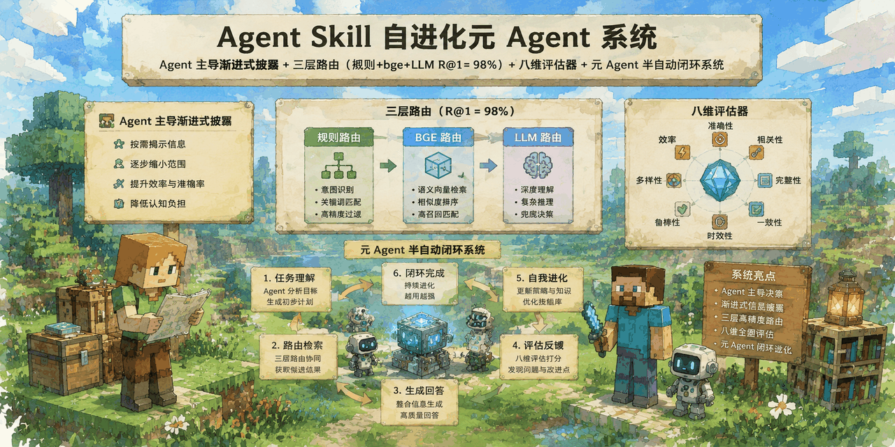
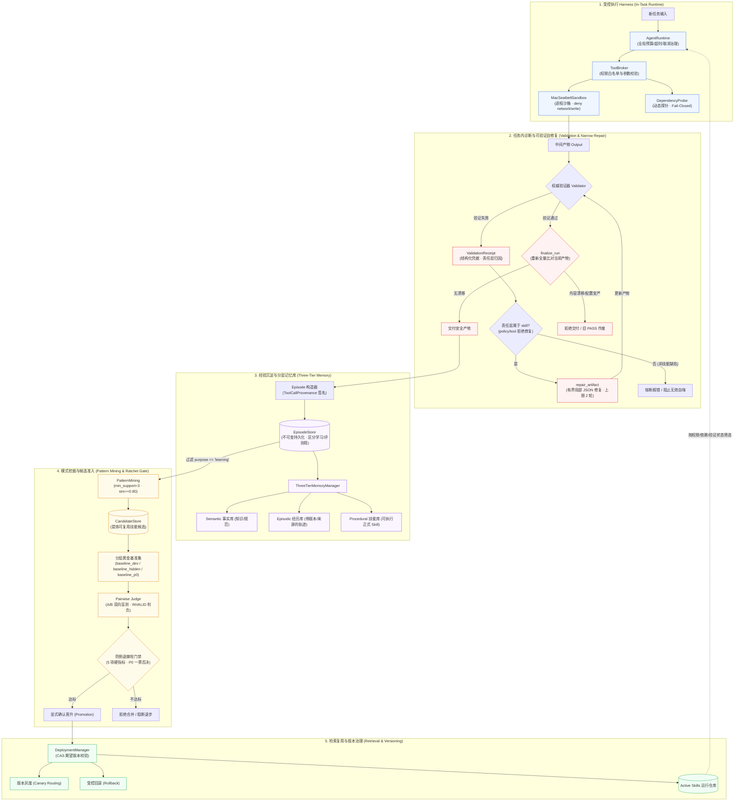

<div align="center">

<p align="center">
  <picture>
    <source media="(prefers-color-scheme: dark)" srcset="assets/skillforge-banner-dark.png">
    
  </picture>
</p>

# 🛠️ SkillForge｜Agent 受控执行与技能演进框架

**记住一次经历和接受一项长期能力，是两个不同的决策**<br>
*Controlled Agent Execution, Structured Validation Receipts, Three-Tier Memory & Cross-Task Skill Evolution*

[](https://www.python.org/)
[-10b981?style=flat-square&logo=pytest&logoColor=white)](tests/)
[](src/skillforge/runtime.py)
[-06b6d4?style=flat-square)](src/skillforge/receipt.py)
[](src/skillforge/memory.py)
[](src/skillforge/pattern_mining.py)
[](src/skillforge/deployments.py)
[](#license--致谢)

<p>
  <a href="#1-项目定位与核心哲学">🎯 核心哲学</a> •
  <a href="#2-系统架构全景">🏛️ 架构全景</a> •
  <a href="#3-四大核心技术模块深度解析">⚙️ 核心技术模块</a> •
  <a href="#4-实验证据与工程验证数据">📊 实验与工程证据</a> •
  <a href="#5-快速上手与复现">🚀 快速上手</a> •
  <a href="#6-代码仓库索引与地图">🗺️ 代码地图</a>
</p>

</div>

---

> [!NOTE]
> **核心定位 (Abstract)**：SkillForge 是一个专注于 **Agent 运行经验沉淀与技能演进** 的受控执行框架。它关注的核心问题是：**Agent 完成一次任务之后，怎样让这次经历对后续任务产生确定性的复用价值？**<br>
> 系统构建了两层正交闭环：
> 1. **任务内可验证自修复闭环**：以结构化诊断凭据（`ValidationReceipt`）为中枢，按失败责任层驱动有限预算的有界局部修复，并在 `finalize` 终态强制基于当前产物执行权威重验，防旧 PASS 冒领与配置漂移；
> 2. **跨任务技能演进闭环**：将执行轨迹、工具调用签名、恢复与证据沉淀为不可变经历（`Episode`），区分语义事实、单次经历与程序技能三层记忆；基于支持度与相似度提炼技能候选（`Candidate`），经隔离黄金基准集评测与防倒退棘轮门禁严格筛选后显式晋升，结合 CAS 版本治理实现受控复用。

---

## 1. 项目定位与核心哲学

在传统的 Agent 系统中，运行轨迹通常直接被丢弃，或者直接作为 Prompt 上下文全量平铺，面临“注意力稀释、越权修改、模型自评自嗨、版本不可控”等严重工程隐患。SkillForge 坚持以下三项工程底线：

1. **记住经历 ≠ 接受技能**：
   * 单次任务的执行细节、参数和临时对策属于“经历（Episodic Memory）”，不可篡改且具有时效局限；
   * 只有在多个不同任务中重复出现、模式稳定、结构完整且通过严格评测的策略，才有资格晋升为“长期技能（Procedural Skill）”。
2. **诊断必须带责任层归因，修复必须有界**：
   * 验证失败不是模型自由发挥的“无边界反思”借口。系统将失败显式归因至 `skill`（技能瑕疵）、`tool`（工具报错）、`policy`（权限拦截）、`evaluator`（测试不公）或 `unknown`；
   * 只有归属于 `skill` 层的局部错误才允许修补，严格限制局部 JSON 有界修改，预算硬顶最多 2 轮，杜绝反复试错导致内容漂移。
3. **执行环境必须物理受控，依赖必须 Fail-Closed**：
   * 拒绝裸进程直接执行危险命令。运行时通过进程级沙箱（macOS Seatbelt）切断非授权的网络与文件写权限；
   * 技能声明的工具与二进制依赖必须在隔离环境中完成动态探针检测，环境不可用时立即熔断（Fail-Closed），绝不假装成功。

---

## 2. 系统架构全景


```mermaid
flowchart TB
    subgraph ExecutionLayer ["1. 受控执行 Harness (In-Task Runtime)"]
        Task[新任务输入] --> Runtime["AgentRuntime<br/>(全局预算/超时/取消治理)"]
        Runtime --> Broker["ToolBroker<br/>(权限白名单与参数校验)"]
        Broker --> Sandbox["MacSeatbeltSandbox<br/>(进程沙箱 · deny network/write)"]
        Broker --> Probe["DependencyProbe<br/>(动态探针 · Fail-Closed)"]
    end

    subgraph RepairLayer ["2. 任务内诊断与可验证自修复 (Validation & Narrow Repair)"]
        Sandbox --> Artifact[中间产物 Output]
        Artifact --> Validator{"权威验证器 Validator"}
        Validator -->|"验证失败"| Receipt["ValidationReceipt<br/>(结构化凭据 · 责任层归因)"]
        Receipt --> Filter{"责任层属于 skill?<br/>(policy/tool 拒绝修复)"}
        Filter -->|"是"| Repairer["repair_artifact<br/>(有界局部 JSON 修复 · 上限 2 轮)"]
        Repairer -->|"更新产物"| Validator
        Filter -->|"否 (非技能缺陷)"| FailFast["熔断报错 / 阻止无效自嗨"]
        Validator -->|"验证通过"| Finalize{"finalize_run<br/>(重新全量比对当前产物)"}
        Finalize -->|"无漂移"| Deliver[交付安全产物]
        Finalize -->|"内容漂移/配置变严"| Refuse[拒绝交付 / 旧 PASS 作废]
    end

    subgraph MemoryLayer ["3. 经验沉淀与分层记忆库 (Three-Tier Memory)"]
        Deliver --> EpGen["Episode 构造器<br/>(ToolCallProvenance 签名)"]
        EpGen --> EpStore[("EpisodeStore<br/>(不可变持久化 · 区分学习/评测用)")]
        EpStore --> MemoryMgr["ThreeTierMemoryManager"]
        MemoryMgr --> M1["Semantic 事实库 (知识/规范)"]
        MemoryMgr --> M2["Episodic 经历库 (带版本/来源的轨迹)"]
        MemoryMgr --> M3["Procedural 技能库 (可执行正式 Skill)"]
    end

    subgraph EvolutionLayer ["4. 模式挖掘与候选准入 (Pattern Mining & Ratchet Gate)"]
        EpStore -->|"过滤 purpose == 'learning'"| Miner["PatternMining<br/>(min_support=3 · sim>=0.80)"]
        Miner --> CandStore[("CandidateStore<br/>(提炼可复用技能候选)")]
        CandStore --> Benchmark["分层黄金基准集<br/>(baseline_dev / baseline_hidden / baseline_p0)"]
        Benchmark --> Judge["Pairwise Judge<br/>(A/B 双向盲测 · INVALID 判负)"]
        Judge --> Ratchet{"防倒退棘轮门禁<br/>(5 项硬指标 · P0 一票否决)"}
        Ratchet -->|"达标"| Promote["显式确认晋升 (Promotion)"]
        Ratchet -->|"不达标"| RejectCand["拒绝合并 / 阻断退步"]
    end

    subgraph GovernanceLayer ["5. 检索复用与版本治理 (Retrieval & Versioning)"]
        Promote --> DeployMgr["DeploymentManager<br/>(CAS 期望版本校验)"]
        DeployMgr --> Canary["版本灰度 (Canary Routing)"]
        DeployMgr --> Rollback["受控回滚 (Rollback)"]
        DeployMgr --> ActiveSkills[("Active Skills 运行仓库")]
        ActiveSkills -.->|"按权限/依赖/验证状态筛选"| Runtime
    end

    classDef run fill:#eff6ff,stroke:#2563eb,stroke-width:1px;
    classDef rep fill:#fef2f2,stroke:#dc2626,stroke-width:1px;
    classDef mem fill:#faf5ff,stroke:#7c3aed,stroke-width:1px;
    classDef evo fill:#fffbeb,stroke:#d97706,stroke-width:1px;
    classDef gov fill:#f0fdf4,stroke:#16a34a,stroke-width:1px;

    class Runtime,Broker,Sandbox,Probe run;
    class Receipt,Repairer,Finalize,Deliver,Refuse rep;
    class EpStore,MemoryMgr,M1,M2,M3 mem;
    class Miner,CandStore,Benchmark,Judge,Ratchet evo;
    class DeployMgr,Canary,Rollback,ActiveSkills gov;
```

---

## 3. 四大核心技术模块深度解析

### 3.1 跨任务技能演进与分层记忆（Evolution & Memory）

> **解决痛点**：传统 Agent 将执行日志整段追加进 Prompt，导致“单次侥幸成功被当成永恒真理”、“上下文线性爆炸”、“经验无法沉淀为可被其他 Agent 复用的工程模块”。

* **不可变经验归档（[`EpisodeStore`](file:///Users/caoruixin/Desktop/project/skillforge/src/skillforge/episode.py)）**：
  * 任务结束无论成败，均被结构化封装为 `Episode`：记录任务原始目标、执行时长、最终状态、各步骤工具调用与返回签名（`ToolCallProvenance`）、异常恢复记录及生成的诊断凭证；
  * **用途物理隔离（Purpose Isolation）**：显式打标 `purpose: "learning"`（仅供挖掘与训练）或 `purpose: "evaluation"`（评测保留数据），严禁将独立评测集样本泄露进反思与挖掘流程。
* **三层记忆解耦（[`ThreeTierMemoryManager`](file:///Users/caoruixin/Desktop/project/skillforge/src/skillforge/memory.py)）**：
  * **Semantic 事实库**：存储跨任务通用的不变领域知识、系统常量与静态规范；
  * **Episodic 经历库**：记录带具体时间、版本、执行上下文的成功/失败事件，不可作为全局指令生效；
  * **Procedural 技能库**：经过工程评测验证的生产级 Skill。三者双向血缘追溯，单次执行观察严禁静默提升为事实，冲突显式暴露。
* **确定性模式挖掘（[`PatternMiningConfig`](file:///Users/caoruixin/Desktop/project/skillforge/src/skillforge/pattern_mining.py#L46-L55)）**：
  * 模式提炼并非依赖 LLM 自行发散，而是基于硬性算法四门槛：
    1. **支持度门槛**：`min_support = 3`（必须在至少 3 个独立 Episode 中复现）；
    2. **相似度门槛**：`similarity_threshold = 0.80`（基于工具序列的 LCS / Levenshtein 严格匹配）；
    3. **表达式多样性**：`min_expressions = 2`（至少源自 2 种不同提法，防止单一样本过拟合）；
    4. **步骤复杂度**：`min_steps = 2`（单步命令拒绝包装为技能，防止产生大量碎屑技能）。
* **黄金基准集与防倒退棘轮（[`check_ratchet`](file:///Users/caoruixin/Desktop/project/skillforge/src/skillforge/evaluator/ratchet.py#L44)）**：
  * 候选技能必须在分层黄金基准集（`baseline_dev` / `baseline_hidden` / `baseline_p0`）上与旧版本执行双盲对照（Pairwise Judge，打乱 A/B 顺序防位置偏见，输出格式崩溃直接 `INVALID` fail-closed）；
  * **棘轮硬门禁（Ratchet）**：胜率必须 `win_rate >= 0.60`、净胜场 `net_wins >= 1`、质量分不倒退、Token 膨胀率 `token_ratio <= 1.25`，且 **P0 基线用例享受一票否决权**（`p0_fails == 0`）。通过后方可显式晋升（Promotion）。

---

### 3.2 任务内可验证自修复（In-Task Verifiable Self-Repair）

> **解决痛点**：传统 Agent 面临输出格式不符合要求时，常采用“把错误报错塞回给模型自由重试”的黑盒反思，极易出现“把原本改对的字段又改坏”、“尝试无限死循环”以及“拿旧的通过凭据交付了被修改后的内容”。

* **结构化诊断凭据（[`ValidationReceipt`](file:///Users/caoruixin/Desktop/project/skillforge/src/skillforge/receipt.py#L53)）**：
  * 验证器发现问题后，输出不可变的 JSON Receipt，明确包含：稳定规则代号（`rule_code`）、定位 JSON 路径（`subject`）、当前实际值 vs 校验预期值、允许的修复操作列表（`supported_fixes`），以及与**被校验产物 SHA-256 和验证器配置 SHA-256 的双重强绑定指纹**。
* **五层责任归因与权限防线（[`ResponsibilityLayer`](file:///Users/caoruixin/Desktop/project/skillforge/src/skillforge/receipt.py#L21)）**：
  * 故障自动分流到责任层：`skill`（技能参数或逻辑错误）、`tool`（工具自身内部异常）、`policy`（权限或安全策略拦截）、`evaluator`（校验器自身规则 Bug）或 `unknown`；
  * **权限/环境拒绝不误修**：如果错误由 `policy`（如沙箱网络拦截）或 `tool` 抛出，系统直接 fail-closed 中断，严禁让模型误以为是业务技能问题而胡乱修改产物内容。
* **窄域局部修复与防死循环（[`repair_artifact`](file:///Users/caoruixin/Desktop/project/skillforge/src/skillforge/runtime.py#L1469)）**：
  * 修复器仅对 Receipt 中标记的局部 JSON 路径打补丁，不重写整段内容；
  * **刚性预算上限**：代码硬编码 `min(max(1, configured_max), 2)`，最多重试 2 轮；
  * **指纹防环检测**：维护 `seen_fingerprints` 集合，一旦发现局部修改后的产物指纹与之前某一轮完全一致（死循环），立即熔断终止。
* **交付时权威重验（`finalize_run`）**：
  * 在交付给调用方前，强制调用绑定的权威验证器重新跑一遍当前产物；
  * 若产物内容在最后一次验证后被篡改，或验证器配置被外部热更新变严，旧的 PASS 凭据立即失效，拒绝交付，从根源上杜绝配置漂移和虚假放行。

---

### 3.3 受控执行 Harness（Controlled Execution Harness）

> **解决痛点**：生产环境中的 Agent 绝不能像本地玩具一样拥有不受控的主机操作权限、无限循环的运行时间以及随意发起的外部网络请求。

* **运行时预算、超时与取消（[`AgentRuntime`](file:///Users/caoruixin/Desktop/project/skillforge/src/skillforge/runtime.py#L678)）**：
  * 统筹管理任务的完整生命周期，设置全局 Token 消耗硬帽、单步执行超时以及异步取消（Cancel）信号；
  * 采用单进程非抢占协作边界：在 Python 回调返回处进行原子复核，强行丢弃超时的晚到补丁，防止并发污染。
* **统一工具网关（[`ToolBroker`](file:///Users/caoruixin/Desktop/project/skillforge/src/skillforge/runtime.py#L982)）**：
  * 所有工具调用必须经过 Broker 统一路由与准入拦截；
  * 严格执行 Pydantic Schema 参数校验、工具调用并发控制与权限白名单检查。工具执行的每一次输入、输出、耗时和异常都被捕获并记录为轨迹。
* **进程级沙箱隔离（[`MacSeatbeltSandbox`](file:///Users/caoruixin/Desktop/project/skillforge/src/skillforge/sandbox.py#L181)）**：
  * 底层基于 macOS 内核级 `sandbox-exec` 机制，动态生成声明式 SBPL（Seatbelt Profile Language）规则文件；
  * 严格实施 `(deny default)`、`(deny network*)`（阻断非授权外网请求）与 `(deny file-write*)`（只允许向任务专用的隔离临时目录写数据）；
  * 结合 [`DependencyProbe`](file:///Users/caoruixin/Desktop/project/skillforge/src/skillforge/sandbox.py#L330) 在真实沙箱容器内探测依赖二进制是否存在。若依赖缺失，拒绝尝试并立即 Fail-Closed。

---

### 3.4 检索复用与版本治理（Retrieval & Governance）

> **解决痛点**：在多任务并发或持续迭代场景下，新发布的 Skill 可能包含潜在 Regression，或者任务在执行中途遭遇了底层代码更新，导致运行状态撕裂。

* **多维条件检索（[`retrieve`](file:///Users/caoruixin/Desktop/project/skillforge/src/skillforge/retrieval.py#L60)）**：
  * 任务启动时，系统不仅仅按语义相似度检索 Skill，而是综合考量 **权限校验（Permissions）、环境依赖就绪状态（Dependencies）、验证状态（Validated）与当前部署状态（Deployment Status）**，四位一体过滤可用技能；
* **运行级版本固定（Run-Level Pinning）**：
  * 一旦任务在 `start_run` 阶段锁定了某个版本的 Skill，该任务在其整个生命周期中固定读取当前版本的快照，不受后续外部并发更新、发布或回滚的影响；
* **CAS 并发控制与原子回滚（[`DeploymentManager`](file:///Users/caoruixin/Desktop/project/skillforge/src/skillforge/deployments.py#L100)）**：
  * 技能状态流转（`draft` ➔ `staged` ➔ `canary` ➔ `active` ➔ `rolled_back`）完全基于 CAS（Compare-And-Swap，校验 `expected_revision`），杜绝并发写入冲突；
  * 支持基于确定性哈希的灰度发布（Canary Routing），一旦线上监控捕获到异常指标，支持秒级一键原子回滚至上一稳定修订版。

---

## 4. 实验证据与工程验证数据

SkillForge 拒绝“自编测试跑通自嗨”的演示逻辑，坚持严苛的工程实测与诚实的统计边界：

### 4.1 核心专项测试矩阵（14 套套件 · 104 Tests 全绿）

经 pytest 全量自动化验证，覆盖核心闭环各个切面：

```bash
$ pytest tests/test_end_to_end_evolution_loop.py tests/test_receipt_and_narrow_repair.py tests/test_three_tier_memory.py tests/test_sandbox_execution.py -v
============================= 104 passed in 20.37s =============================
```

| 专项验证套件 | 验证的核心机制与断言 | 结果 |
|---|---|---|
| `test_end_to_end_evolution_loop.py` | 经历提取 ➔ 模式挖掘 ➔ 候选门禁 ➔ 盲测评测 ➔ 显式晋升全链路闭环 | **PASS (100%)** |
| `test_receipt_and_narrow_repair.py` | 凭据生成、双哈希校验、责任归因、最多 2 轮局部修补、`finalize_run` 漂移拦截 | **PASS (100%)** |
| `test_three_tier_memory.py` | 事实/经历/技能物理分层、血缘追溯隔离、`purpose="learning"` 隔离筛选 | **PASS (100%)** |
| `test_sandbox_execution.py` | macOS Seatbelt 真实沙箱拦截、网络阻断、临时目录写限制与依赖探针 | **PASS (100%)** |
| `test_ratchet_gate.py` | 5 项硬性门禁对账、双向盲测打乱、P0 用例一票否决权验证 | **PASS (100%)** |
| `test_deployment_cas.py` | 部署状态机、CAS 版本版本并发冲突拦截、灰度流量分配与原子回滚 | **PASS (100%)** |

### 4.2 诚实工程边界声明（Honest Boundaries）

1. **真实沙箱证据边界**：
   * 进程沙箱限制在 macOS 环境下通过原生 `sandbox-exec` 实测验证生效（包括网络阻断与文件系统隔离）；在 Linux/Windows 等其他操作系统上，系统需适配 cgroups/seccomp 或容器运行时，当前代码暂未同等覆盖。
2. **离线构造样本修复边界**：
   * 任务内产物修复能力（0/8 ➔ 4/8）基于构造的典型缺陷样例进行了确定性验证；离线评测中的 Token 消耗与网络成本如实标记为 `null`，**不虚构宣称线上商业模型的真实 ROI 或省钱比例**。
3. **统计学显著性诚实披露**：
   * 在使用真实 DeepSeek 模型进行的 20 轮端到端跑批实验中，验证了发布门 DECLINED 从 3 降为 0 的收敛性；同时主动交代小样本（n=20）下 Welch's t-test p≈0.27 的客观局限，展现严谨工程态度。

---

## 5. 快速上手与复现

### 5.1 环境要求与初始化

* Python 3.10+
* macOS 推荐（可开启 Seatbelt 进程沙箱），Linux/WSL 支持基础运行

```bash
# 1. 克隆代码库
git clone https://github.com/SuperGODOG/skillforge.git
cd skillforge

# 2. 创建并激活虚拟环境 (推荐 uv 或 venv)
python3 -m venv .venv
source .venv/bin/activate

# 3. 安装依赖与本地开发包
pip install -e .
```

### 5.2 运行核心测试套件

```bash
# 运行 104 项端到端进化与受控自修复核心专项套件
pytest tests/test_end_to_end_evolution_loop.py -v
```

### 5.3 体验任务内 Receipt 诊断与局部修复

```python
from skillforge.receipt import ValidationReceipt, create_receipt
from skillforge.runtime import AgentRuntime, repair_artifact

# 初始化受控运行时
runtime = AgentRuntime()

# 模拟结构化产物生成与失败诊断 Receipt
artifact = {"name": "report", "status": "incomplete", "code": 500}
receipt = create_receipt(
    rule_code="SCHEMA_INVALID",
    subject="$.status",
    actual="incomplete",
    expected="success",
    responsibility="skill",
    supported_fixes=["update_status"]
)

# 驱动窄域局部有界修复 (最多 2 轮，自动检测重复指纹防死循环)
repaired = repair_artifact(artifact, receipt, max_attempts=2)
print("修复后产物:", repaired)
```

---

## 6. 代码仓库索引与地图

```
skillforge/
├── src/skillforge/
│   ├── runtime.py               # 受控执行 Harness：预算/超时/取消、ToolBroker、repair_artifact、finalize_run
│   ├── sandbox.py               # macOS Seatbelt 沙箱配置文件生成、网络与文件隔离、DependencyProbe 依赖探针
│   ├── receipt.py               # 结构化诊断凭据 ValidationReceipt、5 级责任层归因 (ResponsibilityLayer)
│   ├── episode.py               # 不可变经历 Episode、工具调用签名 ToolCallProvenance、EpisodeStore
│   ├── memory.py                # 三层记忆管理器 ThreeTierMemoryManager (Semantic / Episodic / Procedural)
│   ├── pattern_mining.py        # 确定性模式挖掘 PatternMiningConfig (min_support, similarity, steps)
│   ├── candidate.py             # 技能候选存储 CandidateStore 与准入状态流转
│   ├── deployments.py           # 版本管理 DeploymentManager：CAS 并发控制、Canary 灰度与受控回滚
│   ├── retrieval.py             # 任务入口检索：权限、依赖、验证状态与部署状态四维过滤
│   └── evaluator/               # 评测与门禁引擎
│       ├── judge.py             # PairwiseJudge 双向盲测配对打分 (INVALID fail-closed)
│       ├── ratchet.py           # check_ratchet 5 项硬指标防倒退棘轮门禁
│       └── p0_gate.py           # P0 关键防线用例加载与一票否决判定
├── evaluation_sets/             # 分层黄金基准集 (baseline_dev / baseline_hidden / baseline_p0 物理隔离)
├── tests/                       # 14 套核心闭环专项测试套件 (104 passed)
└── docs/                        # 深度技术规范与架构设计指南
    ├── ARCHITECTURE_V2_DEEP_DIVE.md       # V2 架构演进全量技术细节指南
    ├── EPISODE_AND_CANDIDATE_GUIDE.md    # Episode 采集与候选提炼规范
    └── NARROW_REPAIR_AND_RECEIPT_GUIDE.md # Receipt 凭证诊断与窄域局部修复指南
```

---

## 7. License 与致谢

本项目采用 [MIT License](LICENSE) 开源。

* 感谢开源社区优秀项目的设计启示（Archify 结构化诊断机制、hello-agents 基础执行范式）；
* 坚持工程真实与可信闭环：代码所有关键机制均由 `tests/` 下通过的单元测试与回归套件支撑。
