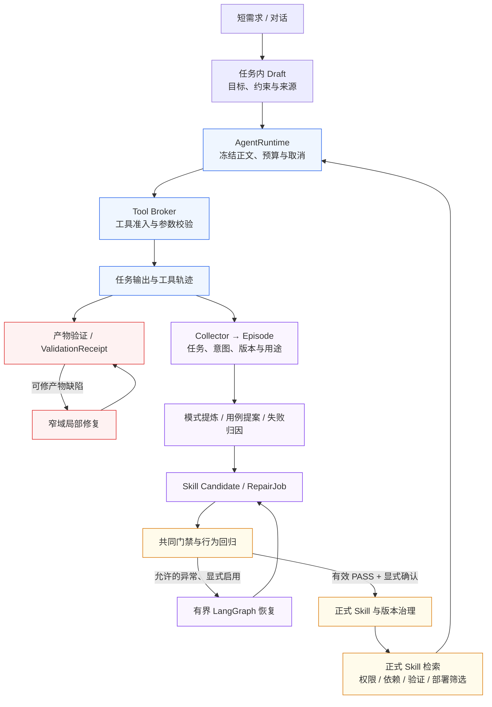

<div align="center">

<p align="center">
  <picture>
    <source media="(prefers-color-scheme: dark)" srcset="assets/skillforge-banner-dark.png">
    
  </picture>
</p>

# 🛠️ SkillForge｜Agent 受控执行与技能演进框架

**让 Agent 快速获得任务技能，并把执行经验转化为可验证、可复用的长期能力。**<br>
*Rapid Skill Generation · Controlled Execution · Evidence-Driven Skill Evolution*

[](pyproject.toml)
[](src/skillforge/runtime.py)
[](src/skillforge/receipt.py)
[](src/skillforge/episode.py)
[](src/skillforge/bounded_recovery.py)
[](src/skillforge/deployments.py)

<p>
  <a href="#1-项目定位">🎯 项目定位</a> •
  <a href="#2-业务主线与架构">🏛️ 业务与架构</a> •
  <a href="#3-四个核心技术支点">⚙️ 实现与设计理由</a> •
  <a href="#4-实验与验证">📊 实验与验证</a> •
  <a href="#5-快速上手">🚀 快速上手</a> •
  <a href="#6-源码与深入阅读">🗺️ 源码与图谱</a>
</p>

</div>

---

> [!NOTE]
> **核心问题：Agent 完成一次任务之后，怎样让这次经历对后续任务产生可验证的复用价值？**
>
> SkillForge 不把“多记一点日志”当成“学会一项技能”。它把 **任务内 Draft、执行经历 Episode、待验证 Candidate、正式 Skill** 分开管理：先快速试用，再根据业务反馈修补，最后通过共同验证与显式确认接受长期能力。

## 1. 项目定位

一个已有工具和基础模型的 Agent，仍然会遇到三个问题：

1. **新任务没有现成技能**：只靠通用 Prompt，缺少当前业务的步骤、约束和输出要求。
2. **失败反馈难以转化为改进**：不知道问题来自技能、工具、权限还是验证器；盲目重试可能越修越错。
3. **经验不能稳定复用**：把一次成功直接写进全局指令，容易固化偶然策略；修改技能又可能破坏原有能力。

SkillForge 的主线是 **“快速生成 → 当前任务试用 → 带证据演进 → 后续检索复用”**，不是训练基础模型权重，也不是让 Agent 无限制地重写自己。

| 常见做法 | SkillForge 的设计 | 设计目的 |
| --- | --- | --- |
| 先手写完整 Skill，再开始任务 | 从短需求或对话生成任务内 Draft | 降低启动成本，让不完整技能先在受控范围内试用 |
| 将全部历史日志追加到 Prompt | 分开管理事实、经历与程序性技能 | 让一次观察保留来源，不自动成为长期规则 |
| 报错后让模型自由反思重试 | 责任层归因、局部修复、共享预算 | 把修改限定在可修问题上，并给恢复过程明确终点 |
| 修改后直接覆盖正式技能 | 隔离候选、行为回归、显式晋升 | 把“提出改进”和“接受长期能力”分成两个决策 |
| 仅按语义相似度拿来一个 Skill | 权限 / 依赖 / 验证 / 部署筛选，运行固定版本 | 让匹配结果既适用又可执行，避免运行中版本漂移 |

> **核心理念：记住一次经历，与接受一项长期能力，是两个不同的决策。**

---

## 2. 业务主线与架构

### 2.1 用一个多包裹物流任务理解项目

用户说：“查一下订单中所有包裹的物流，汇总状态并给出处理建议。”

下面是业务流程示意；完整机制由离线集成场景覆盖，真实模型实验分别验证了失败修补与用户变向后的复用分支。

| 阶段 | 系统做什么 | 体现的能力 |
| --- | --- | --- |
| ① 快速起步 | 把短需求转成带步骤、约束和来源的 Draft | 没有历史 Episode，也能开始当前任务 |
| ② 受控试用 | Agent 消费冻结正文，Broker 调用订单 / 包裹工具，Collector 回收 Episode | 技能不是静态文档，而是进入实际执行链 |
| ③ 用户变向 | 用户改成“只核实状态，不给建议”；修订意图与草稿，保留旧运行快照 | 新目标真正影响后续执行，旧结果不混入新目标 |
| ④ 定向修补 | 若把部分签收误写成全部签收，独立业务 oracle 判失败；归因后修补技能，并检查正常任务 | 不以模型自评成功代替业务正确 |
| ⑤ 接受能力 | 当前候选通过共同验证，获得权威验证记录，显式确认后晋升 | 试用成功或恢复成功，不等于自动发布 |
| ⑥ 后续复用 | 新任务不手填 Skill ID，检索适用的正式版本，固定正文后执行并产生新 Episode | 改进可以成为后续任务的可追溯能力资产 |

### 2.2 两个闭环，一条复用链


```mermaid
flowchart TB
    Q["短需求 / 对话"] --> D["任务内 Draft<br/>目标、约束与来源"]
    F["正式 Skill 检索<br/>权限 / 依赖 / 验证 / 部署筛选"] --> R
    D --> R["AgentRuntime<br/>冻结正文、预算与取消"]
    R --> B["Tool Broker<br/>工具准入与参数校验"]
    B --> A["任务输出与工具轨迹"]

    A --> V["产物验证 / ValidationReceipt"]
    V -->|可修产物缺陷| N["窄域局部修复"]
    N --> V

    A --> E["Collector → Episode<br/>任务、意图、版本与用途"]
    E --> M["模式提炼 / 用例提案 / 失败归因"]
    M --> C["Skill Candidate / RepairJob"]
    C --> G["共同门禁与行为回归"]
    G -->|允许的异常、显式启用| L["有界 LangGraph 恢复"]
    L --> C
    G -->|有效 PASS + 显式确认| P["正式 Skill 与版本治理"]
    P --> F

    classDef run fill:#eff6ff,stroke:#2563eb;
    classDef repair fill:#fef2f2,stroke:#dc2626;
    classDef learn fill:#faf5ff,stroke:#7c3aed;
    classDef gate fill:#fffbeb,stroke:#d97706;
    class R,B,A run;
    class V,N repair;
    class E,M,C,L learn;
    class G,P,F gate;
```

**任务内闭环**修复当前产物；**跨任务闭环**改进长期技能。两者共享责任边界，但不是同一种修复对象，也不共用一个“无限重试”入口。

> [!TIP]
> **交互式图谱与源码导读**（HTML 下载后可在浏览器打开）：
>
> 📖 [知识索引与技术问答](docs/skillforge-knowledge-index.html) ·
> 🏛️ [架构拓扑](docs/skillforge-architecture.html) ·
> ⚡ [任务执行时序](docs/skillforge-task-sequence.html) ·
> 🔄 [经验沉淀工作流](docs/skillforge-evolution-workflow.html) ·
> 🧬 [技能生命周期](docs/skillforge-skill-lifecycle.html)
>
> 图谱用于理解模块关系；具体行为与最新约束以源码和当前指南为准。

---

## 3. 四个核心技术支点

### 3.1 快速生成与意图快照｜让技能跟得上当前任务

**解决什么：** 不必等到积累多次成功经历才生成草稿；同时，用户改目标时不能只改一个标签，或让旧运行悄悄读到新正文。

**如何实现：**

- `generate_candidate_from_requirement` 接受需求 / 对话来源，生成任务内 Draft；同任务重复请求去重，私有草稿不跨任务共享。
- `TaskContext` 区分任务意图修订与 Skill 发布版本。明确变向修订草稿正文；同义措辞不重复生成，模糊变化先确认。
- Runtime 在启动时持久化完整正文与版本绑定，重建后仍读取旧快照；迟到结果归回旧意图，而不是成为新目标的成功正例。

**为何这样设计：** 草稿降低新任务的使用门槛；快照把“本次到底执行了哪份指令”固定下来，使变向、复现与后续归因有明确参照。会话级目标变化也不会全局废除仍适用的正式 Skill。

🔎 [生成器](src/skillforge/skill_generator.py) · [任务上下文](src/skillforge/task_context.py) · [生成与试用专项](tests/test_quick_gen_and_trial.py) · [快照 / 迁移专项](tests/test_source_snapshot_and_migration_closure.py)

### 3.2 受控执行与结构化修复｜让失败反馈成为可操作信息

**解决什么：** “运行失败”太宽泛。权限被拒、工具不可用、业务输出错误，不能都靠修改 Skill 解决。

**如何实现：**

- `AgentRuntime` 管理预算、超时与取消；`ToolBroker` 在 handler 执行前检查权限与参数，并记录输入、结果和错误。
- `ValidationReceipt` 记录规则、问题位置、允许修复动作和责任层，并绑定产物内容与验证器配置。
- 产物级 `repair_artifact` 只修允许的局部路径，最多两轮，重复指纹停止；`finalize_run` 对当前产物重新验证。
- 长期 Skill 的 `RepairJob` 使用经历与业务失败反馈修补指令，不把 policy / tool / evaluator 等问题直接归为技能缺陷。

**为何这样设计：** 结构化反馈告诉修复器“哪里错、允许改什么”；责任层限制“该不该修”；交付重验防止拿旧 PASS 为新内容背书。应用层 Broker 与 macOS Seatbelt 进程隔离相互补充，但前者不能替代 OS 沙箱。

🔎 [Runtime / Broker](src/skillforge/runtime.py) · [Receipt](src/skillforge/receipt.py) · [平台沙箱](src/skillforge/sandbox.py) · [局部修复专项](tests/test_receipt_and_narrow_repair.py)

### 3.3 经历提炼与共同门禁｜让改进有来源，也有反证

**解决什么：** 一次偶然成功不应直接变成长期规则；针对一个 Badcase 的修补也可能损害正常能力。

**如何实现：**

- `EpisodeStore` 持久化任务、工具轨迹、意图与版本；学习入口按 ID 读取规范内容，拒绝评测用途或伪造经历。
- 三层记忆区分 Semantic 事实、Episodic 经历与 Procedural 技能；需求 / 文档不冒充 Episode。
- `PatternMining` 先按业务范围、意图与工具契约分组，再按相似度与独立任务支持度提炼；成功样本帮助描述适用范围，失败样本暴露边界。
- trace 提纯为带工具快照和独立预期的开发 / 回归用例提案；开发反馈与锁定评测按来源、派生家族及近重复关系隔离。
- 共同门禁串起来源、结构、长度、依赖与行为验证；行为评测复用棘轮与关键用例检查，检查 Badcase 改善，也检查正常任务退化。
- 权威验证记录绑定候选正文、规范基线、意图、验证配置及数据集；任何绑定漂移都不能沿用旧 PASS。

**为何这样设计：** 来源回答“改进依据是什么”，独立 oracle 回答“业务是否正确”，正常回归提供“没有修坏原能力”的反证。用途隔离旨在避免把看过的评测答案重新当作能力证据；门禁仍取决于用例质量，不等于证明普遍泛化。

**长度护栏的取舍：** 单章节增长 >25% **且** 净增 >1000 policy tokens，或全文 >1.20 倍 **且** 净增 >1000 tokens，才触发长度 REVIEW。这样允许短草稿从几十 tokens 合理扩展，同时关注较大的绝对增量。无基线新建另设默认 3000 字符上限。1000 是可配置工程策略，`cl100k_base` 用于一致计数，不代表 GLM 原生 token 或已验证的注意力临界点。

🔎 [经历与候选 Store](src/skillforge/episode.py) · [模式提炼](src/skillforge/pattern_mining.py) · [用例提案](src/skillforge/trace_purification.py) · [评测门禁](src/skillforge/evaluator/) · [数据用途专项](tests/test_p4_trace_purification_and_mining.py)

### 3.4 有界恢复与版本复用｜让演进能继续，也能停下来

**解决什么：** 修补过程可能中断、重复生成或消耗失控；即便产生了好候选，也不能在图节点中绕过验证直接覆盖正式版。

**如何实现：**

- 实际 `repair_skill_failure(enable_shadow_recovery=True)` 入口接入 LangGraph 恢复节点与当前 RepairJob；普通小改不强制走图。
- 复用既有 SQLite 检查点与序列化基础设施，适配当前演进链的业务节点，避免与旧 Evolver 混用两套预算和发布路径。
- 图与内部修补共享尝试、调用、token 和原始截止期限；重建不重置预算，重复候选、无进展或绑定漂移停止恢复。
- 图只返回重验后的候选；正式晋升仍需权威验证记录与显式确认。
- 正式 Skill 通过检索筛选与运行级版本固定进入新任务；部署层使用 `expected_revision` / CAS 检查，支持灰度与受控版本回滚。
- 拆分器只提出建议：不同意图 / 前提、可分路由与独立评测才是拆分依据，不因 Skill 长或共享工具就自动拆。

**为何这样设计：** 检查点保存恢复位置，候选与 RepairJob 保存业务状态；预算提供终止条件，显式晋升提供接受能力的边界。固定版本使旧运行可追溯，版本回滚则只改变后续选择，不声称撤销已发生的外部副作用。

🔎 [有界恢复](src/skillforge/bounded_recovery.py) · [实际修补入口](src/skillforge/repair.py) · [正式检索](src/skillforge/retrieval.py) · [版本部署](src/skillforge/deployments.py) · [恢复集成专项](tests/test_p5_langgraph_repair_integration.py)

---

## 4. 实验与验证

**“为何这样设计”是机制解释；“实际验证了什么”要看独立断言、运行轨迹和原始结果。** 项目分别用离线集成测试与真实模型小样本验证不同层面的能力。

### 4.1 可复现的机制验证

2026-10-01，指定 8 文件回归实跑 **61 passed，exit 0**（含恢复专项 11 项）；不是全仓测试总数。

| 验证重点 | 检查的问题 | 对应入口 |
| --- | --- | --- |
| 来源与冻结快照 | 对话来源是否保留？草稿更新 / Runtime 重建后旧运行是否仍读原正文？ | [来源、快照与迁移](tests/test_source_snapshot_and_migration_closure.py) |
| 共同验证与晋升 | 伪 PASS、内容变更或验证条件漂移能否绕过门禁？ | [门禁与生命周期](tests/test_p2_gate_and_lifecycle.py) |
| 实际恢复链 | 是否从业务入口进入 LangGraph / RepairJob？重启后预算、期限与绑定是否有效？ | [恢复集成](tests/test_p5_langgraph_repair_integration.py) |
| 当前产物修复 | 是否只改允许路径？是否拒绝旧凭据并在交付前重验？ | [Receipt 与局部修复](tests/test_receipt_and_narrow_repair.py) |

离线物流专项还覆盖生成、试用、变向、业务失败、修补、确认晋升和后续复用。FakeLLM 用于让故障与边界可重复触发；它验证框架行为，不用于宣称真实模型能力提升。

### 4.2 真实模型与业务轨迹

使用 Ark `glm-5.3-flash` 和 synthetic 多包裹订单，已有两条分别保留的真实模型分支：

- **失败修补分支**：真实生成 V1，基于 DEV 经历 / 反馈修补 V2，并保存小样本 A/B/C 输出及工具轨迹。
- **用户变向与复用分支**：修订为 STATUS_ONLY，通过当前验证与显式确认后，在临时测试库晋升；后续新任务不手填 Skill ID，经实际 Runtime / Broker 执行，Collector 回收新 Episode。

历史标为 LOCKED 的 6 项结果是 **A 无 Skill 5/6、B V1 5/6、C V2 6/6**。这说明该批记录中观察到一次配对改善；由于修订前冻结与派生血缘证据不完整，**不能据此证明干净 heldout 上的泛化或统计显著收益**。

📊 [真实模型原始记录](docs/p6_real_model_abc_raw_results.json) · [物流实验总索引](docs/p6_logistics_abc_raw_results.json) · [调用账本](docs/p6_provider_call_ledger.json)

<details>
<summary><strong>实验范围与尚未验证的部分</strong></summary>

- 真实模型的两条分支不拼接成不存在的完整单次轨迹；完整生命周期目前由离线集成场景覆盖。
- DEV A 组只有 2/6 汇总；早期 125 次调用缺少逐次记录。旧同构样本、事后重分与派生挑战作为探索性数据保留，不补造历史。
- 无实际 usage 或账单时，token / 费用为 `null`；不从小样本推导精确单价、回本次数或普遍收益。
- 已有 macOS Seatbelt 越界写被拒的局部证据，不表示所有实验均处于真实 OS 沙箱。
- 检查点恢复不是跨系统 exactly-once；不确定的在途动作 fail-closed。未验证生产订单、并发负载、SLA 或全部外部副作用的幂等性。
- 本轮不做自动拆分发布、新通用 Agent / Memory 平台或大规模真实模型实验。

详细历史与验证命令见 [进度及最终限定结论](docs/QUICK_GENERATION_EVOLUTION_PROGRESS.md)。

</details>

---

## 5. 快速上手

### 5.1 安装

```bash
git clone https://github.com/SuperGODOG/skillforge.git
cd skillforge
git switch linux

python3 -m venv .venv
.venv/bin/python -m pip install -e ".[dev]"
.venv/bin/skillforge --help
```

Python 3.10+；macOS 可使用 Seatbelt 平台接口，其他平台不具有同等 OS 隔离证据。

CLI 保留 `demo`、`route`、`evaluate`、`evolve`。快速生成、变向与新恢复链通过 Python 接口和集成场景展示，旧 CLI demo 不等于全部生命周期。

### 5.2 从业务场景进入源码

```bash
# 需求 → Draft → 当前任务试用（FakeLLM）
.venv/bin/pytest tests/test_quick_gen_and_trial.py -v

# 用户改目标：正文修订、旧运行隔离与权限边界（FakeLLM）
.venv/bin/pytest tests/test_p3_goal_shift_and_revision.py -v

# 从实际修补入口进入 LangGraph，检查共享预算与恢复（FakeLLM）
.venv/bin/pytest tests/test_p5_langgraph_repair_integration.py -v
```

这些专项帮助定位实现与断言，不需要模型 API key。完整指定回归命令放在下面，避免把测试总数当成项目亮点本身。

<details>
<summary>复现 61 项指定回归</summary>

```bash
.venv/bin/pytest \
  tests/test_p5_langgraph_repair_integration.py \
  tests/test_p5_bounded_recovery_and_split.py \
  tests/test_p2d_langgraph.py \
  tests/test_source_snapshot_and_migration_closure.py \
  tests/test_runtime_and_tool_broker.py \
  tests/test_failure_attribution_and_patching.py \
  tests/test_receipt_and_narrow_repair.py \
  tests/test_p2_gate_and_lifecycle.py -q
```

2026-10-01 记录：`61 passed, 19 warnings, exit 0`。19 条 warning 来自 `hello_agents` 的 Pydantic V2 `dict()` 弃用提示。

</details>

`evaluate`、`evolve` 及真实实验脚本可能访问模型服务，需要自行配置凭据与预算；不要提交 `.env`、密钥、运行数据库或真实订单。仓库 checkpoint JSON 是脱敏实验记录，不是可直接接管的生产状态。

---

## 6. 源码与深入阅读

### 6.1 模块地图

```text
src/skillforge/
├── skill_generator.py     # 短需求 / 对话 → Draft / Candidate
├── task_context.py        # 任务契约、意图修订与运行归属
├── runtime.py             # 冻结快照、预算、ToolBroker、产物修复
├── sandbox.py             # 平台沙箱接口与依赖探测
├── receipt.py             # 结构化诊断凭据与修复边界
├── collector.py           # 执行轨迹 → Episode
├── episode.py             # EpisodeStore / CandidateStore / 验证记录
├── memory.py              # Semantic / Episodic / Procedural 分层
├── pattern_mining.py      # 兼容分组、支持度与模式提炼
├── trace_purification.py  # trace → 可复现用例提案
├── data_partition.py      # 用途、家族与评测分区
├── repair.py              # 失败归因、RepairJob、显式晋升
├── bounded_recovery.py    # 适配当前演进链的 LangGraph 恢复
├── langgraph_loop.py      # 既有图基础设施与 SQLite 检查点
├── skill_splitter.py      # 拆分建议，不自动发布
├── retrieval.py           # 正式 Skill 筛选与检索
├── deployments.py         # CAS、灰度与受控版本回滚
├── evaluator/             # 结构 / 长度 / 依赖 / 行为门禁
└── scenarios/             # synthetic 物流与模型实验
```

### 6.2 按问题深入阅读

| 想了解的问题 | 阅读入口 |
| --- | --- |
| 项目各模块怎样协作？ | [知识索引与图谱](docs/skillforge-knowledge-index.html) |
| 如何从经历提炼技能，为什么不直接把日志放进 Prompt？ | [Episode / Candidate 指南](docs/EPISODE_AND_CANDIDATE_GUIDE.md) |
| 验证反馈怎样驱动局部修复，如何防旧 PASS 冒领？ | [Receipt 与局部修复指南](docs/NARROW_REPAIR_AND_RECEIPT_GUIDE.md) |
| 快速生成与受控演进最初如何规划？ | [原始重构计划](docs/SKILL_GENERATION_EVOLUTION_HANDOFF_PLAN.md) |
| 已跑通哪些机制，实验结论的边界在哪里？ | [进度与限定验收记录](docs/QUICK_GENERATION_EVOLUTION_PROGRESS.md) |

---

## 致谢

项目基于 [HelloAgents](https://github.com/jjyaoao/HelloAgents)、LangGraph 等开源组件实现。当前仓库未提供独立 `LICENSE` 文件，使用与再分发前请确认项目及各依赖的许可条件。
