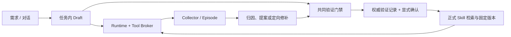

<div align="center">
  <picture>
    <source media="(prefers-color-scheme: dark)" srcset="assets/skillforge-banner-dark.png">
    
  </picture>

# SkillForge

**记住一次经历，与接受一项长期能力，是两个不同的决策。**

Agent 受控执行、任务内草稿试用与跨任务技能演进的个人工程项目。

[](pyproject.toml)
[](src/skillforge/bounded_recovery.py)

</div>

## 项目解决什么问题

Agent 能完成一次任务，不代表它已经获得可长期复用的技能。SkillForge 把执行、经历、候选与正式技能分开管理：

- **短需求先试用**：从需求或对话生成任务内 Draft，不需要先伪造 Episode，也不立即发布到正式库。
- **执行留下证据**：Runtime 固定运行快照，Tool Broker 检查工具权限与参数，Collector 回收带来源、版本和工具轨迹的 Episode。
- **修改经过门禁**：候选需要来源、结构、长度、依赖与行为验证；旧 PASS 不能在正文、基线、意图、配置或数据集漂移后继续使用。
- **长期能力显式接受**：共同验证的权威记录与显式确认是晋升条件；一次任务成功、图恢复成功或模型自评成功都不能替代发布决策。

这是工程机制与实验项目，**不是生产就绪平台，也不保证模型会持续变好**。

## 核心链路


```mermaid
flowchart LR
    R["需求 / 对话"] --> D["任务内 Draft"]
    D --> T["Runtime + Tool Broker"]
    S["正式 Skill 检索与固定版本"] --> T
    T --> E["Collector / Episode"]
    E --> C["归因、提案或定向修补"]
    D --> V["共同验证门禁"]
    C --> V
    V --> P["权威验证记录 + 显式确认"]
    P --> S
```

### 1. 快速生成、试用与用户变向

- 需求与 conversation 保留各自真实来源；对话草稿可记录会话和消息引用。
- 同一任务内重复请求复用 Draft，不跨任务共享私有草稿。
- 用户明确改变目标、禁止项或交付形式时，修订任务意图和草稿正文；同义改写不重复生成，模糊变向需要确认。
- 旧运行使用启动时冻结的正文和版本；Runtime 重建后仍从持久化快照恢复，迟到结果不覆盖新意图。
- 单会话变向不全局废除正式 Skill，也不把只读任务自动升级为写权限。

### 2. 受控执行与验证

- Runtime 管理运行预算、超时与取消；Broker 统一工具准入、参数校验和调用记录。
- 产物级 `ValidationReceipt` 驱动有限范围的局部修复，交付时基于当前产物重新验证。
- 长期 Skill 的 `RepairJob` 根据失败责任层定向修补，不把权限拒绝、工具环境故障或无可靠 oracle 的结果当作业务技能缺陷。
- 应用层 Broker 与真实 OS 沙箱是不同证据层；macOS Seatbelt 能力依赖平台与环境，FakeSandbox 或影子目录不代表 OS 隔离。

### 3. 经历、提案与用途隔离

- Episode 按 ID 从规范 Store 读取；需求、文档和调用方伪造内容不能冒充学习经历。
- 开发反馈与锁定评测分流；来源家族、派生血缘与近重复检查用于避免评测泄漏。
- 从 trace 提取带工具快照和独立预期的可复现用例提案；缺少预期的样本保留待审或诊断状态。
- 模式提炼先按业务范围、意图与工具契约兼容性分组，再复用既有相似度聚类；不凭相似措辞合并不同任务。

### 4. 有界恢复与受控晋升

实际演进入口 `repair_skill_failure(enable_shadow_recovery=True)` 可调用 LangGraph 恢复节点和当前 RepairJob；普通小改不强制走图。

实现**复用既有 LangGraph SQLite 检查点与序列化基础设施，新建适配当前演进链的恢复节点**，未原样复用旧 Evolver 业务节点，避免两套预算、状态与注册路径冲突。

- 图与内部修补共享尝试次数、调用、token 与原始截止期限，重启不重置账本。
- 重复候选、无进展、预算耗尽或绑定漂移会停止恢复并保留诊断。
- 已完成步骤可恢复；不确定的在途动作按 fail-closed 处理，不承诺跨系统 exactly-once 或外部副作用回滚。
- 图只返回经过重验的候选，不自动晋升或部署。
- 拆分器首期只给建议，不自动修改 Skill、路由或发布子技能；长而连贯的流程不因长度自动拆分。

### 5. 当前长度护栏

有基线修改采用“比例 **AND** 绝对净增”规则：

| 检查范围 | 触发长度 REVIEW 的条件 |
| --- | --- |
| 单章节 | 增长 > 25%，且净增 > 1000 policy tokens |
| 全文正文 | 大小 > 基线的 1.20 倍，且净增 > 1000 policy tokens |
| 无基线新建 | 可配置的初始正文上限，默认 3000 字符 |

恰好净增 1000 tokens 不触发上述增长门。计数采用固定 policy tokenizer（默认 `cl100k_base`），不是 GLM 原生 token 或供应商账单用量；计数不可用时保留 REVIEW。1000 是工程策略值，不是已实证的注意力过载临界点。通过长度检查也不等于通过其他验证或获得发布许可。

## 验证到了哪一层

截至 2026-10-01，三项收尾工程缺口——conversation 来源、跨 Runtime 的草稿快照与旧库迁移、实际 LangGraph → RepairJob 接入——已完成限定本地验收。

| 证据 | 已有记录 | 不能据此推断 |
| --- | --- | --- |
| 收尾工程回归 | 下列 8 个测试文件本次复跑 **61 passed，exit 0**；包含恢复专项 11 项 | 全仓库测试全部通过、真实模型效果或生产 SLA |
| 离线物流生命周期 | scripted / FakeLLM 下覆盖生成、试用、变向、修补、确认晋升与后续复用 | 同一条完整链已经全部由真实模型执行 |
| 真实模型实验 | Ark `glm-5.3-flash`，synthetic 订单，实际 Runtime / Broker / Collector；分别有失败修补和变向后正式版复用记录 | 真实订单接入、生产部署或普遍效果提升 |
| 历史小样本 A/B/C | 标为 LOCKED 的 6 项记录为 A 5/6、B 5/6、C 6/6 | 缺少修订前冻结与派生血缘证据，不能称为干净的独立家族 heldout |
| OS 隔离 | 已有 macOS Seatbelt 越界写被拒的局部记录 | 所有实验都运行在真实 OS 沙箱 |

**历史限制保留，不补造记录：** DEV A 组只有 2/6 汇总，缺少完整逐任务原始配对；早期 125 次调用只有 aggregate 记录；两条真实模型分支分别展示，不拼接成不存在的纵向轨迹。缺少实际 usage 或账单的 token / 费用字段保留 `null`，不声称精确单价、回本次数或统计显著收益。旧同构样本、事后重分与派生挑战属于探索性结果。

详细验收、取舍与历史更正见 [交付进度与最终限定结论](docs/QUICK_GENERATION_EVOLUTION_PROGRESS.md)。本次上传没有重新调用真实模型。

## 安装与本地复现

```bash
git clone https://github.com/SuperGODOG/skillforge.git
cd skillforge
git switch linux
python3 -m venv .venv
.venv/bin/python -m pip install -e ".[dev]"
.venv/bin/skillforge --help
```

CLI 保留 `demo`、`route`、`evaluate`、`evolve` 入口。快速生成、用户变向与新恢复链主要通过 Python 接口及集成专项展示，不能把旧 CLI demo 当作全部生命周期验收。

复现本次收尾回归（FakeLLM、本地临时数据库，不需要模型 API key）：

```bash
.venv/bin/pytest \
  tests/test_p5_langgraph_repair_integration.py \
  tests/test_p5_bounded_recovery_and_split.py \
  tests/test_p2d_langgraph.py \
  tests/test_source_snapshot_and_migration_closure.py \
  tests/test_runtime_and_tool_broker.py \
  tests/test_failure_attribution_and_patching.py \
  tests/test_receipt_and_narrow_repair.py \
  tests/test_p2_gate_and_lifecycle.py -q
```

本次结果：`61 passed, 19 warnings, exit 0`。Warning 来自 `hello_agents` 使用 Pydantic V2 已弃用的 `dict()`。这是指定回归集合，不是全仓测试总数；环境或平台变化可能影响结果。

长度规则与物流记录可另行检查：

```bash
.venv/bin/pytest \
  tests/test_p6_token_bloat_guard.py \
  tests/test_p6_business_experiment_and_handoff.py -q
```

`evaluate`、`evolve` 及真实实验脚本可能访问配置的模型服务；它们不是上述离线复现步骤。真实实验需要自行提供凭据、明确预算和供应商配置；不要提交 `.env`、密钥、运行数据库或真实用户数据。仓库中的 checkpoint JSON 是脱敏实验记录，不是可直接接管的生产运行状态。

## 代码索引

| 模块 | 作用 |
| --- | --- |
| [skill_generator.py](src/skillforge/skill_generator.py) / [task_context.py](src/skillforge/task_context.py) | 需求与对话生成、任务契约和意图修订 |
| [runtime.py](src/skillforge/runtime.py) / [sandbox.py](src/skillforge/sandbox.py) | 运行快照、预算、Broker 与平台沙箱接口 |
| [collector.py](src/skillforge/collector.py) / [episode.py](src/skillforge/episode.py) | 经历回收、EpisodeStore 与 CandidateStore |
| [repair.py](src/skillforge/repair.py) / [bounded_recovery.py](src/skillforge/bounded_recovery.py) | 失败归因、RepairJob 与有界 LangGraph 恢复 |
| [receipt.py](src/skillforge/receipt.py) | 产物级验证凭据与局部修复 |
| [trace_purification.py](src/skillforge/trace_purification.py) / [data_partition.py](src/skillforge/data_partition.py) | 用例提案、数据用途与分区 |
| [pattern_mining.py](src/skillforge/pattern_mining.py) / [skill_splitter.py](src/skillforge/skill_splitter.py) | 模式提炼与拆分建议 |
| [evaluator/](src/skillforge/evaluator/) | 结构、长度、依赖、行为评测与棘轮门禁 |
| [retrieval.py](src/skillforge/retrieval.py) / [registry.py](src/skillforge/registry.py) / [deployments.py](src/skillforge/deployments.py) | 正式技能检索、注册与版本部署 |
| [scenarios/](src/skillforge/scenarios/) | synthetic 物流用例与实验驱动 |

## 文档与实验记录

- [原始重构交接计划](docs/SKILL_GENERATION_EVOLUTION_HANDOFF_PLAN.md)：推荐方案与验收编号，不代表全部能力均已获独立验证。
- [交付进度与证据边界](docs/QUICK_GENERATION_EVOLUTION_PROGRESS.md)：阶段记录、历史更正与用户接受的复用取舍。
- [Episode / Candidate 指南](docs/EPISODE_AND_CANDIDATE_GUIDE.md)：生成、经历、候选与晋升链。
- [Receipt 与局部修复指南](docs/NARROW_REPAIR_AND_RECEIPT_GUIDE.md)：产物诊断、局部修复和交付重验。
- [物流 A/B/C 原始记录](docs/p6_logistics_abc_raw_results.json) / [真实模型原始记录](docs/p6_real_model_abc_raw_results.json)：保留逐任务输出、工具轨迹及失败。
- [调用账本](docs/p6_provider_call_ledger.json) / [补充行为评测](docs/p6_real_behavior_eval_summary.json)：记录已有用量与缺失字段。
- [交互式知识索引与图谱](docs/skillforge-knowledge-index.html)：辅助理解；图示或早期话术与当前证据不一致时，以源码和最终交付记录为准。

## 范围与暂不承诺

本轮不包含自动拆分发布、生产订单接入、新通用 Agent / Memory / 队列平台、签名系统或大规模真实模型实验。没有验证生产并发、故障 SLA、所有外部副作用的幂等性，也没有足够证据证明普遍泛化或经济收益。

项目使用 [hello-agents](https://github.com/jjyaoao/HelloAgents) 与 LangGraph 等依赖。当前仓库未提供独立的 `LICENSE` 文件；使用与再分发前请确认项目及各依赖的许可条件。
