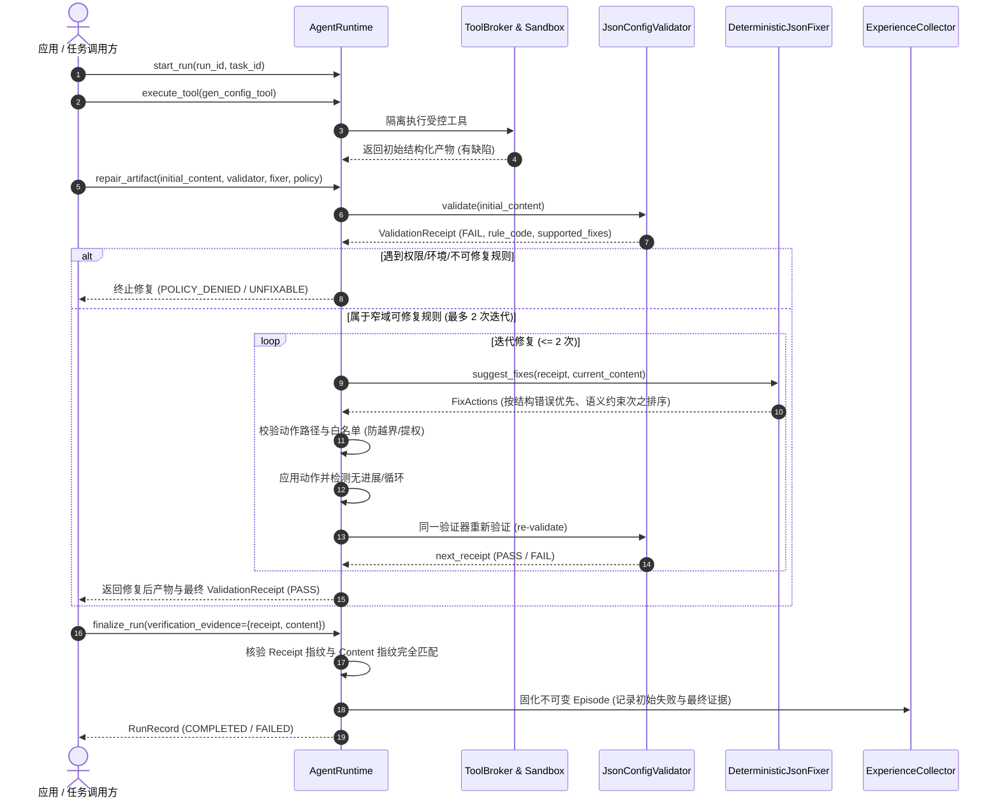

# SkillForge 可操作诊断与窄域局部修复指南 (Narrow Local Repair & Validation Receipt)

## 一、背景与设计原则 (Archify-Inspired Pattern)

在 Agent 系统运行中，工具常产出 JSON 配置或结构化数据产物。传统报错往往只返回非结构化字符串（如 `"Validation failed"` 或 `"Schema error"`），导致上层修复器只能盲目重试或全量重跑。

借鉴 **Archify 的可操作诊断模式**，SkillForge 在运行时引入了 **`ValidationReceipt`** 与 **窄域局部修复（Narrow Local Repair）** 机制：
1. **结构化凭证 (ValidationReceipt)**：每次验证生成包含稳定 `rule_code`、JSON 路径 `subject`、`expected/actual` 证据、责任层 (`responsibility_layer`)、`retryable` 标识及应用预设的 `supported_fixes`。
2. **确定性指纹绑定 (Fingerprint Binding)**：Receipt 严格绑定产物内容的 SHA-256 指纹与验证器（ID / 版本 / 配置哈希）。若验证后篡改产物或更换规则，旧 PASS 即刻失效，杜绝错绑。
3. **窄域安全局部修复 (Narrow Domain Fix)**：修复器只能在应用策略 `CorrectionPolicy` 预设的字段白名单和操作类型内修复，最多 2 次迭代；权限、环境与不可修复规则严禁调用修复器掩盖故障。
4. **生命周期与预算对齐**：所有修复调用受限于现有 `AgentRuntime` 的总预算、超时、取消和终态守卫，终态后晚到结果不可覆盖。
5. **产物修复与技能演化严格隔离**：单次产物的局部修正仅服务于当前任务执行，**绝不静默修改或晋升长期 Skill**；长期 Skill 的修改仍严格遵循 `RepairJob -> Regression Gate -> caller_confirmed -> 不可变版本发布` 路径。

---

## 二、架构全景与执行时序



---

## 三、可重放代码示例 (Runnable Example)

```python
from pathlib import Path
from skillforge import (
    AgentRuntime,
    CorrectionPolicy,
    DeterministicJsonFixer,
    EpisodeStore,
    JsonConfigValidator,
    init_db,
)

# 1. 初始化运行环境
db_path = Path("/tmp/skillforge_demo.db")
init_db(db_path).close()
ep_store = EpisodeStore(db_path)
runtime = AgentRuntime(db_path=db_path, episode_store=ep_store)

# 2. 注册验证器、修复器与治理策略
validator = JsonConfigValidator(
    required_fields=["name", "workers", "timeout_seconds", "retry_seconds"],
    min_workers=1,
    max_workers=64,
    min_timeout=1,
    max_timeout=3600,
    min_retry=0,
    max_retry=300,
)
fixer = DeterministicJsonFixer(
    default_name="production_service",
    default_workers=8,
    default_timeout=60,
    default_retry=10,
)
policy = CorrectionPolicy(
    enabled=True,
    max_corrections=2,
    allowed_paths={"$.name", "$.workers", "$.timeout_seconds", "$.retry_seconds"},
    allowed_ops={"set", "replace"},
)

# 3. 启动任务并获取初始缺陷产物
run_id = "demo_run_01"
runtime.start_run(run_id=run_id, task_id="demo_task_config", purpose="learning")

# 缺陷产物：缺少必需字段 'name'，且 cross-field 违规 (timeout 10 < retry 30)
initial_flawed_payload = {
    "workers": 4,
    "timeout_seconds": 10,
    "retry_seconds": 30,
}

# 4. 驱动窄域局部修复
final_content, final_rcpt, history, stop_reason = runtime.repair_artifact(
    run_id=run_id,
    initial_content=initial_flawed_payload,
    validator=validator,
    fixer=fixer,
    correction_policy=policy,
)

print(f"Repair Result: stop_reason={stop_reason}, status={final_rcpt.status}")
print(f"Attempts taken: {len(history)}")
for step in history:
    print(f"  Attempt {step['attempt']}: actions={step['actions']}, status={step['receipt_status']}")
print(f"Final Artifact: {final_content}")

# 5. 交付终态与证据绑定
run, ep = runtime.finalize_run(
    run_id=run_id,
    verification_evidence={
        "independent_pass": final_rcpt.status == "PASS",
        "receipt": final_rcpt.to_dict(),
        "content": final_content,
        "correction_attempts": len(history),
    },
)
print(f"Final Episode outcome={ep.outcome}, ep_id={ep.episode_id}")
```

---

## 四、离线受控 A/B 对照原始测试表格 (SC6 Offline Benchmark)

在完全相同的 8 组基准用例（涵盖结构缺失、数值超限、跨字段约束、双重错误、不可修复规则、策略拦截、无进展、越界尝试）下，对 **Group A（原流程，局部修复关闭）** 与 **Group B（Receipt + 窄域局部修复开启）** 进行了离线受控对照实验：

### 1. 原始指标对比汇总表

| 指标项 (Metric) | Group A (原流程 Baseline) | Group B (Receipt + 窄域修复) | 差异 (Delta B - A) | 备注说明 |
|---|---|---|---|---|
| **测试用例总数 (Total Cases)** | 8 | 8 | 0 | 相同输入用例集 |
| **最终验证通过数 (Final Passes)** | **0** | **4** | **+4** | 成功恢复 4 个可修复配置 |
| **误报成功数 (False Positives)** | **0** | **0** | 0 | 严格遵循真实规则重验，0 误报 |
| **验证器调用次数 (Validator Calls)** | 8 | 13 | +5 | 初始验证 8 次 + 修复重验 5 次 |
| **局部修复器调用数 (Fixer Calls)** | 0 | 7 | +7 | 仅可修复项调用，策略/不可修复 0 次 |
| **无进展次数 (No-Progress Cases)** | 0 | 1 | +1 | 探测到无效修改即刻终止 |
| **人工处理终态数 (Human Intervention)** | 8 | 4 | -4 | 无法自动修复项安全转入人工终态 |
| **实际执行耗时 (Elapsed Time)** | 0.0028s | 0.0042s | +0.0014s | 毫秒级离线确定性执行 |
| **Token 消耗 (Tokens)** | **null** | **null** | null | 离线规则/Fixture测试，无外部模型 |
| **API 成本 (Cost USD)** | **null** | **null** | null | 无商业收费调用 |

### 2. 用例级逐项结果明细

| Case ID | 类别 | Group A 状态 | Group B 状态 | Group B 终止原因 | 修正轮数 |
|---|---|---|---|---|---|
| `case_1_missing_field` | 可修复结构错误 (缺 name) | FAIL | **PASS** | SUCCESS | 1 |
| `case_2_invalid_range` | 可修复结构错误 (workers=0) | FAIL | **PASS** | SUCCESS | 1 |
| `case_3_cross_field` | 可修复语义约束 (timeout<retry) | FAIL | **PASS** | SUCCESS | 1 |
| `case_4_sequential_both` | 可修复双重错误 (缺 name + 跨字段) | FAIL | **PASS** | SUCCESS | 2 (顺序处理) |
| `case_5_unfixable_rule` | 不可修复规则 (非字典载荷) | FAIL | FAIL | UNFIXABLE_RULE_NO_REPAIR | 0 (不误修) |
| `case_6_policy_denied` | 环境/权限拒绝 (403/Policy) | FAIL | FAIL | POLICY_DENIED_NO_REPAIR | 0 (不掩盖) |
| `case_7_no_progress` | 修复器无进展修改 | FAIL | FAIL | NO_PROGRESS | 1 (防死循环) |
| `case_8_out_of_bounds` | 修复器越界/提权尝试 | FAIL | FAIL | OUT_OF_BOUNDS_PATH | 1 (防逃逸) |

---

## 五、重要边界声明与局限性 (Limitations & Governance)

> [!WARNING]
> **真实 ROI 未证实声明**：
> 上述测试中获得的验证通过率提升（0 -> 4）属于**离线固定规则与机械 Fixture 测试下的确定性恢复收益**，绝不等于真实复杂用户环境或大语言模型（LLM）端到端的成本降低或性能提升。在未接入真实大模型线上真实流量并完成统计显著性检验前，不得宣称“该机制降低了 X% 的 LLM 调用成本”。Token 与 Cost 字段在测试报告中严格显式标记为 `null`。

> [!IMPORTANT]
> **验证器权威绑定与终态门禁 (SC5)**：
> 1. **强制权威核验**：凡启用 Receipt/Correction 的 Run，进入 `finalize_run` 时必须绑定当前权威验证器（通过 `register_artifact_validator` 或 `repair_artifact` 自动绑定）。
> 2. **漂移拦截**：`finalize_run` 独立核验内容指纹、验证器 ID、版本与配置哈希 `config_hash`，并使用持有的权威验证器执行独立重验。旧 PASS 凭证若因规则变严导致配置哈希不匹配或重验不通过，将直接判定为失败并覆盖交付结果，不可信任调用方单方面传入的 `PASS` 标记。
> 3. **缺失与篡改拦截**：缺少 Receipt、伪造 Receipt 或内容篡改均 fail-closed，准确终态。未启用 Receipt 的合法流程保持全向后兼容。

> [!NOTE]
> **并发与生命周期控制边界 (SC4 & Python 运行环境)**：
> 1. **硬上限与预算**：即使应用策略配置更大的修复次数，系统也强制执行硬上限 `max_corrections <= 2`；一旦单步或总工具调用预算耗尽，修复立即终止。
> 2. **超时与取消**：修复循环在每次迭代前后均核查截止时间戳与取消信号，已终态的 Run 绝不追加新动作或覆写成功 Episode。
> 3. **晚到补丁守卫 (Late Patch Guard)**：若外部修复器计算耗时较长、在返回后发现 Run 已被外部取消或超时，其生成的修复动作被直接丢弃，不生效也不污染产物。
> 4. **Python 单进程非抢占协作边界**：在 Python 单进程内，普通可调用对象（用户态 Fixer / 函数）无法被外部信号硬杀（无抢占式 SIGKILL）；修复器需自行感知协作退出，或依赖运行时在函数返回的第一时间执行状态复核以丢弃无效动作。

> [!IMPORTANT]
> **产物修复与技能演化职责边界**：
> - **Artifact Repair（产物局部修复）**：作用域仅限当前单次 Run 的瞬态输出，不持久化任何技能逻辑变更。
> - **Skill Evolution（技能自进化）**：依然严格依赖全链路中的 `Failure Attribution -> RepairJob -> Regression Test Gate -> Explicit Confirmation -> ReleaseStateMachine`，二者权限与代码链绝不混用。

---

## 六、业务故障修复收据与外部副作用不可逆性 (Business Repair Receipts & Side-Effect Irreversibility)

在端到端业务闭环（如电商多包裹物流履约）中，修复机制不仅涵盖结构化 JSON 配置的瞬态纠错，还协同支撑长期 Skill 业务缺陷的受控修复与凭证固化：

### 1. 业务修复凭据与多维绑定 (Business Repair Receipts & Validation Binding)
- 当业务执行未通过独立业务 Oracle（如部分签收误报全送达、违反 `STATUS_ONLY` 意图添加建议、漏查包裹）时，`RepairJob` 触发受控修复；
- 修复后产出的 Candidate 重新提交统一准入门禁（`validate_candidate`），必须经由独立业务 Oracle 给出真实检验凭证；
- 验证通过后生成的 `ValidationRecord` 完整绑定 Candidate ID、内容哈希、基线版本、意图范围哈希、评测配置哈希与评测集版本，写入 SQLite 权威表；
- 任何篡改候选正文、规则配置漂移或伪造验证标记的行为均被准入门禁（G6 Gate）直接阻断，杜绝无收据或篡改收据的静默发布。

### 2. 外部副作用不可逆性治理 (Irreversible Side-Effect Accounting)
现实物理系统中的外部工具调用（如支付退款、仓库发货、外部短信通知）具有**物理不可撤销性**：
1. **真实审计不伪称回滚**：当任务被调用方显式取消（`runtime.cancel_run`）或因超时终态时，运行时在 `get_cancellation_report()` 中如实披露已执行的工具调用列表，并明确声明 `side_effects_reversible=False`，坚决不向调用方虚假承诺“已全量撤销/回滚”。
2. **恢复状态继承与防重复触发**：在有界恢复编排（如 LangGraph Checkpointer）从断点恢复时，系统严格继承已记录的副作用集合（`executed_side_effects`）；对于已执行成功的不可撤销动作，Handler 调用次数严格保持为 1，严禁重试重复执行、重复发货或重复扣费。
3. **顶层统一预算守卫**：外部编排图与内部 RepairJob 共享顶层调用预算、Token 预算与截止时间（Deadline），一旦预算耗尽或超时即刻硬退出，避免重试失控引发外部系统雪崩。

### 3. 晚到提案与终态隔离 (Late Proposal & Terminal State Guard)
- 当任务已由于用户取消、超时或致命故障进入终态后，迟到的工具执行回调或异步修复建议被安全拦截并丢弃；
- 迟到的执行结果严格归属于发起时的旧意图版本，绝不作为新目标正例，亦不可覆盖已持久化的终态 Episode 记录。

---

## 七、生产演进入口与真实 StateGraph 影子恢复闭环 (Production Entry & StateGraph Recovery Loop)

### 1. 实际生产演进入口调用链 (Actual Invocation Chain)
在真实演进生产中，针对长期 Skill 执行失败的受控恢复流程已完全接入标准 5 节点状态图：
```
repair_skill_failure(enable_shadow_recovery=True)
  │
  ├── 1. check_non_recoverable_blockers (前置廉价门禁)
  │      ├─ 权限/安全拒绝 (403) ──> AWAITING_REVIEW (REASON_PERMISSION_DENIED, 0次模型调用)
  │      ├─ 缺少 Truth Oracle ───> BLOCKED (REASON_EVALUATOR_FAULT, 0次模型调用)
  │      ├─ 环境/文件缺失 ────────> BLOCKED (REASON_ENV_MISSING, 0次模型调用)
  │      └─ 用户手动取消 ──────────> BLOCKED (REASON_USER_CANCELLED, 0次模型调用)
  │
  ├── 2. 策略门禁判断 (enable_shadow_recovery)
  │      └─ False ──> 维持 AWAITING_REVIEW (REASON_PROMPT_BLOAT_REVIEW, 0次图调用, 0次模型调用)
  │
  ├── 3. 影子 5 节点 StateGraph (LangGraph + SqliteCheckpointer)
  │      ├─ failure_analysis (诊断根因并生成机器可读理由码)
  │      ├─ candidate_generation (FakeLLM 生成候选补丁)
  │      ├─ validation (调用统一 validate_candidate 沙箱共同验证)
  │      ├─ defense_adjudication (棘轮裁判，验证单据绑定与防回退)
  │      └─ rounds_state_machine (轮次状态机判定 PASS / RETRY / EXHAUSTED)
  │
  ├── 4. 权威 CandidateStore 存储
  │      └─ 固化 READY 候选与权威 ValidationRecord (绑定 content_hash, config_hash)
  │         正式库 SkillRegistry 保持不变 (版本保持 1.0.0)
  │
  └── 5. 显式确认受控晋升 (promote_repaired_skill)
         ├─ caller_confirmed=False ──> 拒绝晋升 (抛出异常, 正式库保持 1.0.0)
         ├─ 候选正文被篡改 ──────────> 拒绝晋升 (哈希校验失败)
         └─ caller_confirmed=True ───> ReleaseStateMachine 发布为新版本 1.0.1 (PROMOTED)
```

### 2. 核心责任边界与事实声明
1. **单一顶层预算 (Shared Budget)**：图编排与内部 RepairJob 共享顶层 `RecoveryBudget`，多轮内部重试扣减同一账本，严禁隐式预算翻倍；
2. **断点恢复不归零与绝对时点守卫**：SqliteCheckpointer 新实例恢复继承 `consumed_attempts`, `consumed_calls`, `consumed_tokens`, `deadline_seconds` 以及 `start_time` 绝对开始时间；若推进时钟越过绝对期限，恢复直接终止为 `TIMEOUT`，模型调用严格为 0（不重新获得 100 秒窗口）；已完成步骤不重复执行；
3. **血缘与权威数据集漂移阻断**：意图修订、基线哈希或由 `compute_cases_hash(eval_cases)` 提取的 `dataset_version` 漂移时，阻断恢复（`CHECKPOINT_INVALIDATED`）；
4. **历史事实与测试声明**：全量测试采用受控 FakeLLM + 本地 SQLite，真实 Provider 消耗严格为 0；DEV A2/6 仅汇总不补造逐任务配对，LOCKED 小样本不可追证，早期 125 aggregate-only 成本记为 `null`，两真实分支物理独立保持现状；
5. **LangGraph 模块实际复用界限**：复用既有 LangGraph 检查点与序列化基础设施，新建适配当前演进链的恢复节点；未原样复用旧 Evolver 业务节点，以避免预算、状态和注册路径冲突。


