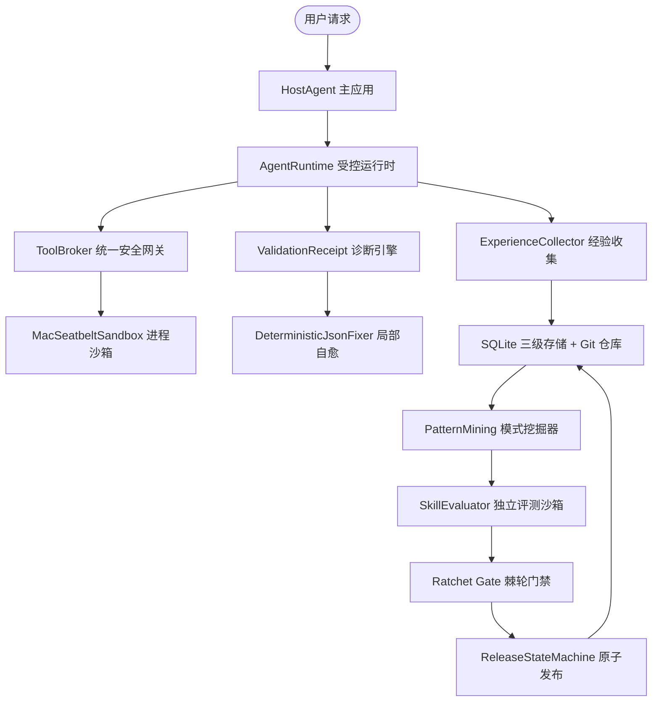

# SkillForge 生产级架构图景与面试阐述全景通关指南

> **系统全称**：SkillForge 2.0 (Agent Experience Crystallization & Controlled Evolution Framework)  
> **文档定位**：`docs/` 核心架构与面试阐述总指南（深度融合 Archify 4 大交互式架构图、简历四大项逐字攻防、30 道大厂高频题库与三大深钻专精）  
> **关联交互图景**：
> - 🏛️ [**全景架构拓扑 (Architecture)**](file:///Users/caoruixin/Desktop/project/skillforge/docs/skillforge-architecture.html)
> - ⚡ [**任务内诊断与交付重验时序 (Sequence)**](file:///Users/caoruixin/Desktop/project/skillforge/docs/skillforge-task-sequence.html)
> - 🔄 [**跨任务经验沉淀工作流 (Workflow)**](file:///Users/caoruixin/Desktop/project/skillforge/docs/skillforge-evolution-workflow.html)
> - 🧬 [**候选隔离与技能生命周期 (Lifecycle)**](file:///Users/caoruixin/Desktop/project/skillforge/docs/skillforge-skill-lifecycle.html)
> - 📖 [**交互式知识索引主页 (Knowledge Index Portal)**](file:///Users/caoruixin/Desktop/project/skillforge/docs/skillforge-knowledge-index.html)

---

# 目录

- [第一章：Archify 四大交互图景与架构映射](#第一章archify-四大交互图景与架构映射)
  - [1.1 🏛️ 全景架构拓扑图（skillforge-architecture.html）](#11-️-全景架构拓扑图skillforge-architecturehtml)
  - [1.2 ⚡ 任务内自愈与交付重验时序图（skillforge-task-sequence.html）](#12-⚡-任务内自愈与交付重验时序图skillforge-task-sequencehtml)
  - [1.3 🔄 跨任务经验演进状态图（skillforge-evolution-workflow.html）](#13--跨任务经验演进状态图skillforge-evolution-workflowhtml)
  - [1.4 🧬 候选隔离与生命周期图（skillforge-skill-lifecycle.html）](#14--候选隔离与生命周期图skillforge-skill-lifecyclehtml)
- [第二章：口头表达漏斗与预设战场](#第二章口头表达漏斗与预设战场)
  - [2.1 30 秒电梯演讲与黄金钩子](#21-30-秒电梯演讲与黄金钩子)
  - [2.2 3 分钟技术主线陈述](#22-3-分钟技术主线陈述)
  - [2.3 10 分钟白板架构推演](#23-10-分钟白板架构推演)
- [第三章：简历四大 Bullet 逐字深度拷打与应对](#第三章简历四大-bullet-逐字深度拷打与应对)
  - [3.1 Bullet 1 逐字攻防：跨任务技能演进](#31-bullet-1-逐字攻防跨任务技能演进)
  - [3.2 Bullet 2 逐字攻防：任务内可验证自修复](#32-bullet-2-逐字攻防任务内可验证自修复)
  - [3.3 Bullet 3 逐字攻防：受控执行 Harness](#33-bullet-3-逐字攻防受控执行-harness)
  - [3.4 Bullet 4 逐字攻防：检索复用与版本治理](#34-bullet-4-逐字攻防检索复用与版本治理)
- [第四章：30 道大厂路由题库与真实代码串联（四步答辩法）](#第四章30-道大厂路由题库与真实代码串联四步答辩法)
  - [4.1 宏观认知与架构范式篇（L80, L93, L6, L8, L9, L23, L25, L16）](#41-宏观认知与架构范式篇l80-l93-l6-l8-l9-l23-l25-l16)
  - [4.2 记忆体系与上下文治理篇（L177, L19, L21, L17, L133, L137, L27, L57）](#42-记忆体系与上下文治理篇l177-l19-l21-l17-l133-l137-l27-l57)
  - [4.3 评测体系、归因与稳定性工程篇（L201, L45, L63, L237, L188, L403）](#43-评测体系归因与稳定性工程篇l201-l45-l63-l237-l188-l403)
  - [4.4 计算机底层与系统工程篇（L326, L319, L363, L150, L74, L30, L31, L12）](#44-计算机底层与系统工程篇l326-l319-l363-l150-l74-l30-l31-l12)
- [第五章：三大核心深钻支柱全景剖析](#第五章三大核心深钻支柱全景剖析)
  - [5.1 经验沉淀与 5 维启发式模式提炼（从 Episode 到 Candidate）](#51-经验沉淀与-5-维启发式模式提炼从-episode-到-candidate)
  - [5.2 ValidationReceipt 结构化契约与防漂移局部自修复](#52-validationreceipt-结构化契约与防漂移局部自修复)
  - [5.3 受控执行 Harness、沙箱生命周期与不可变发布](#53-受控执行-harness沙箱生命周期与不可变发布)
- [第六章：生产级踩坑：DHR 故障卡与组合 Failure 推演](#第六章生产级踩坑dhr-故障卡与组合-failure-推演)
  - [6.1 八套核心场景 DHR 故障应急卡](#61-八套核心场景-dhr-故障应急卡)
  - [6.2 三大跨模块组合 Failure 级联推演](#62-三大跨模块组合-failure-级联推演)
- [第七章：极限考题与“四步收刀法”防守指南](#第七章极限考题与四步收刀法防守指南)
- [第八章：全景速查对照表（核心参数、代码锚点与决策底线）](#第八章全景速查对照表核心参数代码锚点与决策底线)

---

# 第一章：Archify 四大交互图景与架构映射

SkillForge 2.0 在 `docs/` 目录下配备了 4 幅通过 Archify 生成的交互式、可探索、高保真独立 HTML 架构图，构成了整个系统工程落地的视觉骨架：

```
┌────────────────────────────────────────────────────────────────────────┐
│ 🗺️ Archify 四大交互图景矩阵                                            │
├──────────────────────────┬─────────────────────────────────────────────┤
│ 交互 HTML 图景文件       │ 核心表达架构与工程映射                      │
├──────────────────────────┼─────────────────────────────────────────────┤
│ 🏛️ skillforge-architecture.html│ 10 大核心组件、执行沙箱边界与候选物理隔离边界│
│ ⚡ skillforge-task-sequence.html│ ValidationReceipt 局部修复、2轮上限与交付重验│
│ 🔄 skillforge-evolution-workflow.html│ 跨任务经验沉淀、5 维模式挖掘与棘轮门禁状态图 │
│ 🧬 skillforge-skill-lifecycle.html  │ 候选从 DRAFT 到 PUBLISHED 5 状态机与 CAS 回滚 │
└──────────────────────────┴─────────────────────────────────────────────┘
```

---

## 1.1 🏛️ 全景架构拓扑图（skillforge-architecture.html）

> 🔗 **点击查看独立交互图**：[`docs/skillforge-architecture.html`](file:///Users/caoruixin/Desktop/project/skillforge/docs/skillforge-architecture.html)

### 架构核心亮点：
1. **在线数据面（Data Plane）**：`HostAgent` 通过 `SkillRegistry` 实行两段式渐进披露（开局加载 `build_index()`，使用时调用 `use_skill(name, reason)`），大模型决策时面对的活动工具数 $\le 2$ 个，消除注意力稀释与工具误选；
2. **受控执行边界（Harness Boundary）**：`AgentRuntime` 管预算预扣与超时取消，`ToolBroker` 统一 Schema 校验与敏感词递归脱敏，由 `MacSeatbeltSandbox` 实行进程断网与文件写隔离；
3. **三级存储平面（Storage Plane）**：基于 SQLite 单文件数据库维护 `SemanticStore`（客观事实）、`EpisodeStore`（执行凭据）、`CandidateStore`（隔离候选）与 `SkillRegistry` + Git 仓库（正式规程）；
4. **离线控制面（Control Plane）**：模式挖掘器（`PatternMining`）基于余弦相似度聚类并执行 5 维启发式指标过滤，通过 `SkillEvaluator` 跑独立测试集，由 `check_ratchet` 门禁放行后晋升。



---

## 1.2 ⚡ 任务内自愈与交付重验时序图（skillforge-task-sequence.html）

> 🔗 **点击查看独立交互图**：[`docs/skillforge-task-sequence.html`](file:///Users/caoruixin/Desktop/project/skillforge/docs/skillforge-task-sequence.html)

### 时序核心亮点：
1. **ToolBroker 隔离执行**：真实环境执行工具，产出初始结构化 JSON 配置；
2. **结构化诊断出单**：校验失败生成 `ValidationReceipt`，包含 `rule_code`、JSONPath `subject`、`expected/actual` 与 `responsibility_layer`；
3. **有界局部自愈（Loop $\le 2$ 次）**：`DeterministicJsonFixer` 仅在 `CorrectionPolicy.allowed_paths` 白名单内打补丁，检测哈希环路防死锁；
4. **finalize 强一致性双重验**：调用 `receipt.is_valid_for(current_content, current_validator)`，比对实时内容 SHA-256 与验证器配置 Hash，防旧 PASS 欺诈与规则漂移。

---

## 1.3 🔄 跨任务经验演进状态图（skillforge-evolution-workflow.html）

> 🔗 **点击查看独立交互图**：[`docs/skillforge-evolution-workflow.html`](file:///Users/caoruixin/Desktop/project/skillforge/docs/skillforge-evolution-workflow.html)

### 工作流核心亮点：
1. **A8 数据物理隔离**：过滤 `purpose != 'learning'` 样本，测试集绝不进入挖掘输入；
2. **5 维启发式过滤**：`min_support >= 3`（独立 task 去重）、覆盖率 $\ge 80\%$、成功率 $\ge 80\%$、表达多样性 $\ge 2$、步骤数 $\ge 2$；
3. **Candidate 生成与隔离**：生成 `CandidateSkill`，打上 `status=DRAFT` 存入 `CandidateStore`，与在线检索物理隔离；
4. **反思自愈重修回环**：遇到沙箱 DECLINED 时，触发专门的诊断 Agent 进行错因反思，重试 3 次失败彻底归档。

---

## 1.4 🧬 候选隔离与生命周期图（skillforge-skill-lifecycle.html）

> 🔗 **点击查看独立交互图**：[`docs/skillforge-skill-lifecycle.html`](file:///Users/caoruixin/Desktop/project/skillforge/docs/skillforge-skill-lifecycle.html)

### 生命周期 5 状态机转移链：
$$\text{DRAFT} \xrightarrow{\text{评测通过}} \text{VALIDATED} \xrightarrow{\text{发布放行}} \text{CANARY} \xrightarrow{\text{全量晋升}} \text{ACTIVE} \xrightarrow{\text{废弃归档}} \text{ARCHIVED}$$
- **回滚机制**：若 Canary 或 Active 发生隐患，通过 CAS 乐观锁原子回退至上一稳定版本；
- **运行级版本固定**：长任务启动绑定 `RunVersionBinding`，执行过程不受并发发布干扰。

---

# 第二章：口头表达漏斗与预设战场

## 2.1 30 秒电梯演讲与黄金钩子

> “面试官您好，我负责的 **SkillForge** 是一个 **Agent 运行经验沉淀与技能演进框架**。  
> 我们核心解决一个工程痛点：**Agent 完成一次任务之后，怎样让这次经历对后续任务产生确定性的工程价值？**  
> 
> 我在系统里提出的核心设计，是**将执行轨迹提取、分类后沉淀为三级记忆，严格区分事实、具体执行经历与可复用技能，而不是把单次运行日志直接当成长期 SOP**。在这之上，系统通过启发式指标挖掘重复模式，经过独立评测沙箱与回归门禁，才显式晋升为正式 Skill。  
> 
> 我总结的核心原则是：**‘记住一次经历和接受一项长期能力，是两个截然不同的工程决策’**。  
> 执行侧我们提供受控 Runtime、工具权限和进程沙箱；对于结构化产物，还提供 Receipt 驱动的有界局部自修复和交付双重验。  
> 我最想跟您展开的，正是中间这一步：**哪些轨迹值得留下，系统又凭什么从‘经历’升级成‘技能’**。”

---

## 2.2 3 分钟技术主线陈述

- **第一步：经验高保真沉淀与分层**  
  摒弃纯文本存向量库。任务结束沉淀不可变 **`Episode`**，绑定环境指纹、**`ToolCallProvenance`**（入参、响应快照、延迟和签名）及客观验收凭证。底层划分为 **Semantic 事实库**（存实体观察，单次观察严禁标记 `is_universal=True`，保留冲突）、**Episodic 经历库**（存不可变运行轨迹）与 **Procedural 规程库**。
- **第二步：从重复经历提炼候选（Candidate）**  
  一次成功不代表它是通用能力。模式挖掘器在离线扫描学习型经历池时，必须满足 5 维硬性代理指标：**独立任务覆盖数 $\ge 3$（同一任务重试不累加）、结果覆盖率 $\ge 80\%$、成功率 $\ge 80\%$、语义多样性 $\ge 2$ 且步骤复杂度 $\ge 2$**。提炼出的产物作为 `CandidateSkill (DRAFT)` 存入隔离库，线上检索完全不可见。
- **第三步：独立沙箱评测与 Ratchet 棘轮门禁**  
  候选必须在**物理隔离的独立评测集**（A8 协议防泄漏）上重新运行回归测试。执行 5 条发布红线：SLA-P0 核心断言 100% 通过、净增益为正、无破坏性回归、硬负例拒识不降、Prompt 长度控制。门禁 DECLINED 触发反思回环，重试 3 次失败直接归档。
- **第四步：在线受控执行与任务内局部自修复**  
  线上采用两段式渐进披露（开局看 30 Token 索引，使用时挂载 SOP，大模型面对活动工具数 $\le 2$ 个，节省 95% Token）；底层由 `AgentRuntime` 管预算预扣与超时取消，`ToolBroker` 管权限与脱敏，结合进程沙箱限制文件和网络。  
  对于结构化产物错误，签发携带 SHA-256 双重指纹的 **`ValidationReceipt`**，在白名单路径内做最多 2 次局部修复，并在交付阶段进行内容与配置哈希的双重重验，彻底杜绝旧 PASS 欺诈或规则漂移。

---

## 2.3 10 分钟白板架构推演

在白板上现场推演系统“双闭环”架构与三大核心时序（参见[第 1.1 节全景架构图](#11-️-全景架构拓扑图skillforge-architecturehtml)与[第 1.2 节时序图](#12-⚡-任务内自愈与交付重验时序图skillforge-task-sequencehtml)），重点阐明数据流转的因果确定性与隔离边界。

---

# 第三章：简历四大 Bullet 逐字深度拷打与应对

本章针对简历原文逐句拆解，按 **L1概念 ➔ L2原理 ➔ L3代码 ➔ L4权衡 ➔ L5防御** 五层深度全面防御。

---

## 3.1 Bullet 1 逐字攻防：跨任务技能演进

> **简历原文**：*“跨任务技能演进：将工具调用、执行结果、失败恢复与验证证据沉淀为带来源和版本的 Episode，从重复模式中提炼 Skill Candidate；区分 Semantic 事实、Episodic 经历与 Procedural 技能，根据重复性、稳定性和复杂度筛选可复用模式。隔离学习数据与独立评测数据，通过失败归因、定向修补、回归门禁和显式晋升控制长期 Skill 更新。”*

### 核心攻防点：
1. **Episode vs Log**：Log 只是文本流；`Episode` 绑定了环境指纹、真实工具调用的物理凭据 `ToolCallProvenance`，以及第三方客观验收断言；若模型在 Prompt 中自评成功但无客观断言，契约校验直接报 `ValueError`。  
   *源码：[`src/skillforge/models.py:46`](file:///Users/caoruixin/Desktop/project/skillforge/src/skillforge/models.py#L46), [`src/skillforge/episode.py:40`](file:///Users/caoruixin/Desktop/project/skillforge/src/skillforge/episode.py#L40)*
2. **三级记忆分层**：Semantic 存实体客观事实（`is_universal=False`，冲突以 `SemanticConflict` 并存保留）；Episodic 存不可变单次运行记录；Procedural 存正式规程。  
   *源码：[`src/skillforge/memory.py:52`](file:///Users/caoruixin/Desktop/project/skillforge/src/skillforge/memory.py#L52)*
3. **模式提炼 5 维指标**：`min_support >= 3`（独立 task 去重）、覆盖率 $\ge 80\%$、成功率 $\ge 80\%$、表达多样性 $\ge 2$、步骤数 $\ge 2$、聚类余弦相似度 $\ge 0.80$。  
   *源码：[`src/skillforge/pattern_mining.py:46`](file:///Users/caoruixin/Desktop/project/skillforge/src/skillforge/pattern_mining.py#L46)*
4. **数据防泄漏与门禁**：A8 协议物理隔离 `purpose='evaluation'` 样本；Ratchet Gate 执行 5 条红线（SLA-P0 100%），晋升需 `caller_confirmed=True` 显式确认。  
   *源码：[`src/skillforge/evolution_loop.py:58`](file:///Users/caoruixin/Desktop/project/skillforge/src/skillforge/evolution_loop.py#L58)*

---

## 3.2 Bullet 2 逐字攻防：任务内可验证自修复

> **简历原文**：*“任务内可验证自修复：将验证失败转为结构化 Receipt，根据失败责任层决定是否修补，结合有限尝试预算、回归测试和棘轮门禁验证修改。绑定产物内容与验证器配置，驱动有界 JSON 局部修复；在 finalize 阶段基于当前产物重新验证，防止旧 PASS、内容变化及配置漂移导致错误交付。”*

### 核心攻防点：
1. **ValidationReceipt 契约**：包含 `rule_code`、JSONPath `subject`、`expected/actual` 与 `responsibility_layer`；非 `skill` 责任层（如 `tool` 网络故障或 `policy` 安全违规）严禁自愈掩盖故障。  
   *源码：[`src/skillforge/receipt.py:35`](file:///Users/caoruixin/Desktop/project/skillforge/src/skillforge/receipt.py#L35)*
2. **有界局部自修复**：`DeterministicJsonFixer` 严格限定在 `CorrectionPolicy.allowed_paths` 白名单字段内，仅允许 `set/replace` 操作，上限 2 次，哈希环路检测防死锁。  
   *源码：[`src/skillforge/repair.py:20`](file:///Users/caoruixin/Desktop/project/skillforge/src/skillforge/repair.py#L20)*
3. **finalize 防漂移双重验**：调用 `receipt.is_valid_for(current_content, current_validator)` 核对产物实时 SHA-256 指纹与验证器配置 Hash，内容改动或规则漂移当场作废旧 PASS 阻断交付。  
   *源码：[`src/skillforge/receipt.py:85`](file:///Users/caoruixin/Desktop/project/skillforge/src/skillforge/receipt.py#L85)*

---

## 3.3 Bullet 3 逐字攻防：受控执行 Harness

> **简历原文**：*“受控执行 Harness：以 Runtime 管理预算、超时和取消，Tool Broker 统一工具准入与参数校验，并结合进程沙箱限制文件与网络访问；依赖在真实执行环境中验证，不可用时 Fail-Closed。”*

### 核心攻防点：
1. **Runtime 状态机与预算**：`PENDING ➔ RUNNING ➔ TERMINAL` 单向原子转移；预扣式预算检查（超支分发前掐断）；`deadline_ts` 绝对超时守护。  
   *源码：[`src/skillforge/runtime.py:7`](file:///Users/caoruixin/Desktop/project/skillforge/src/skillforge/runtime.py#L7)*
2. **ToolBroker 网关与脱敏**：应用白名单与 Skill 依赖求交集（防越权）；参数 Schema 校验；正则 `REDACT_KEYS_RE` 递归脱敏替换为 `***REDACTED***`。  
   *源码：[`src/skillforge/runtime.py:54`](file:///Users/caoruixin/Desktop/project/skillforge/src/skillforge/runtime.py#L54)*
3. **沙箱隔离与进程树强杀**：macOS Seatbelt 原生断网 `(deny network*)` 与工作区写隔离；`terminate_process_tree`（SIGTERM ➔ 0.4s 宽限 ➔ SIGKILL）强杀进程树防僵尸；依赖探针实地验证，异常时 Fail-Closed。  
   *源码：[`src/skillforge/sandbox.py:37`](file:///Users/caoruixin/Desktop/project/skillforge/src/skillforge/sandbox.py#L37)*

---

## 3.4 Bullet 4 逐字攻防：检索复用与版本治理

> **简历原文**：*“检索复用与版本治理：按权限、依赖、验证状态和部署状态筛选正式 Skill，并接入真实任务入口；通过运行级版本固定、不可变快照、灰度路由和受控回滚保证复用与演进过程可追溯。”*

### 核心攻防点：
1. **四维筛选与两段式渐进披露**：权限 ➔ 依赖探针 ➔ 验证状态 ➔ 部署状态；开局读 `build_index()` 元数据（30 Token），调用 `use_skill` 挂载正文，活动工具数 $\le 2$ 个，Token 节省 **95%**，工具误触归零。  
   *源码：[`src/skillforge/registry.py:65`](file:///Users/caoruixin/Desktop/project/skillforge/src/skillforge/registry.py#L65)*
2. **运行级版本固定（RunVersionBinding）**：任务启动绑定不可变 `VersionSnapshot`，全生命周期读取固定快照，不受后台并发发布干扰。  
   *源码：[`src/skillforge/deployments.py:91`](file:///Users/caoruixin/Desktop/project/skillforge/src/skillforge/deployments.py#L91)*
3. **灰度算法与 CAS 回滚**：SHA-256 哈希取模确定性分桶；SQLite 4 步原子发布事务；CAS 乐观锁 `revision` 变更，并发冲突抛 `ConcurrencyError` 阻断覆盖。  
   *源码：[`src/skillforge/deployments.py:41`](file:///Users/caoruixin/Desktop/project/skillforge/src/skillforge/deployments.py#L41), [`src/skillforge/state_machine.py`](file:///Users/caoruixin/Desktop/project/skillforge/src/skillforge/state_machine.py)*

---

# 第四章：30 道大厂路由题库与真实代码串联（四步答辩法）

本章遵循大厂高分答辩范式：**①概念澄清 ➔ ②架构机制 ➔ ③工程权衡 ➔ ④生产实战与代码证据**。

---

## 4.1 宏观认知与架构范式篇（L80, L93, L6, L8, L9, L23, L25, L16）

### 题目快速索引与标准答题要点：
- **L80 & L25 (Workflow vs Agent 权衡)**：外层由 `AgentRuntime` 与 `StateGraph` 固化超时、预算、沙箱与发布状态机（工作流）；内层 ReAct 智能体在受控工具池内做局部规划与自愈（Agent）。  
  *证据：[`src/skillforge/runtime.py:7`](file:///Users/caoruixin/Desktop/project/skillforge/src/skillforge/runtime.py#L7), [`src/skillforge/repair.py:20`](file:///Users/caoruixin/Desktop/project/skillforge/src/skillforge/repair.py#L20)*
- **L93 & L6 & L8 (多步骤长任务与 ReAct 漂移)**：采用分段状态快照测试（Sub-Step Snapshot Testing）与错题反思回环；单步失败由 Receipt 捕获状态，原位定向修补，耗时从分钟级降至 500ms 内。  
  *证据：[`src/skillforge/receipt.py:53`](file:///Users/caoruixin/Desktop/project/skillforge/src/skillforge/receipt.py#L53), [`tests/test_p1h_reflection_loop.py`](file:///Users/caoruixin/Desktop/project/skillforge/tests/test_p1h_reflection_loop.py)*
- **L9 & L23 (Multi-Agent 模式选型)**：离线控制面基于 LangGraph 有向循环图构建 4 类专精诊断 Agent（边界、SOP、工具协议、约束 Agent），共享 `EvolveState` 黑板，坚决不用自由辩论（防 Token 浪费与低质妥协），靠沙箱硬指标断言胜负。  
  *证据：[`src/skillforge/langgraph_loop.py`](file:///Users/caoruixin/Desktop/project/skillforge/src/skillforge/langgraph_loop.py)*
- **L16 (AI Coding Agent 架构理解)**：代码生成必须进入强约束沙箱执行，输出截断 64KB，真实环境依赖探针 Fail-Closed。  
  *证据：[`src/skillforge/sandbox.py:37`](file:///Users/caoruixin/Desktop/project/skillforge/src/skillforge/sandbox.py#L37)*

---

## 4.2 记忆体系与上下文治理篇（L177, L19, L21, L17, L133, L137, L27, L57）

### 题目快速索引与标准答题要点：
- **L177 & L19 (多级存储持久化)**：短期工作记忆（Runtime 内存黑板）、中期经历记忆（`EpisodeStore` SQLite 事务表）、长期事实（`SemanticStore` 冲突保留）、长期规程（`SkillRegistry` + Git 仓库）。  
  *证据：[`src/skillforge/memory.py:1`](file:///Users/caoruixin/Desktop/project/skillforge/src/skillforge/memory.py#L1)*
- **L21 & L17 (记忆读写路由)**：规则护栏主导写入，模型辅助提炼语义。单次观察严禁标记 `is_universal`；前置级联路由（正则 ➔ 向量卡片 ➔ LLM），硬负例由规则前置秒级拒识。  
  *证据：[`src/skillforge/router/cascade.py:75`](file:///Users/caoruixin/Desktop/project/skillforge/src/skillforge/router/cascade.py#L75)*
- **L133 & L137 (长上下文压缩与动态技能加载)**：两段式渐进披露模式；开局读 `build_index()`，使用时显式调用 `use_skill` 挂载正文，活动工具 $\le 2$ 个，Token 节省 95%，TTFT 提速 9 倍。  
  *证据：[`src/skillforge/registry.py:65`](file:///Users/caoruixin/Desktop/project/skillforge/src/skillforge/registry.py#L65)*
- **L27 & L57 (指代消解与确定性链路优势)**：以单轮 Harness 为主，结构化抽取多轮核心要素，高频意图走确定性规则链路，0ms 延迟且 100% 确定性。  
  *证据：[`evaluation_sets/baseline_dev.json:27`](file:///Users/caoruixin/Desktop/project/skillforge/evaluation_sets/baseline_dev.json#L27)*

---

## 4.3 评测体系、归因与稳定性工程篇（L201, L45, L63, L237, L188, L403）

### 题目快速索引与标准答题要点：
- **L201 (评估指标选择 Hit@3 而非 Hit@1)**：意图表达具有多义性；系统后置两段式渐进披露机制，Top 3 召回给主 Agent 即可通过轻量 CoT 确定精确意图；Hit@3 兼顾 98%+ 高召回与下游容错。  
  *证据：[`scripts/eval_router.py`](file:///Users/caoruixin/Desktop/project/skillforge/scripts/eval_router.py)*
- **L45 (Badcase 全链路 Trace 归因)**：四级捕获漏斗，输出 `ValidationReceipt` 中的 `responsibility_layer`，精准定界契约错误、网络/基础设施错误（`tool`）、业务不变量错误（`skill`）或安全违规（`policy`）。  
  *证据：[`src/skillforge/receipt.py:35`](file:///Users/caoruixin/Desktop/project/skillforge/src/skillforge/receipt.py#L35)*
- **L63 & L237 (商用 Agent 稳定性工程手段)**：状态机单向原子跃迁、白盒校验签发 Receipt（SHA-256 双重指纹绑定）、Ratchet 门禁 5 条红线、断网沙箱熔断、进程树强杀。  
  *证据：[`src/skillforge/evaluator/ratchet.py`](file:///Users/caoruixin/Desktop/project/skillforge/src/skillforge/evaluator/ratchet.py)*
- **L188 & L403 (状态机恢复与可靠消息权衡)**：长流程通过状态机与断点检查点（Checkpoints）支持无缝恢复；关键任务选用具备强确认与死信路由机制的消息模型。  
  *证据：[`src/skillforge/data_partition.py`](file:///Users/caoruixin/Desktop/project/skillforge/src/skillforge/data_partition.py)*

---

## 4.4 计算机底层与系统工程篇（L326, L319, L363, L150, L74, L30, L31, L12）

### 题目快速索引与标准答题要点：
- **L326 (OS 进程创建、沙箱隔离与生命周期)**：`subprocess.Popen` 裁剪环境变量，仅放行白名单变量（防密钥泄漏）；macOS Seatbelt 断网写隔离；超时执行 `terminate_process_tree`（SIGTERM ➔ 0.4s ➔ SIGKILL 强杀）。  
  *证据：[`src/skillforge/sandbox.py:37`](file:///Users/caoruixin/Desktop/project/skillforge/src/skillforge/sandbox.py#L37)*
- **L319 (HTTP 503 vs 504 与工具调用处置)**：503 走指数退避重试；504 严格判断幂等性，非幂等操作（如支付）**严禁自动重试**，定界为 `tool` 故障转人工对账。  
  *证据：[`src/skillforge/receipt.py:21`](file:///Users/caoruixin/Desktop/project/skillforge/src/skillforge/receipt.py#L21)*
- **L363 (单线程异步模型与事件循环)**：单线程事件循环负责网络 I/O 调度，阻塞式子进程交由外部线程池执行，防卡死主事件循环。  
  *证据：[`src/skillforge/runtime.py:20`](file:///Users/caoruixin/Desktop/project/skillforge/src/skillforge/runtime.py#L20)*
- **L150 & L74 (注入攻击与统一连接协议 MCP)**：`ToolBroker` 标准化 JSON Schema 协议、权限校验、入参递归掩码脱敏与调用凭据，解耦编排与工具实现；底层沙箱断网兜底防注入外带。  
  *证据：[`src/skillforge/runtime.py:1`](file:///Users/caoruixin/Desktop/project/skillforge/src/skillforge/runtime.py#L1)*
- **L30 & L31 (Query 改写与延迟优化)**：高置信请求直接走规则路由跳过改写；改写采用小模型本地化部署，缓存高频意图，控制延迟开销。  
  *证据：[`src/skillforge/router/embed.py`](file:///Users/caoruixin/Desktop/project/skillforge/src/skillforge/router/embed.py)*

---

# 第五章：三大核心深钻支柱全景剖析

详细技术细节可进一步阅读本目录下的独立专精剖析：
- 📘 [**深钻点 1：经验高保真沉淀与模式挖掘**](file:///Users/caoruixin/Desktop/project/skillforge/面试阐述/04_深钻点1_经验沉淀与模式挖掘.md)
- 📘 [**深钻点 2：任务内可验证自修复与 Receipt 契约**](file:///Users/caoruixin/Desktop/project/skillforge/面试阐述/05_深钻点2_任务内局部修复与Receipt.md)
- 📘 [**深钻点 3：受控执行 Harness 与不可变版本治理**](file:///Users/caoruixin/Desktop/project/skillforge/面试阐述/06_深钻点3_受控Harness与版本治理.md)

---

# 第六章：生产级踩坑：DHR 故障卡与组合 Failure 推演

详细故障卡与跨模块级联推演见：[**07_DHR故障应急卡与组合Failure推演.md**](file:///Users/caoruixin/Desktop/project/skillforge/面试阐述/07_DHR故障应急卡与组合Failure推演.md)。

---

# 第七章：极限考题与“四步收刀法”防守指南

详细收刀策略与五大高危极限考题拆解见：[**08_不会题防守与极限对决模板.md**](file:///Users/caoruixin/Desktop/project/skillforge/面试阐述/08_不会题防守与极限对决模板.md)。

---

# 第八章：全景速查对照表（核心参数、代码锚点与决策底线）

| 核心模块 | 关键代码入口 | 核心配置参数 / 阈值 | 核心设计底线与红线 |
| :--- | :--- | :--- | :--- |
| **三级记忆架构** | [`src/skillforge/memory.py`](file:///Users/caoruixin/Desktop/project/skillforge/src/skillforge/memory.py) | 前缀：`fact_` / `ep_` / `cand_` | 单次观察严禁 `is_universal=True`；矛盾观察以 `SemanticConflict` 保留 |
| **模式挖掘过滤** | [`src/skillforge/pattern_mining.py`](file:///Users/caoruixin/Desktop/project/skillforge/src/skillforge/pattern_mining.py) | `min_support = 3`<br>`min_success_rate = 0.8`<br>`min_coverage = 0.8`<br>`min_expressions = 2`<br>`min_steps = 2` | 物理隔离评测集；单任务重试不累加；生成候选状态为 DRAFT 并与在线检索绝对隔离 |
| **局部自修复** | [`src/skillforge/receipt.py`](file:///Users/caoruixin/Desktop/project/skillforge/src/skillforge/receipt.py)<br>[`src/skillforge/repair.py`](file:///Users/caoruixin/Desktop/project/skillforge/src/skillforge/repair.py) | `max_corrections = 2`<br>`allowed_paths`<br>`allowed_ops: {set, replace}` | 非 `skill` 责任层严禁自愈；哈希环路检测防震荡；禁止全量自由重写 |
| **双重指纹重验** | [`src/skillforge/receipt.py`](file:///Users/caoruixin/Desktop/project/skillforge/src/skillforge/receipt.py#L85-L97) | SHA-256 产物指纹<br>SHA-256 验证器配置哈希 | `finalize_run` 强验实时一致性；内容改动或规则漂移立即作废旧 PASS 阻断交付 |
| **受控运行时** | [`src/skillforge/runtime.py`](file:///Users/caoruixin/Desktop/project/skillforge/src/skillforge/runtime.py) | `current_spent_usd <= total`<br>`deadline_ts` | 终态不可逆；超支分发前掐断；级联取消触发沙箱进程树强杀 |
| **沙箱隔离** | [`src/skillforge/sandbox.py`](file:///Users/caoruixin/Desktop/project/skillforge/src/skillforge/sandbox.py) | `timeout_grace = 0.4s`<br>`max_output_bytes = 64KB` | macOS Seatbelt 断网；SIGTERM ➔ SIGKILL 进程树强杀；依赖探针异常 Fail-Closed |
| **渐进式披露** | [`src/skillforge/registry.py`](file:///Users/caoruixin/Desktop/project/skillforge/src/skillforge/registry.py) | T4 索引（约 30 Token）<br>T6 按需激活（活动工具 $\le 2$ 个） | 禁止开局全量注入 SOP；Token 节省 95%，彻底杜绝跨工具误触 |
| **版本与回滚** | [`src/skillforge/deployments.py`](file:///Users/caoruixin/Desktop/project/skillforge/src/skillforge/deployments.py) | `SHA256(name:salt:id) % 100`<br>CAS 乐观锁 `revision` | 运行级版本固定（`RunVersionBinding`）；Git Commit 不可变快照；CAS 冲突抛 `ConcurrencyError` |
| **棘轮门禁** | [`src/skillforge/evaluator/ratchet.py`](file:///Users/caoruixin/Desktop/project/skillforge/src/skillforge/evaluator/ratchet.py) | 5 条发布红线（SLA-P0 100%） | 破坏性回归当场 DECLINED；晋升必须 `caller_confirmed=True` 显式确认 |
