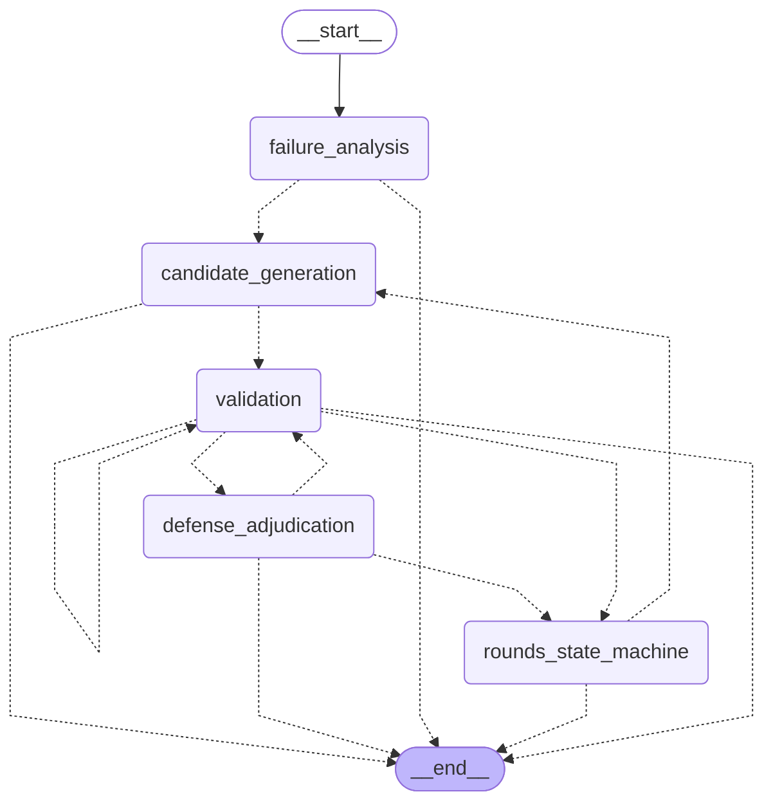

# SkillForge 受控回环 LangGraph 状态图旁路架构说明书

> **版本**：v1.0.0 (P2-D Milestone)  
> **模块定位**：`skillforge.langgraph_loop` 作为受控反思进化主流程（`evolver.py`）的 **Shadow 旁路架构**，提供状态黑板化、显式图拓扑流转与 Durable 检查点断点恢复能力。

---

## 1. 架构总览与图拓扑设计 (Graph Topology)

SkillForge 的核心能力是在沙箱评测、根因分析、防线裁决与定向反思之间进行闭环自我进化。在既有架构中，`SkillEvolver` 通过确定性的 `for round_idx in range(...)` 循环驱动；在 P2-D 阶段，我们将这一受控回环重构为显式 **LangGraph `StateGraph`** 架构，实现状态黑板化与图路由解耦。

### 1.1 5 个核心 Node 职责说明

图引擎包含 7 个节点（含 `__start__` 与 `__end__`），其中 5 个核心 Node 严格复用 `evolver.py` 的底层原子组件，不重写核心业务逻辑：

```
[__start__]
     │
     ▼
[failure_analysis] ──(终止/出口)──► [__end__]
     │ (通过)
     ▼
[candidate_generation] ──(终止/硬帽超限)──► [__end__]
     │ (生成有效候选)
     ▼
[validation] ◄────────┐ (同轮下一个候选)
     │                │
     ├───────────[defense_adjudication] ──(未达标/继续下一候选)
     │ (通过)         │
     │                │ (L1 发布成功 / 本轮候选耗尽)
     ▼                ▼
[rounds_state_machine] ──(触发反思 Round 2)──► [candidate_generation]
     │ (正常终态 / 预算耗尽 / 熔断)
     ▼
  [__end__]
```

1. **`failure_analysis`（基线与根因分析节点）**：
   - 运行 Baseline 沙箱评测（支持 P0 Fail-Closed 门禁裁决）；
   - 执行 A2 根因定位分析（若开启 A2），提取失败样本及执行轨迹；
   - 依赖异常判定（`is_dependency_issue`）：若判定为环境/外部工具故障，归档诊断报告并转入 `REVIEW` 出口直接终止。
2. **`candidate_generation`（候选生成与去重节点）**：
   - 结合基线失败原因或上一轮反思反馈（`AttemptFeedback`），调用 LLM 定向生成 L1/L2 候选 Patch；
   - 执行候选指纹提取与历史去重（`seen_fingerprints`），拦截重复生成与熔断候选；
   - 校验候选生成硬帽预算（`candidate_cap`）。
3. **`validation`（沙箱评测与门禁过滤节点）**：
   - 从 `pending_patches` 队列弹出首个待验候选；
   - 在受控沙箱中执行完整评测集打分，记录评测消耗至 `LLMLedger`；
   - 若评测预算超限，判定是否为第一轮可反思状态或直接熔断。
4. **`defense_adjudication`（质量防线与防劣化裁决节点）**：
   - 执行 **双防线裁决**：
     - **棘轮防线（Score Ratchet）**：候选得分必须严格 ≥ 基线得分，拒绝负向劣化；
     - **膨胀防线（BloatGate）**：检测 Token/代码行数膨胀与语义漂移；
   - 若通过防线且处于非 Shadow 模式且符合 L1 条件，执行 `_publish_patch` 自动发布；
   - 否则归档为 `REVIEW` 建议或记录为 `DECLINED` 退步记录。
5. **`rounds_state_machine`（轮次状态机与反思控制节点）**：
   - 汇总本轮候选验证结果；
   - 若本轮未产出达标候选、且在最大反思轮次限制内、且预算充裕，构造结构化反思提示词（`AttemptFeedback`），触发进入 Round 2；
   - 否则根据最终状态设置 `stop_reason`（如 `ACCEPTABLE_CANDIDATE_FOUND`, `ROUNDS_EXHAUSTED`, `BUDGET_EXCEEDED` 等）并流转至 `__end__`。

### 1.2 Mermaid 拓扑全景图



---

## 2. 状态机转移全景与 for 循环分支对照 (Equivalence Mapping)

在设计 `langgraph_loop.py` 时，我们遵循 **零逻辑漂移、100% 行为等价** 的原则。下表展示了 LangGraph 条件分支边与原生 `evolver.py` 主链中 `for` 循环与分支跳转的完整对照映射：

| 业务场景 / 触发条件 | 原生 `evolver.py` 控制流分支 | LangGraph StateGraph 条件路由边 | 终态 / 动作 |
|:---|:---|:---|:---|
| **1. 基线 INVALID / P0 门禁失败** | `if not baseline_result.passed_p0: return outcome` | `failure_analysis -.-> __end__` (`action='stop'`) | `P0_FAIL_CLOSED` / 立即安全退出 |
| **2. 依赖故障诊断** | `if is_dependency_issue: _archive_...; return outcome` | `failure_analysis -.-> __end__` (`stop_reason='DEPENDENCY_ISSUE'`) | `DEPENDENCY_ISSUE` / 归档 REVIEW 并退出 |
| **3. 根因分析预算超限** | `except BudgetExceededError: return outcome` | `failure_analysis -.-> __end__` (`outcome.error=...`) | 立即中止并抛出错误原因 |
| **4. 候选生成硬预算超限** | `if requested > cap: return outcome` | `candidate_generation -.-> __end__` (`outcome.error=...`) | `CANDIDATE_LIMIT_EXCEEDED` 终止 |
| **5. 无有效待验 Patch / 全重复熔断** | `if not pending_patches: break` | `candidate_generation -.-> __end__` (`stop_reason='NO_CANDIDATE'`) | 熔断退出，留痕审计轨迹 |
| **6. 候选沙箱评测预算超限 (R1)** | `except BudgetExceededError: break` (跳出候选循环进入反思判定) | `validation -.-> rounds_state_machine` (`validation_status='budget_exceeded'`) | 转入状态机评估是否可反思或停止 |
| **7. 候选沙箱评测失败 / 退步 (同轮有剩余候选)** | `if not ok: continue` (遍历下一个 candidate) | `validation -.-> validation` (自回环重试) | 验证本轮队列中的下一候选 Patch |
| **8. 候选通过沙箱打分** | `if verdict.passed: ...` (进入质量闸门) | `validation -.-> defense_adjudication` | 移交防线裁决节点 |
| **9. 裁决未达标 (同轮有剩余候选)** | `if verdict != 'ACCEPTABLE': continue` | `defense_adjudication -.-> validation` | 继续验证当前轮次下一候选 |
| **10. L1 自动发布成功** | `if verdict == 'PUBLISHED': break` (本轮成功发布，结束尝试) | `defense_adjudication -.-> rounds_state_machine` | 终态归档，停止后续无效尝试 |
| **11. 本轮候选耗尽，触发定向反思** | `if not has_acceptable and round < max_rounds: continue` | `rounds_state_machine -.-> candidate_generation` (`action='reflect'`) | 注入 `AttemptFeedback` 启动 Round 2 |
| **12. 反思轮次用尽 / 已获可接受候选** | `break` / 循环自然终止 | `rounds_state_machine -.-> __end__` | 正常终态退出 (`ROUNDS_EXHAUSTED` / `ACCEPTABLE_FOUND`) |

> **双跑验证成果**：运行 `scripts/dual_run_p2d.py`，在包含上述 7 大典型场景的全量测试集中，原生 for 循环与 LangGraph StateGraph 在 `patches_generated`, `patches_review`, `patches_declined`, `stop_reason`, `rounds_executed`, `baseline_score` 上达到 **100.0% 逐字段完全等价**。

---

## 3. Durable 检查点断点恢复与崩溃保护 (Durable Recovery)

在真实复杂生产环境与大模型 Agent 演进场景中，单次迭代可能耗时数分钟乃至数十分钟。若进程遭遇 OOM、网络抖动、主机重启或被外部信号中断，传统的内存 `for` 循环会导致已消耗的数百 Token 与评测进度全部丢失，无法复原。

为此，SkillForge 在 LangGraph 旁路中实现了 `SqliteCheckpointer` 持久化方案：

### 3.1 核心设计与序列化

1. **`SqliteCheckpointer` 原理**：
   - 符合 LangGraph Checkpointer 规范（`put`, `get_tuple`, `list` 等标准 API）；
   - 使用本地 SQLite 数据库独立存储每个执行线程（`thread_id`）的状态快照序列；
   - 内置线程安全锁与事务控制，防止多协程或并发评测时的写竞争。
2. **复合对象安全序列化 (`JsonPlusSerializer`)**：
   - 状态字典中包含 `EvolveOutcome`、`EvolveBudget`、`LLMLedger` 等复杂数据结构；
   - 默认 JSON 序列化器无法处理嵌套 dataclass；我们定制了带有安全模块白名单的序列化机制与 Pickle 回退容错，确保状态持久化落盘与冷启动反序列化 100% 可逆。

3. **事务、恢复与预算接续**：
   - SQLite 写入使用 `BEGIN IMMEDIATE`，在事务内读取最新快照并按 thread/namespace/checkpoint map 合并，避免陈旧 checkpointer 静默覆盖其他线程。
   - 损坏或 schema 不完整的快照显式抛出 `CHECKPOINT_RESTORE_FAILED`，不会降级为空状态。
   - `run_evolve_langgraph(..., resume=True)` 和节点级 `invoke(None, config)` 都会把 checkpoint 中的 `LLMLedger` 与 `active_budget` 重新绑定到新进程的 `SkillEvolver`，延续 calls/tokens/deadline，不重置预算。

4. **Shadow 产物隔离**：
   - 图入口强制使用独立 `shadow_root`；省略时分配独立临时目录，`traces`、`failures`、`suggestions`、`router` 与 durable `db` 均位于该 root，绝不回落到主链 `runs`。
   - 双跑 harness 为 for 与 graph 创建独立 registry/evaluator 输入根，严格比较完整终态、ledger、规范化 trace/archive manifest，并在 graph 结束后核验主链 `runs` 快照零变化。

### 3.2 进程崩溃与冷加载断点续跑验证

在 `scripts/demo_langgraph_p2d.py` 与 `tests/test_p2d_langgraph.py` 中，我们模拟了极端的进程 Crash 恢复流程：

```python
# 1. 进程 1 挂载 SQLite Checkpointer 并启动，在 validation 节点前注入中断
cp1 = SqliteCheckpointer(db_path=db_path)
graph_paused = build_evolve_state_graph(checkpointer=cp1, interrupt_before=['validation'])
graph_paused.invoke(init_state, config={'configurable': {'thread_id': 'run-42', 'evolver': evolver}})

# 验证状态已安全持久化在磁盘 SQLite 中
snapshot = graph_paused.get_state(cfg)
assert snapshot.next == ('validation',)
checkpoint_calls = snapshot.values['outcome'].ledger.total_calls

# 2. 模拟进程 1 强行终止（Crash）。新进程 2 启动，直接冷加载同一 SQLite 数据库
cp2 = SqliteCheckpointer(db_path=db_path)
graph_resumed = build_evolve_state_graph(checkpointer=cp2)
restored = graph_resumed.get_state(cfg)
assert restored.next == ('validation',)

# 3. 进程 2 从中断点继续无缝向下执行 (Resume)
final_state = graph_resumed.invoke(None, cfg)
assert final_state["outcome"].context.stop_reason == 'ACCEPTABLE_CANDIDATE_FOUND'
# 新进程接续原 ledger，而不是从 0 开始
assert final_state["outcome"].ledger.total_calls == checkpoint_calls
```

实测证明：**状态机能够无缝在崩溃处完全复活，跳过已完成的基线评测与候选生成，直接进入候选验证阶段并正确达成终态**。

---

## 4. 旁路/Shadow 架构演进思考：为什么不直接替换主链？

在架构选型讨论中，直觉可能会认为“图引擎更加现代化，应该直接把 `evolver.py` 的 for 循环全部删掉改用 LangGraph”。但在 SkillForge 的工程实践中，我们坚持将 LangGraph 保持为 **旁路/Shadow 验证模式**，而非贸然替换主链。

以下是支撑这一决策的核心技术权衡：

### 4.1 冷启动耗时与依赖开销 (Startup & Footprint Overhead)
- **原生 `for` 循环**：纯 Python 标准库与项目核心轻量模块驱动，导入时间 < 50ms，内存底噪几乎为零。
- **LangGraph / LangChain 生态**：引入了庞大的抽象依赖树（`langchain-core`, `langgraph`, `pydantic-v2`, `jsonplus`, `msgpack` 等），仅模块冷加载耗时就增加 300~500ms。在 CLI 短命令调用或轻量级单元测试中，此项开销尤为显著。

### 4.2 状态序列化与深拷贝开销 (State Snapshotting Overhead)
- LangGraph 为了保证函数式纯度与 Checkpoint 历史回溯，在每个节点执行前后都会进行状态快照与通道值拷贝。对于包含数十个 Case 详细日志、代码 AST 和大文本 Diff 的进化状态黑板，频繁的深拷贝与序列化带来了不可忽视的 CPU 和内存开销。

### 4.3 确定性调试成本与调用栈透明度 (Deterministic Debuggability)
- 原生 `for` 循环是单步透明的命令式代码。任何报错均能产生清晰线性的调用栈（`traceback` 直接定位到 `evolver.py:342`），断点调试所见即所得。
- 图引擎采用事件循环与状态调度器驱动，一旦出现异常，调用栈往往深达数十层 Pregel 运行时框架代码，在排查复杂边界（如并发超时、外部 API 限流、复杂 Mock）时认知负荷显著增加。

### 4.4 Fail-Closed 防御底线与系统健壮性 (Fail-Closed Robustness)
- SkillForge 的最高准则是**质量防线不可逾越**与**异常安全 Fail-Closed**。在演进未充分沉淀前，主链代码承担着自动化发布生产技能的重任。
- 采用 **Shadow 旁路双跑机制**：
  1. 保证了主链 100% 可用与绝对稳定性；
  2. 允许在旁路中长周期积累 LangGraph 的鲁棒性指标、断点恢复成功率与监控告警；
  3. 当旁路在生产流量中双跑数千次且达到 99.99% 以上的等价与稳定时，才具备平滑无缝灰度切流的前提条件。

---

## 5. 总结与后续演进

| 特性维度 | 原生 for 循环主链 (`evolver.py`) | LangGraph 旁路 (`langgraph_loop.py`) |
|:---|:---|:---|
| **执行模型** | 确定性命令式单步循环 | 显式有向图 (StateGraph) 事件驱动 |
| **状态管理** | 局部变量与对象引用 | 状态黑板与 Checkpoint 快照 |
| **持久化断点续跑** | 不支持（进程中断丢失） | **完整支持（SQLite / Memory Checkpointer）** |
| **外部展示与可视化** | 纯文本日志 / Trace | **Mermaid 图拓扑、可视化迁移序列** |
| **调试与排障复杂度** | 极低（调用栈清晰透明） | 中等（需通过检查点快照与图事件排查） |
| **生产定位** | 当前发布与执行主力主链 | **Shadow 演进、复杂长任务断点保护底座** |
